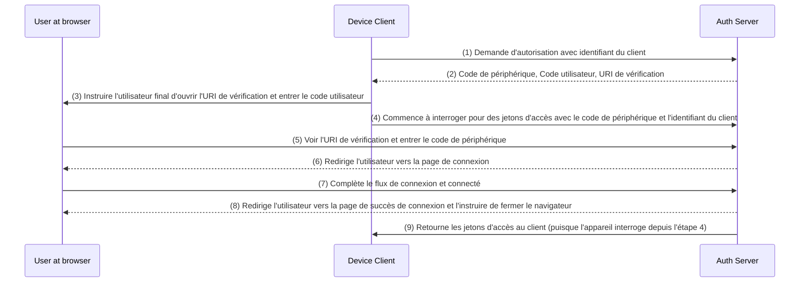

## Qu'est-ce que le flux de périphérique (device flow) ?

Le [Flux d'autorisation d'appareil OAuth](https://www.rfc-editor.org/rfc/rfc8628), également connu sous le nom de Device Flow, est une implémentation de [OAuth 2.0](https://oauth.net/2/) conçue pour les appareils avec des capacités d'entrée limitées (par exemple, les téléviseurs intelligents, les appareils IoT, les consoles de jeux) ou les applications sans interface (par exemple, les outils CLI). Il permet aux utilisateurs d'initier des demandes d'autorisation sur ces appareils puis de compléter le processus en utilisant un appareil plus adapté aux entrées comme un smartphone ou un ordinateur portable.

## Quand utiliser le flux de périphérique (device flow) ?

1. **Appareils à entrée limitée**
    - Connexion sur les Smart TVs (par exemple, applications multimédia)
    - Connexion sur Consoles de jeux (par exemple, système de jeu ou applications multimédia)
    - Connexion sur Appareils de réunion (par exemple, applications officielles ou applications de visioconférence)
    - Connexion sur Appareils portables (par exemple, montres intelligentes à entrée limitée)
    - Accès aux appareils IoT (par exemple, imprimantes, encodeurs vidéo ou haut-parleurs)
2. **Applications sans interface**
    - Connexion via une Interface en Ligne de Commande (par exemple, GitHub CLI ou Stripe CLI)
3. **Connexion par Code QR pour Applications de Bureau**
    - Se connecter rapidement et en toute sécurité aux applications de bureau en scannant un code QR avec votre smartphone (par exemple, Telegram, Steam on desktop). Ce flux de connexion par code QR peut être considéré comme une variante du flux de périphérique OAuth 2.0 traditionnel.

## A quoi ressemble le flux utilisateur final du flux de périphérique (device flow) ?

En ignorant la variante de connexion par code QR, concentrons-nous sur le flux de périphérique OAuth 2.0 standard. Il y a deux types d'appareils impliqués :

### Appareil d'affichage du code de périphérique

Il s'agit de l'appareil à entrée limitée ou de l'application sans interface où l'utilisateur doit autoriser l'accès. Il affiche le [code de périphérique et l'URI de vérification](#what-does-device-flow-workflow-look-like), guidant l'utilisateur sur comment procéder.

L'interface de base est :


Pour améliorer l'expérience utilisateur, les services génèrent souvent un code QR pour l'URL de vérification :


Pour encore plus d'efficacité, remplacez la ressource du code QR dans le `verification_uri` (par exemple, `https://example.com/device`) par `verification_uri_complete` (par exemple, `https://example.com/device?user_code=WDJB-MJHT`), qui inclut le code du périphérique dans l'URL, aidant les utilisateurs à pré-remplir le code du périphérique dans le champ.

### Appareil d'autorisation

En suivant les instructions sur l'appareil cible de connexion, l'utilisateur :

1. Utilise un autre appareil avec accès au navigateur et capacités d'entrée pour ouvrir l'URL de vérification.
2. Entrez le code de périphérique affiché (qui pourrait être pré-rempli) et continuez.
3. S'il n'y a pas de sessions existantes sur le navigateur, l'utilisateur devra d'abord se connecter au service.
4. Une page de consentement incitera l'utilisateur à autoriser la connexion de l'appareil.
5. Enfin, une page de succès sera affichée après l'autorisation.

Voici quelques URLs de vérification du flux de périphérique établies par des produits pour vos tests :

- Connectez-vous à [Youtube sur les téléviseurs intelligents](https://www.youtube.com/watch?v=yTcuazSy5Cs) : [youtube.com/activate](https://youtube.com/activate)
- Connectez-vous à Disney+ sur téléviseur intelligent : [disneyplus.com/begin](https://disneyplus.com/begin)
- Connectez-vous à [Shopify sur Samsung Galaxy Watch](https://www.drmare.com/spotify-music/spotify-on-galaxy-watch.html) : [spotify.com/pair](https://spotify.com/pair)
- Connectez-vous à [Zoom sur appareils de réunion](https://developers.zoom.us/blog/device-authorization/) : [zoom.us/oauth_device](https://zoom.us/oauth_device)
- Connectez-vous à [GitHub CLI](https://docs.github.com/en/apps/oauth-apps/building-oauth-apps/authorizing-oauth-apps#device-flow) : [github.com/login/device](https://github.com/login/device)
- Utilisez [Google device flow](https://www.oauth.com/oauth2-servers/device-flow/user-flow/) : https://www.google.com/device

## A quoi ressemble le flux de travail du flux de périphérique (device flow) ?

D'abord, vous devez comprendre les paramètres de la réponse d'autorisation de périphérique, utilisée pour gérer les informations affichées sur l'appareil d'affichage du code de périphérique :

| Paramètre                              | Description                                                                                                                                                                    |
| -------------------------------------- | ------------------------------------------------------------------------------------------------------------------------------------------------------------------------------ |
| `device_code`                          | Le code de vérification de l'appareil.                                                                                                                                         |
| `user_code`                            | Le code de vérification de l'utilisateur final.                                                                                                                                |
| `verification_uri`                     | L'URI de vérification de l'utilisateur final sur le serveur d'autorisation.  L'URI doit être court et facile à mémoriser car les utilisateurs finaux seront invités à le taper manuellement dans leur agent utilisateur. |
| `verification_uri_complete` (optionnel) | Un URI de vérification qui inclut le "user_code" (ou d'autres informations ayant la même fonction que le "user_code"), conçu pour la transmission non-textuelle.               |
| `expires_in`                           | La durée de vie en secondes du "device_code" et du "user_code".                                                                                                                |
| `interval`                             | La durée minimale en secondes que le client DOIT attendre entre les requêtes de sonde vers le point d'accès token.  Si aucune valeur n'est fournie, les clients DOIVENT utiliser 5 par défaut. |

```json
{
    "device_code": "GmRhmhcxhwAzkoEqiMEg_DnyEysNkuNhszIySk9eS",
    "user_code": "WDJBMJHT",
    "verification_uri": "https://custom.domain.com/device",
    "verification_uri_complete":
        "https://custom.domain.com/device?user_code=WDJB-MJHT",
    "expires_in": 900,
    "interval": 5
}
```

Quand un utilisateur utilise le flux de périphérique pour l'authentification, il inclut principalement les étapes suivantes :



1. Le client de l'appareil demande l'autorisation au serveur d'auth (auth server) avec un identifiant du client (généralement l'idientifiant du client sur la plateforme auth server).
2. Le serveur d'auth répond au client de l'appareil avec un code de périphérique, un code utilisateur et un URI de vérification.
3. Le client de l'appareil affiche l'URI de vérification et le code utilisateur à l'utilisateur sous forme de texte (ou un code QR, etc.), en instruisant l'utilisateur de visiter l'URI et d'entrer le code.
4. En même temps que l'étape 3, le client de l'appareil commence à interroger pour des jetons d'accès avec le code de périphérique et l'identifiant du client depuis le serveur d'auth et commence à attendre que l'utilisateur examine la demande d'autorisation et complète l'autorisation.
5. L'utilisateur visite l'URI de vérification hébergée par le serveur d'auth, via un navigateur sur un autre appareil, et entre le code utilisateur.
6. Le serveur d'auth redirige l'utilisateur vers la page de connexion et l'instruit de compléter la connexion.
7. L'utilisateur complète le flux de connexion et se connecte avec succès.
8. Le serveur d'auth redirige l'utilisateur vers la page de succès de connexion et lui demande de fermer le navigateur.
9. En même temps que l'étape 8, le serveur d'auth retourne les jetons d'accès au client de l'appareil puisque le client a interrogé depuis l'étape 4.

Après ces processus, le client de l'appareil pourra obtenir le jeton d'accès pour les services ultérieurs !

Pour plus de détails, lisez [RFC 8628 OAuth 2.0 Device Authorization Grant](https://datatracker.ietf.org/doc/html/rfc8628#autoid-3).

<SeeAlso slugs={['authorization-code-flow', 'implicit-flow', 'client-credentials-flow']} />

<Resources urls={['https://blog.logto.io/a-brief-introduction-to-oauth2-device-flow', 'https://datatracker.ietf.org/doc/html/rfc8628']} />