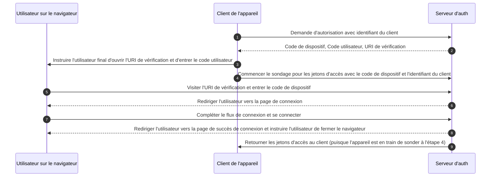

## Qu'est-ce que le flux de dispositif (device flow) ?

Le [flux d'autorisation de dispositif OAuth](https://www.rfc-editor.org/rfc/rfc8628), également connu sous le nom de flux de dispositif, est un <Ref slug="oauth-2.0-grant" /> conçu pour les appareils avec des capacités d'entrée limitées (par exemple, téléviseurs intelligents, appareils IoT, consoles de jeux) ou les applications sans interface (par exemple, outils CLI). Il permet aux utilisateurs d'initier des <Ref slug="authorization-request">demandes d'autorisation</Ref> sur ces appareils, puis de terminer le processus en utilisant un appareil avec plus de capacités d'entrée comme un smartphone ou un ordinateur portable.

## Quand utiliser le flux de dispositif (device flow) ?

1. **Appareils à entrée limitée**
    - Connexion sur les téléviseurs intelligents (par exemple, applications multimédia)
    - Connexion sur les consoles de jeux (par exemple, système de jeu ou applications multimédia)
    - Connexion sur les appareils de réunion (par exemple, applications officielles ou applications de visioconférence)
    - Connexion sur les appareils portables (par exemple, montres intelligentes avec entrée limitée)
    - Accès aux appareils IoT (par exemple, imprimantes, encodeurs vidéo ou haut-parleurs)
2. **Applications sans interface**
    - Connexion en ligne de commande (par exemple, GitHub CLI ou Stripe CLI)
3. **Connexion par code QR pour les applications de bureau**
    - Connexion rapide et sécurisée aux applications de bureau en scannant un code QR avec votre smartphone (par exemple, connexions Telegram, Steam sur bureau). Ce flux de connexion par code QR peut être considéré comme une variante du flux de dispositif OAuth 2.0 traditionnel.

## À quoi ressemble le flux utilisateur final du flux de dispositif (device flow) ?

En ignorant la variante de connexion par code QR, concentrons-nous sur le flux de dispositif OAuth 2.0 standard. Il y a deux types d'appareils impliqués :

### Appareil d'affichage du code de dispositif

C'est l'appareil à entrée limitée ou l'application sans interface où l'utilisateur doit autoriser l'accès. Il affiche le [code de dispositif et l'URI de vérification](#what-does-device-flow-workflow-look-like), guidant l'utilisateur sur la façon de procéder.

L'interface utilisateur de base est :


Pour améliorer l'expérience utilisateur, les services génèrent souvent un code QR pour l'URL de vérification :


Pour encore plus d'efficacité, remplacez la ressource du code QR dans le `verification_uri` (par exemple, `https://example.com/device`) par `verification_uri_complete` (par exemple, `https://example.com/device?user_code=DSHP-SNCT`), qui inclut le code de dispositif dans l'URL, aidant les utilisateurs à pré-remplir le code de dispositif dans les champs.

### Appareil d'autorisation

En suivant les instructions sur l'appareil cible de connexion, l'utilisateur va :

1. Utiliser un autre appareil avec accès au navigateur et capacités d'entrée pour ouvrir l'URL de vérification.
2. Entrer le code de dispositif affiché (qui pourrait être pré-rempli) et continuer.
3. S'il n'y a pas de sessions existantes sur le navigateur, l'utilisateur se connectera d'abord au service.
4. Une page de consentement invitera les utilisateurs à autoriser la connexion de l'appareil.
5. Enfin, une page de succès sera affichée après l'autorisation.


Voici quelques URLs de vérification de flux de dispositif de produits établis pour vos tests :

- Connectez-vous à [Youtube sur les téléviseurs intelligents](https://www.youtube.com/watch?v=yTcuazSy5Cs) : [youtube.com/activate](https://youtube.com/activate)
- Connectez-vous à Disney+ sur téléviseur intelligent : [disneyplus.com/begin](https://disneyplus.com/begin)
- Connectez-vous à [Shopify sur Samsung Galaxy Watch](https://www.drmare.com/spotify-music/spotify-on-galaxy-watch.html) : [spotify.com/pair](https://spotify.com/pair)
- Connectez-vous à [Zoom sur les appareils de réunion](https://developers.zoom.us/blog/device-authorization/) : [zoom.us/oauth_device](https://zoom.us/oauth_device)
- Connectez-vous à [GitHub CLI](https://docs.github.com/en/apps/oauth-apps/building-oauth-apps/authorizing-oauth-apps#device-flow) : [github.com/login/device](https://github.com/login/device)
- Utilisez [Google device flow](https://www.oauth.com/oauth2-servers/device-flow/user-flow/) : https://www.google.com/device

## À quoi ressemble le flux de travail du flux de dispositif (device flow) ?

Tout d'abord, vous devez comprendre les paramètres de la réponse d'autorisation de dispositif, qui est utilisée pour gérer les informations affichées sur l'appareil d'affichage du code de dispositif :

| Paramètre                              | Description                                                                                                                                                                    |
| -------------------------------------- | ------------------------------------------------------------------------------------------------------------------------------------------------------------------------------ |
| `device_code`                          | Le code de vérification de l'appareil.                                                                                                                                         |
| `user_code`                            | Le code de vérification de l'utilisateur final.                                                                                                                                |
| `verification_uri`                     | L'URI de vérification de l'utilisateur final sur le serveur d'autorisation. L'URI doit être courte et facile à retenir car les utilisateurs finaux devront la taper manuellement dans leur agent utilisateur. |
| `verification_uri_complete` (optionnel) | Un URI de vérification qui inclut le "user_code" (ou d'autres informations ayant la même fonction que le "user_code"), conçu pour la transmission non textuelle.                |
| `expires_in`                           | La durée de vie en secondes du "device_code" et du "user_code".                                                                                                                |
| `interval`                             | Le temps minimum en secondes que le client DOIT attendre entre les requêtes de sondage vers le point de terminaison du jeton. Si aucune valeur n'est fournie, les clients DOIVENT utiliser 5 par défaut. |

```json
{
    "device_code": "GmRhmhcxhwAzkoEqiMEg_DnyEysNkuNhszIySk9eS",
    "user_code": "WDJBMJHT",
    "verification_uri": "https://custom.domain.com/device",
    "verification_uri_complete":
        "https://custom.domain.com/device?user_code=WDJB-MJHT",
    "expires_in": 900,
    "interval": 5
}
```

Lorsqu'un utilisateur utilise le flux de dispositif pour l'authentification, cela inclut principalement les étapes suivantes :



1. Le client de l'appareil demande l'autorisation du serveur d'auth avec un identifiant de client (généralement l'id client sur la plateforme du serveur d'auth).
2. Le serveur d'auth répond au client de l'appareil avec le code de dispositif, le code utilisateur et l'URI de vérification.
3. Le client de l'appareil affiche l'URI de vérification et le code utilisateur à l'utilisateur sous forme de texte (ou d'un code QR, etc.), en instruisant l'utilisateur de visiter l'URI et d'entrer le code.
4. En même temps que l'étape 3, le client de l'appareil commence à sonder pour les jetons d'accès avec le code de dispositif et l'identifiant du client depuis le serveur d'auth et commence à attendre que l'utilisateur examine la <Ref slug="authorization-request" /> et complète l'autorisation de l'utilisateur.
5. L'utilisateur visite l'URI de vérification hébergée par le serveur d'auth, via un navigateur sur un autre appareil, et entre le code utilisateur.
6. Le serveur d'auth redirige l'utilisateur vers la page de connexion et l'instruit de compléter la connexion.
7. L'utilisateur complète le flux de connexion et se connecte avec succès.
8. Le serveur d'auth redirige l'utilisateur vers la page de succès de connexion et l'instruit de fermer le navigateur.
9. En même temps que l'étape 8, le serveur d'auth retourne les jetons d'accès au client de l'appareil puisque le client a sondé depuis l'étape 4.

Après ces processus, le client de l'appareil pourra obtenir le <Ref slug="access-token" /> pour les services ultérieurs.

Pour plus de détails, lisez [RFC 8628 OAuth 2.0 Device Authorization Grant](https://datatracker.ietf.org/doc/html/rfc8628#autoid-3).

## Quelles sont les considérations de sécurité pour le flux de dispositif (device flow) ?

Le flux de dispositif implique une interaction entre deux appareils, l'exposant à des risques de sécurité potentiels tels que l'exposition du code de dispositif, les attaques par force brute ou les attaques de type homme du milieu (MitM).

Bien qu'obtenir un code de dispositif seul ne garantisse pas immédiatement l'autorisation (puisque l'utilisateur doit toujours s'authentifier et autoriser), un attaquant pourrait tenter de rejouer une demande de code de dispositif pendant sa période de validité. Cela pourrait entraîner un accès répété non autorisé. Pour renforcer la sécurité, envisagez les précautions suivantes :

- **Réduire la durée de `expires_in` :** Réduisez la fenêtre d'opportunité pour les attaques en minimisant la période de validité du code de dispositif.
- **Limiter les tentatives échouées :** Restreindre le nombre d'entrées de code incorrectes pour prévenir les attaques par force brute.
- **Imposer HTTPS :** Assurez-vous que toutes les communications entre l'appareil et le serveur d'autorisation sont cryptées en utilisant HTTPS pour prévenir les attaques de type homme du milieu.
- **Limiter les codes de dispositif à usage unique :** Restreindre chaque code de dispositif à **une seule session** pour empêcher sa réutilisation par des parties non autorisées.

Notez que l'utilisation unique pour les codes de dispositif n'est pas une exigence intégrée du flux de dispositif OAuth 2.0. C'est une bonne pratique optionnelle. Certains développeurs peuvent intentionnellement concevoir pour des autorisations de dispositif simultanées avec le même code (par exemple, sur des centaines d'appareils), mais cette approche augmente les risques de sécurité et doit être soigneusement évaluée.

## Les fournisseurs OIDC prennent-ils en charge le flux de dispositif (device flow) ?

Bien que le flux de dispositif soit traditionnellement associé à OAuth, les fournisseurs <Ref slug="openid-connect" /> peuvent également le prendre en charge. OIDC offre des avantages supplémentaires au-delà de l'objectif principal d'autorisation d'OAuth. Il s'étend à l'authentification, permettant aux applications d'obtenir à la fois un <Ref slug="access-token" /> et un <Ref slug="id-token" /> dans un seul flux.

La gestion d'identité unifiée robuste d'OIDC, y compris la validation des jetons et le <Ref slug="refresh-token">rafraîchissement</Ref>, le rend bien adapté pour une <Ref slug="authentication" /> et une <Ref slug="authorization" /> sécurisées et fiables entre les appareils et les applications, en particulier ceux avec des capacités d'entrée limitées.

<SeeAlso slugs={['oauth-2.0-grant', 'authorization-code-flow', 'implicit-flow', 'client-credentials-flow']} />

<Resources urls={['https://blog.logto.io/a-brief-introduction-to-oauth2-device-flow', 'https://datatracker.ietf.org/doc/html/rfc8628']} />