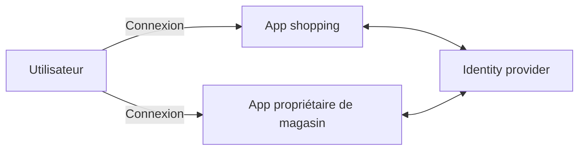
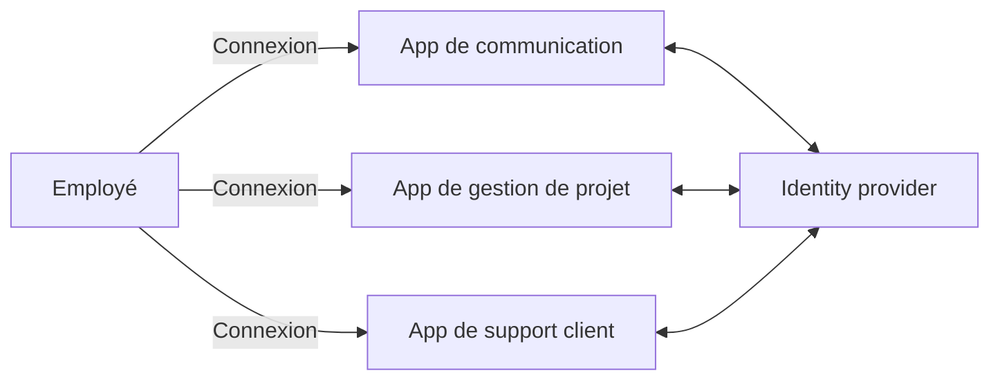
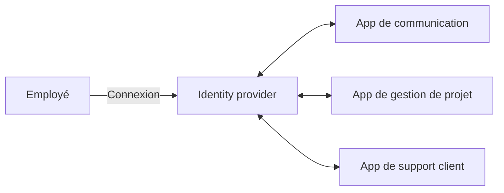
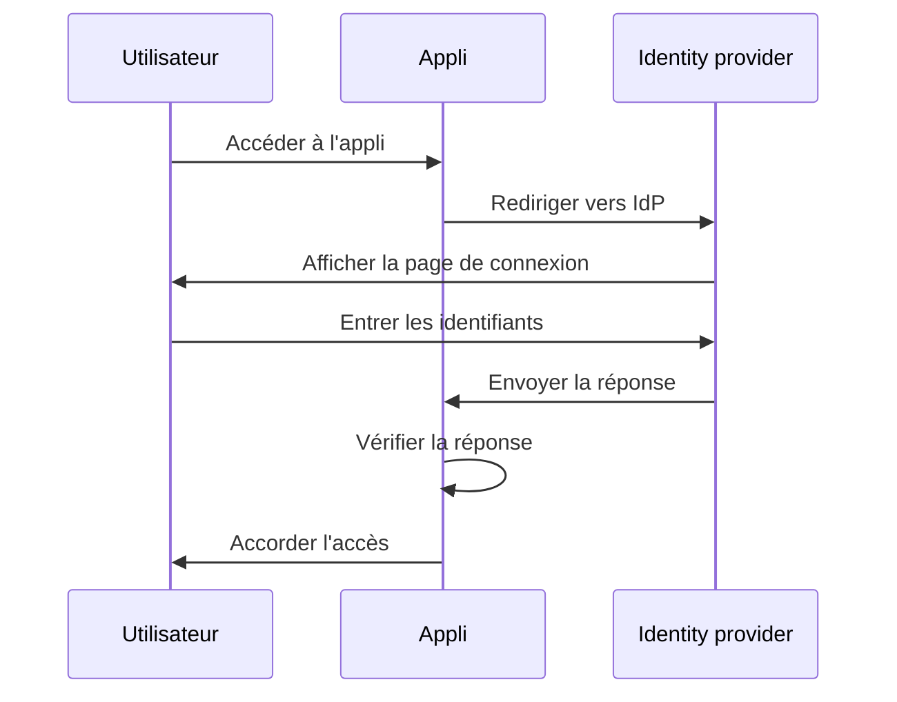
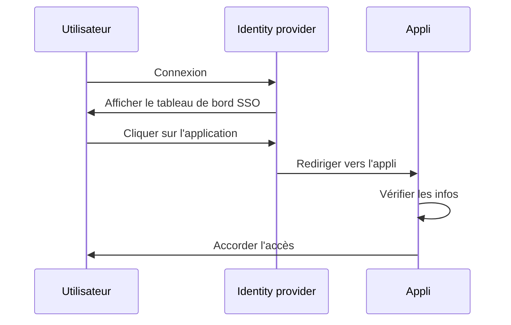
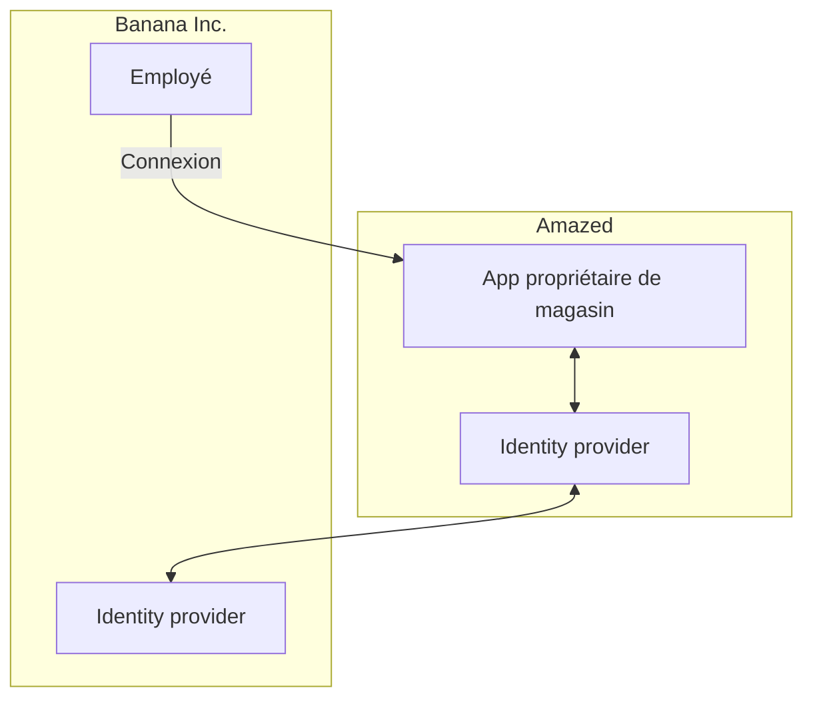

## Qu'est-ce que le SSO d'entreprise ?

Avant de plonger dans la définition, il est important de clarifier la différence entre le SSO et le SSO d'entreprise, car cela peut souvent prêter à confusion.

- <Ref slug="single-sign-on" /> est un terme général qui fait référence à la capacité d'un utilisateur à se connecter une fois et à accéder à plusieurs applications ou ressources sans avoir besoin de se reconnecter.
- Le SSO d'entreprise est un type spécifique de SSO conçu pour les employés au sein d'une organisation.

Toujours pas sûr ? Regardons un exemple :

Un site de shopping en ligne appelé _Amazed_ a deux applications web : une pour les clients et une pour les propriétaires de magasins. Les clients se connectent à l'application shopping pour acheter des produits, tandis que les propriétaires de magasins se connectent à l'application dédiée pour gérer leurs boutiques. Les deux applications utilisent le même identity provider pour l'authentication. En conséquence, les utilisateurs n'ont besoin de se connecter qu'une seule fois pour accéder aux deux applications, offrant ainsi une expérience de single sign-on.

En interne, _Amazed_ utilise plusieurs applications pour la communication en équipe, la gestion de projet et le support client. Pour rationaliser les flux de travail quotidiens, _Amazed_ met en œuvre le SSO d'entreprise pour ses employés. Avec le SSO d'entreprise, les employés peuvent accéder à toutes les applications internes avec une connexion unique.

Typiquement, les solutions de SSO d'entreprise fournissent également un tableau de bord centralisé permettant aux employés d'accéder à toutes les applications en un clic. Ce tableau de bord est souvent appelé le tableau de bord SSO.

En résumé, les deux scénarios sont des exemples de single sign-on. La différence est que le premier exemple est un SSO générique, tandis que le second est un SSO d'entreprise. Ce sont des cas d'utilisation typiques pour le Customer IAM (Identity and Access Management) et le Workforce IAM, respectivement.

## Comment fonctionne le SSO d'entreprise ?

Le SSO d'entreprise fonctionne en connectant plusieurs applications à un identity provider centralisé. La connexion peut être unidirectionnelle (de l'application à l'identity provider) ou bidirectionnelle (entre l'application et l'identity provider). Divers standards et protocoles, tels que SAML, OpenID Connect, et OAuth 2.0, sont utilisés pour ces connexions.

Quel que soit le protocole, le flux de travail de base est généralement similaire :

1. L'utilisateur accède à une application (par exemple, l'application de communication) qui nécessite une authentication.
2. L'application redirige l'utilisateur vers l'identity provider pour l'authentication.
3. L'utilisateur se connecte à l'identity provider.
4. L'identity provider envoie une réponse d'authentication à l'application.
5. L'application vérifie la réponse et accorde l'accès à l'utilisateur.

Lorsque l'utilisateur accède à une autre application (par exemple, l'application de gestion de projet) connectée au même identity provider, il est automatiquement connecté sans avoir besoin de saisir à nouveau ses identifiants. Dans ce cas, l'étape 3 est omise, et comme les étapes 2, 4 et 5 se déroulent en arrière-plan, l'utilisateur peut même ne pas remarquer le processus d'authentication.

Ce processus est appelé Service Provider (SP)-Initiated SSO, où l'application (SP) initie le processus d'authentication.

Dans un autre scénario, l'identity provider fournit un tableau de bord centralisé pour que les utilisateurs accèdent à toutes les applications connectées. Un flux de travail simplifié est le suivant :

1. L'utilisateur se connecte à l'identity provider.
2. L'identity provider affiche une liste d'applications auxquelles l'utilisateur peut accéder.
3. L'utilisateur clique sur une application (par exemple, l'application de support client) pour y accéder.
4. L'identity provider redirige l'utilisateur vers l'application avec les informations d'authentification.
5. L'application vérifie les informations et accorde l'accès à l'utilisateur.

Ce processus est appelé Identity Provider (IdP)-Initiated SSO, où l'identity provider (IdP) initie le processus d'authentication.

## Pourquoi le SSO d'entreprise est-il important ?

### SSO d'entreprise dans le Workforce IAM

#### Gestion centralisée

Le principal avantage du SSO d'entreprise n'est pas seulement la commodité pour les employés, mais aussi la sécurité renforcée et la conformité pour les organisations. Au lieu de gérer plusieurs identifiants pour différentes applications et de configurer l'authentication et l'autorisation séparément pour chacune, les organisations peuvent centraliser la gestion des identités utilisateur, les politiques d'access control et les journaux d'audit.

Par exemple, lorsqu'un employé quitte l'entreprise, le département informatique peut désactiver le compte de l'employé dans l'identity provider, révoquant immédiatement l'accès à toutes les applications. Cela est crucial pour prévenir l'accès non autorisé et les violations de données, un processus connu sous le nom de gestion du cycle de vie.

#### Access control

Les solutions de SSO d'entreprise incluent souvent des fonctionnalités d'access control, telles que le role-based access control (RBAC) et l'attribute-based access control (ABAC). Ces fonctionnalités permettent aux organisations de définir des politiques d'accès détaillées basées sur les rôles des utilisateurs, les attributs et d'autres informations contextuelles, garantissant que les employés ont le bon niveau d'accès aux bonnes ressources.

Pour une comparaison détaillée entre RBAC et ABAC, consulte [RBAC et ABAC : Les modèles d'access control que vous devriez connaître](https://blog.logto.io/rbac-and-abac).

#### Sécurité renforcée

Un autre avantage est la capacité à appliquer des méthodes d'authentication fortes, telles que le multi-factor authentication (MFA), l'authentication sans mot de passe et l'authentication adaptative, sur toutes les applications. Ces méthodes aident à protéger les données sensibles et à se conformer aux réglementations de l'industrie.

Pour plus d'informations sur le MFA, se référer à [Explorer le MFA : Regarder l'authentication du point de vue d’un produit](https://blog.logto.io/elaborate-mfa).

### SSO d'entreprise dans le Customer IAM

Le terme "SSO d'entreprise" apparaît également dans les solutions Customer IAM. Que signifie-t-il dans ce contexte ? Revenons à l'exemple d'_Amazed_ : certains propriétaires de magasins sont constitués en entreprises. Un propriétaire de magasin, _Banana Inc._, met en œuvre le SSO d'entreprise pour ses employés. Dans le cadre de l'accord, _Banana Inc._ exige qu'_Amazed_ applique le SSO d'entreprise pour toutes les adresses e-mail de _Banana Inc._ (par exemple, `*@banana.com`) lors de l'accès à l'application de gestion de magasins.

Dans ce cas, _Amazed_ doit intégrer son identity provider avec celui de _Banana Inc._ pour permettre le SSO d'entreprise pour les employés de _Banana Inc._ Cette intégration, souvent réalisée via des protocoles standards comme SAML, OpenID Connect ou OAuth, est communément appelée connexion SSO d'entreprise, connecteur SSO d'entreprise ou fédération SSO.

Pour une explication approfondie du Customer IAM, consulte la série CIAM :

- [CIAM 101 : Authentication, Identity, SSO](https://blog.logto.io/ciam-101-intro-authn-sso)
- [CIAM 102 : Authorization & Role-Based Access Control](https://blog.logto.io/ciam-102-authz-and-rbac)

#### Être prêt pour l'entreprise

Dans les scénarios B2B (business-to-business), le SSO d'entreprise est une fonctionnalité incontournable pour les fournisseurs SaaS comme _Amazed_ pour soutenir leurs clients d'entreprise. Ce n'est pas seulement une question de commodité ; c'est une question de sécurité et de conformité pour les deux parties. Le SSO d'entreprise peut faire en sorte que toutes les identités gérées par le client d'entreprise s'authentifient par l'intermédiaire de l'identity provider d'entreprise, garantissant que l'entreprise garde le contrôle sur ses utilisateurs, ses données, ses politiques d'accès et de sécurité.

Le SSO d'entreprise est un facteur clé pour atteindre la _prêtitude d'entreprise_, c'est-à-dire la capacité à répondre aux besoins des clients d'entreprise. Cependant, la gestion des identités et des accès, en particulier dans le contexte des clients d'entreprise, est complexe et nécessite un investissement significatif en temps, ressources et expertise. Les fournisseurs modernes de SaaS choisissent souvent des plateformes IAM pour gérer ces complexités.

<SeeAlso slugs={['single-sign-on']} />
