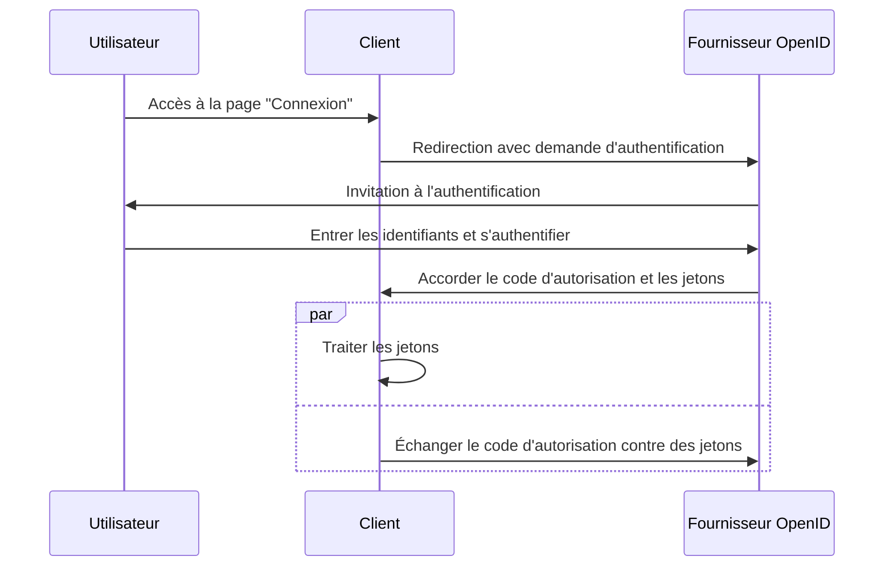

## Qu'est-ce que le flux hybride (Hybrid flow) ?

Le flux hybride (Hybrid flow) est un processus d'authentification qui combine les caractéristiques du <Ref slug="authorization-code-flow" /> et du <Ref slug="implicit-flow" />. Il convient de noter que le flux hybride ne fait pas partie de la spécification <Ref slug="oauth-2.0" /> mais est une extension fournie par <Ref slug="openid-connect" />.

Ce flux est conçu pour offrir un équilibre entre la sécurité et la convivialité pour l'authentification des utilisateurs. Cependant, le flux hybride n'est pas recommandé pour les nouvelles applications en raison des [considérations de sécurité](#security-considerations) associées au flux implicite. Une alternative populaire au flux hybride est d'utiliser le flux de l'autorisation (authorization code flow) avec <Ref slug="pkce" /> pour une meilleure sécurité.

## Comment fonctionne le flux hybride (Hybrid flow) ?

Voici les principales étapes du flux hybride :

1. Comme pour d'autres flux OIDC, le flux hybride commence par le <Ref slug="client" /> initiant une <Ref slug="authentication-request" /> au <Ref slug="openid-connect" headingId="openid-provider-op" />.

    Note : Le client doit inclure le paramètre `response_type` avec la combinaison de `code` et au moins un de `id_token` ou `token`, ce qui signifie qu'il y a trois combinaisons possibles :

      - `code id_token` : Le client s'attend à un code d'autorisation et un ID token.
      - `code token` : Le client s'attend à un code d'autorisation et un jeton d'accès.
      - `code id_token token` : Le client s'attend à un code d'autorisation, un ID token et un jeton d'accès.

    La demande est explicite : le client s'attend à la fois à un code d'autorisation et à un ou plusieurs jetons, qui correspondent respectivement au flux de l'autorisation (authorization code flow) et au flux implicite.
2. L'utilisateur s'authentifie sur le <Ref slug="openid-connect" headingId="openid-provider-op" />.
3. Le <Ref slug="openid-connect" headingId="openid-provider-op" /> redirige l'utilisateur vers l'application cliente avec le code d'autorisation et les jetons demandés.
4. L'application cliente traite les jetons et peut les utiliser pour accéder aux ressources protégées au nom de l'utilisateur ; elle peut également utiliser le code d'autorisation pour obtenir des jetons supplémentaires via la <Ref slug="token-request" />.

Voici un diagramme de séquence simplifié du flux hybride :



Voici un exemple non normatif d'une demande d'authentification de flux hybride :

```http
GET /authorize?response_type=code%20id_token
  &client_id=YOUR_CLIENT_ID
  &redirect_uri=https%3A%2F%2Fclient.example.com%2Fcallback
  &scope=openid%20profile%20email
  &nonce=123456
  &state=abc123 HTTP/1.1
Host: your-openid-provider.com
```

### Paramètres clés dans une demande d'authentification de flux hybride

La demande d'authentification de flux hybride comprend les paramètres clés suivants :

- **`response_type`** : La valeur doit être une combinaison de `code` et au moins un de `id_token` ou `token`. Par exemple, `code id_token` ou `code token`.
- **`client_id`** : L'identifiant du client délivré par le <Ref slug="openid-connect" headingId="openid-provider-op" /> (serveur d'autorisation).
- **`redirect_uri`** : L'URI où le serveur d'autorisation envoie l'utilisateur après le processus d'authentification.
- **`scope`** : Les <Ref slug="scope">scopes</Ref> demandés (autorisations) pour les jetons.
- **`resource`** : Le paramètre optionnel qui spécifie le <Ref slug="resource-indicator" /> pour les ressources demandées. Le serveur d'autorisation doit prendre en charge [RFC 8707](https://datatracker.ietf.org/doc/html/rfc8707) pour utiliser ce paramètre.

Pour la liste complète des paramètres et leurs descriptions, consultez [Authentication using the Hybrid Flow](https://openid.net/specs/openid-connect-core-1_0.html#HybridFlowAuth).

## Considérations de sécurité

Le flux hybride intègre le flux implicite, qui est connu pour ses limitations de sécurité. Les jetons sont toujours transmis via le canal frontal (navigateur), ce qui peut les exposer à des attaques potentielles. Le flux implicite sera déprécié dans <Ref slug="oauth-2.1" /> en raison de ces préoccupations.

Le <Ref slug="authorization-code-flow" /> avec <Ref slug="pkce" /> est l'alternative recommandée au flux hybride. Il offre une manière plus sécurisée d'authentifier les utilisateurs sans exposer les jetons dans le canal frontal.

<SeeAlso slugs={["openid-connect", "oauth-2.1", "authorization-code-flow", "pkce", "implicit-flow"]} />

<Resources
  urls={[
    "https://blog.logto.io/implicit-flow-is-dead",
    "https://blog.logto.io/oauth-2-1",
    "https://openid.net/specs/openid-connect-core-1_0.html#HybridFlowAuth",
  ]}
/>
