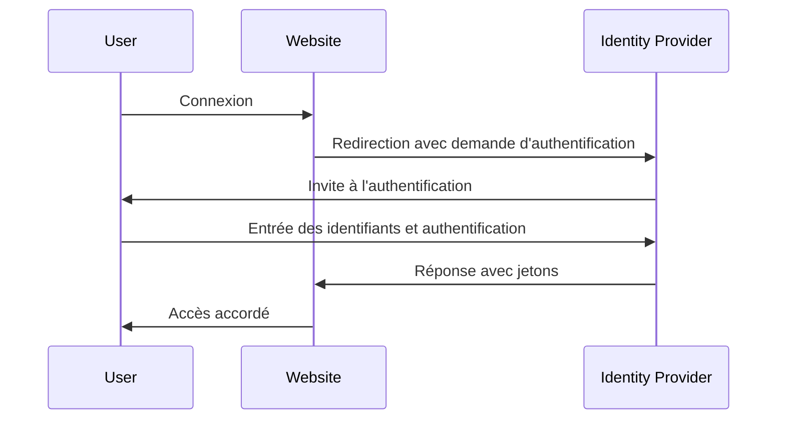

## Qu'est-ce que la gestion des identités et des accès (IAM) ?

Comme le suggère la définition, la gestion des identités et des accès (IAM) est un concept large qui implique de nombreux aspects de la gestion des identités numériques et de la réalisation de <Ref slug="access-control" />. Décortiquons d'abord les termes :

- **Identité** : Une représentation numérique d'un utilisateur, d'un service ou d'un dispositif. Une identité peut inclure des attributs tels que des identifiants, des rôles et des permissions.
- **Accès** : La capacité d'interagir avec des ressources, d'effectuer des actions ou d'utiliser des services. Pour résumer, l'accès concerne les actions à effectuer sur certaines ressources.

### Gestion des identités

La gestion des identités est le processus de gestion, d'authentification et de sécurisation des identités numériques. Elle implique les activités clés suivantes :

- **Enregistrement des identités** : Création de nouvelles identités pour les utilisateurs, services ou dispositifs.
- **Authentification des identités** : Vérification de la propriété d'une identité par divers mécanismes tels que les mots de passe, la biométrie ou l'authentification multi-facteurs (mfa).
- **Sécurité des identités** : Protection des identités contre un accès non autorisé, un usage abusif ou une divulgation.

Chaque sujet est vaste et peut être subdivisé en sous-sujets tels que la gestion des mots de passe, la fédération d'identités et la gestion du cycle de vie des identités.

### Gestion des accès

La gestion des accès (ou <Ref slug="access-control" />) est le processus de contrôle de qui peut effectuer quelles actions sur certaines ressources. Elle implique les activités clés suivantes :

- **Politiques de contrôle d'accès** : Définition de règles et de politiques qui dictent qui peut accéder à quelles ressources et quelles actions ils peuvent effectuer.
- **Mise en œuvre du contrôle d'accès** : Application des politiques de contrôle d'accès par des mécanismes tels que l'authentification, l'autorisation et l'audit.
- **Gouvernance de l'accès** : Surveillance et gestion des droits d'accès pour garantir la conformité aux réglementations et aux meilleures pratiques de sécurité.

Chaque activité joue un rôle important dans les applications et systèmes modernes pour s'assurer que seules les identités autorisées (utilisateurs, services ou dispositifs) peuvent accéder aux ressources en fonction des politiques définies.

## Quels sont les composants de l'IAM ?

En application, l'IAM est mise en œuvre à l'aide d'une combinaison de logiciels, de services et de meilleures pratiques. Deux composants importants de l'IAM sont :

- **<Ref slug="identity-provider" />** : Un service qui gère les identités des utilisateurs et l'authentification.
- **<Ref slug="service-provider" />** : Un service qui s'appuie sur un fournisseur d'identité pour l'authentification et l'autorisation. Dans la plupart des cas, il s'agit de l'application ou du service que vous développez.

Une séparation claire entre le fournisseur d'identité et le fournisseur de service aidera à découpler l'IAM de la logique de l'application, facilitant ainsi sa gestion et son évolutivité.

## Gestion des identités et des accès en pratique

Voyons un exemple de fonctionnement de l'IAM : lorsque vous vous connectez à un site web, le processus de vérification de votre identité et de vous accorder l'accès au site peut être considéré comme un processus de gestion des identités et des accès.

Habituellement, le processus IAM comporte deux étapes principales : authentication et authorization :

- <Ref slug="authentication" /> répond à la question "Quelle identité possédez-vous ?"
- <Ref slug="authorization" /> répond à la question "Que pouvez-vous faire ?"

> Parfois, l'authentication sera interprétée comme "Qui êtes-vous ?" Cependant, lorsque l'on parle d'identités numériques, il est plus précis de démontrer l'authentication en "prouvant la propriété de l'identité".

De plus, le concept de gestion des identités et des accès est même assez large pour donner naissance à de nouveaux concepts, tels que WIAM (Workforce IAM) et CIAM (Customer IAM).

Bien que WIAM et CIAM partagent la même base, ils ont des cas d'utilisation distincts : WIAM est généralement utilisé pour les utilisateurs internes, tandis que CIAM est utilisé pour les clients externes. Quelques exemples :

- **WIAM** : Votre entreprise dispose d'un système d'identité unifié pour les employés, ainsi chacun peut utiliser le même compte pour accéder aux ressources de l'entreprise, telles que les abonnements logiciels, les services de cloud computing, etc.
- **CIAM** : Votre librairie en ligne nécessite un système d'identité pour les clients et les vendeurs. L'expérience de connexion est une partie essentielle de l'intégration, car elle se situe au sommet de l'entonnoir de conversion.

Pour en savoir plus sur le concept de CIAM et les sujets connexes, vous pouvez vous référer à [CIAM 101: Authentication, Identity, SSO](https://blog.logto.io/ciam-101-intro-authn-sso).

### Authentication

Voici quelques méthodes d'authentication courantes utilisées en IAM :

- **Authentification par mot de passe** : La méthode la plus courante, où les utilisateurs fournissent un nom d'utilisateur et un mot de passe pour prouver leur identité.
- **<Ref slug="passwordless" /> authentication** : Une méthode qui permet aux utilisateurs de se connecter sans mot de passe, par exemple en utilisant un code unique envoyé à leur email ou téléphone. Notez que l'authentication passwordless peut également désigner d'autres méthodes, telles que l'authentification biométrique.
- **Connexion via les réseaux sociaux** : Une méthode qui permet aux utilisateurs de se connecter en utilisant leurs comptes de réseaux sociaux, tels que Google, Facebook ou Twitter.
- **<Ref slug="passkey" /> (WebAuthn)** : Une méthode qui permet aux utilisateurs de se connecter en utilisant une clé de sécurité, telle qu'une clé USB ou un smartphone prenant en charge WebAuthn.
- **Authentification biométrique** : Une méthode qui utilise des caractéristiques physiques, telles que les empreintes digitales, la reconnaissance faciale ou vocale, pour vérifier l'identité d'un utilisateur.
- **<Ref slug="machine-to-machine" /> authentication** : Une méthode qui permet aux services ou dispositifs de s'authentifier mutuellement sans intervention humaine, par exemple en utilisant des clés API ou des certificats.

Pour une couche de sécurité supplémentaire, <Ref slug="mfa" /> peut être utilisé en combinaison avec ces méthodes d'authentication. MFA exige que les utilisateurs fournissent deux ou plusieurs facteurs pour prouver leur identité, tels que quelque chose qu'ils connaissent (mot de passe), quelque chose qu'ils possèdent (clé de sécurité ou <Ref slug="totp" />), ou quelque chose qu'ils sont (données biométriques).

### Authorization

Avec l'authentification en place, authorization détermine quelles actions une identité peut effectuer. L'authorization peut être basée sur divers facteurs, tels que le rôle de l'identité, l'appartenance à un groupe, les permissions, les attributs, les politiques, etc. Il existe plusieurs modèles d'authorization courants :

- **<Ref slug="rbac" />** : Un modèle qui attribue des permissions à des rôles, puis assigne des rôles à des identités. Par exemple, un rôle d'employé pourrait avoir accès à certaines ressources, tandis qu'un rôle d'administrateur pourrait avoir accès à toutes les ressources.
- **<Ref slug="abac" />** : Un modèle qui utilise les attributs (propriétés) de l'identité, de la ressource et de l'environnement pour prendre des décisions de contrôle d'accès. Par exemple, une identité avec l'attribut "department=engineering" pourrait avoir accès aux ressources d'ingénierie.
- **Contrôle d'accès basé sur des politiques (PBAC)** : Un modèle qui utilise des politiques pour définir des règles de contrôle d'accès. Les politiques peuvent être basées sur divers facteurs, tels que l'heure de la journée, le lieu, le type de dispositif, etc.
- **Contrôle d'accès granulaire** : Un modèle qui offre un contrôle plus granulaire sur l'accès, permettant de définir des permissions au niveau des ressources ou des actions individuelles.

## Quels sont les standards ouverts largement utilisés pour l'IAM ?

Il existe plusieurs standards ouverts et protocoles largement utilisés en IAM :

- **<Ref slug="oauth-2.0" />** : Un protocole qui permet aux applications d'accéder à des ressources au nom d'un utilisateur sans partager les identifiants de l'utilisateur. OAuth 2.0 est couramment utilisé pour l'authorization, comme permettre à une application tierce d'accéder aux fichiers Google Drive d'un utilisateur.
- **<Ref slug="openid-connect" />** : Une couche d'identité construite sur OAuth 2.0 qui permet aux applications de vérifier l'identité d'un utilisateur et d'obtenir des informations de profil de base sur l'utilisateur. La single sign-on (SSO) est un cas d'utilisation courant d'OpenID Connect. Combiner OAuth 2.0 et OpenID Connect est une pratique courante pour l'IAM moderne.
- **<Ref slug="saml" />** : Un standard basé sur XML pour échanger des données d'authentication et d'authorization entre fournisseurs d'identité et fournisseurs de services. SAML est couramment utilisé pour SSO dans les environnements d'entreprise.
- **SCIM (System for Cross-domain Identity Management)** : Un standard pour automatiser l'échange d'informations d'identité des utilisateurs entre fournisseurs d'identité et fournisseurs de services. SCIM est couramment utilisé pour l'approvisionnement et la déprovisionnement des utilisateurs dans les applications basées sur le cloud.

## Quelles sont les principales considérations de conception pour l'IAM ?

Lors de la conception d'un système IAM, il y a plusieurs considérations clés à garder à l'esprit :

- **Sécurité** : La sécurité est primordiale en IAM. Assurez-vous que les méthodes d'authentication suivent les meilleures pratiques, telles que l'utilisation d'un hachage de mot de passe fort, l'application de mfa, et la protection contre les attaques courantes comme le phishing et la force brute.
- **Confidentialité** : Respectez la confidentialité des utilisateurs en ne collectant que les informations nécessaires et en obtenant le consentement des utilisateurs lorsque cela est nécessaire.
- **Évolutivité** : Faites en sorte que le système IAM soit évolutif pour gérer un grand nombre d'utilisateurs et d'applications. Envisagez d'utiliser des fournisseurs d'identité basés sur le cloud pour l'évolutivité.
- **Interopérabilité** : Un avantage de l'utilisation de standards ouverts est qu'il permet l'interopérabilité entre différents systèmes. Par exemple, la plupart des fournisseurs d'identité populaires comme Google, Facebook et Microsoft prennent en charge OAuth 2.0 et OpenID Connect.
- **Expérience utilisateur** : L'expérience utilisateur pour l'authentication et l'autorization impacte grandement la conversion et la rétention des utilisateurs. Trouver l'équilibre entre la sécurité et la facilité d'utilisation est un art en IAM.

<SeeAlso slugs={['openid-connect', 'oauth-2.0', 'single-sign-on', 'enterprise-sso']} />

<Resources
  urls={[
    "https://blog.logto.io/ciam-101-intro-authn-sso",
    "https://blog.logto.io/ciam-102-authz-and-rbac"
  ]}
/>
