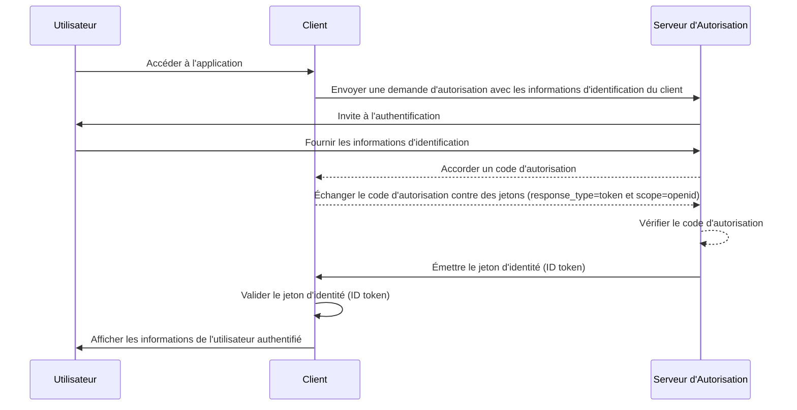

## Qu'est-ce qu'un jeton d'identité (ID token) ?

Un jeton d'identité (ID token) est un type spécifique de jeton de sécurité qui contient des informations sur l'utilisateur authentifié, livré à l'application cliente après une authentification réussie. Le jeton d'identité (ID token) est la fonctionnalité clé qui distingue OpenID Connect (OIDC) de OAuth 2.0. Alors que OAuth 2.0 se concentre uniquement sur l'autorisation, OIDC s'appuie sur celui-ci pour ajouter l'authentification (authentication) de l'utilisateur en introduisant le jeton d'identité (ID token).

Dans le processus d'authentification OIDC, une application cliente (partie de confiance) initie l'authentification en redirigeant l'utilisateur vers un serveur d'autorisation. Après une authentification réussie, le serveur répond avec un jeton d'identité parmi d'autres jetons comme le jeton d'accès (access token). Le jeton d'identité est généralement encodé en tant que JWT (JSON Web Token) et inclut des claims clés tels que l'identifiant de l'utilisateur (sub), l'issuer (iss), l'audience (aud) et d'autres informations spécifiques à l'utilisateur.

La fonction principale du jeton d'identité (ID token) est de vérifier l'identité de l'utilisateur et de transmettre cette information à l'application cliente. Cela permet à l'application d'authentifier l'utilisateur sans gérer directement les informations d'identification. Étant donné que le client ne reçoit le jeton d'identité qu'après que l'utilisateur a été authentifié par le serveur d'autorisation, le jeton d'identité peut être utilisé comme un moyen sécurisé pour vérifier l'identité de l'utilisateur.

## Comment fonctionne le jeton d'identité (ID token) ?

L'application cliente initie le processus d'authentification en redirigeant l'utilisateur vers le serveur d'autorisation. L'utilisateur s'authentifie auprès du serveur, qui émet ensuite un jeton d'identité ainsi que d'autres jetons comme le jeton d'accès (access token). Le jeton d'identité est retourné à l'application cliente, qui peut ensuite l'utiliser pour vérifier l'identité de l'utilisateur.

Étant donné qu'OIDC est un protocole populaire et standardisé, de nombreuses bibliothèques et frameworks offrent un support intégré pour gérer les jetons d'identité (ID tokens). Cela rend les jetons d'identité (ID tokens) faciles à intégrer dans les applications clientes, et ils sont largement utilisés dans les scénarios de Single Sign-On (SSO) et d'identité fédérée.

## Claims dans un jeton d'identité (ID token)

Un jeton d'identité (ID token) est un JWT (JSON Web Token) qui contient un ensemble de claims concernant l'utilisateur authentifié. Ces claims incluent à la fois des claims JWT standard définis dans la [spécification JWT](https://datatracker.ietf.org/doc/html/rfc7519#section-4), ainsi que des claims spécifiques à OIDC utilisés pour transmettre des informations sur l'identité de l'utilisateur.

Claims standards des jetons JWT :

- **iss (Issuer)** : REQUIS. Le claim d'issuer identifie l'issuer du jeton d'identité (ID token). Il s'agit généralement de l'URL du serveur d'autorisation qui a émis le jeton.
- **sub (Subject)** : REQUIS. Le claim de sujet identifie l'utilisateur auquel le jeton d'identité (ID token) se rapporte. Il s'agit généralement d'un identifiant unique pour l'utilisateur.
- **aud (Audience)** : REQUIS. Le claim d'audience identifie l'audience pour le jeton d'identité (ID token). Il s'agit généralement de l'application cliente qui a demandé le jeton.
- **exp (Expiration time)** : REQUIS. Le claim de temps d'expiration identifie le moment où le jeton expire. Après ce moment, le jeton ne devrait pas être accepté pour traitement.
- **iat (Issued at)** : REQUIS. Le claim indiquant l'heure d'émission identifie le moment où le jeton a été émis.
- **auth_time (Authentication time)** : OPTIONNEL. Le claim de temps d'authentification identifie le moment où l'utilisateur a été authentifié. Ce claim n'est présent que si l'utilisateur a été authentifié pendant la session en cours.
- **nonce** : OPTIONNEL. Le claim nonce est utilisé pour associer une session client avec un jeton d'identité (ID token). Il est généralement utilisé pour prévenir les attaques par répétition.

Claims d'informations utilisateur standards OIDC :

- **name** : Le nom complet de l'utilisateur.
- **given_name** : Le prénom de l'utilisateur.
- **family_name** : Le nom de famille de l'utilisateur.
- **middle_name** : Le deuxième prénom de l'utilisateur.
- **nickname** : Le surnom ou autre nom court de l'utilisateur.
- **preferred_username** : Le nom d'utilisateur préféré de l'utilisateur.
- **profile** : Une URL qui pointe vers la page de profil de l'utilisateur.
- **picture** : Une URL qui pointe vers la photo de profil de l'utilisateur.
- **website** : Une URL qui pointe vers le site web de l'utilisateur.
- **email** : L'adresse email de l'utilisateur.
- **email_verified** : Une valeur booléenne indiquant si l'adresse email de l'utilisateur a été vérifiée.
- **gender** : Le genre de l'utilisateur.
- **birthdate** : La date de naissance de l'utilisateur. Représentée sous forme de chaîne au format AAAA-MM-JJ.
- **zoneinfo** : Le fuseau horaire de l'utilisateur. Chaîne issue de la [base de données de fuseaux horaires IANA](https://www.iana.org/time-zones).
- **locale** : La locale de l'utilisateur. Représente la langue et la région préférées de l'utilisateur pour le formatage des dates, heures et nombres.
- **phone_number** : Le numéro de téléphone de l'utilisateur.
- **phone_number_verified** : Une valeur booléenne indiquant si le numéro de téléphone de l'utilisateur a été vérifié.
- **address** : L'adresse postale de l'utilisateur. La valeur est un objet JSON qui contient les informations d'adresse de l'utilisateur.
- **updated_at** : L'heure à laquelle les informations de l'utilisateur ont été mises à jour pour la dernière fois.

Ces claims fournissent un moyen standardisé de transmettre les informations d'identité de l'utilisateur dans le jeton d'identité (ID token). Bien que la spécification ne définisse qu'un ensemble de claims standards, des claims personnalisés peuvent également être inclus dans le jeton d'identité (ID token) pour transmettre des informations supplémentaires spécifiques à l'utilisateur si nécessaire.

## Validation du jeton d'identité (ID token)

Lorsque l'application cliente reçoit un jeton d'identité (ID token), elle doit valider le jeton pour garantir son authenticité et son intégrité. Le processus de validation implique généralement les étapes suivantes :

1. **Vérifier la signature** : Le client doit vérifier la signature du jeton d'identité (ID token) à l'aide de la clé publique du serveur d'autorisation. Cela garantit que le jeton n'a pas été falsifié et a été émis par la partie attendue.
2. **Vérifier l'issuer** : Le client doit vérifier que le claim `iss` dans le jeton d'identité (ID token) correspond à l'URL du serveur d'autorisation qui a émis le jeton. Cela aide à prévenir les attaques par substitution de jeton.
3. **Vérifier l'audience** : Le client doit vérifier que le claim `aud` dans le jeton d'identité (ID token) correspond à l'`client_id` de l'application cliente. Cela garantit que le jeton a été émis pour l'application cliente.
4. **Vérifier le temps d'expiration** : Le client doit vérifier que le claim `exp` dans le jeton d'identité (ID token) n'est pas passé. Si le jeton a expiré, il ne doit pas être accepté. Les implémentations peuvent prévoir une marge pour tenir compte des décalages horaires.
5. **Vérifier le nonce** : Si le client a inclus un paramètre `nonce` dans la demande d'authentification, il doit vérifier que le claim `nonce` dans le jeton d'identité (ID token) correspond à la valeur du paramètre `nonce`. Cela aide à prévenir les attaques par répétition.

## Jeton d'identité (ID token) vs jeton d'accès (access token)

Bien que les jetons d'identité (ID tokens) et les jetons d'accès (access tokens) soient largement utilisés dans OIDC, ils ont des objectifs différents et des caractéristiques distinctes :

|              | Jeton d'identité (ID token)                                                                            | Jeton d'accès (Access token)                                                                                                                 |
| ------------ | ------------------------------------------------------------------------------------------------------ | -------------------------------------------------------------------------------------------------------------------------------------------- |
| **But**      | Vérifie l'identité de l'utilisateur et transmet les informations de l'utilisateur à l'application cliente. | Fournit l'accès aux ressources protégées au nom de l'utilisateur.                                                                            |
| **Format**   | Typiquement un JWT qui contient des claims d'identité utilisateur.                                      | Peut être un JWT ou un opaque token (chaîne aléatoire).                                                                                      |
| **Audience** | Destiné à l'application cliente qui a demandé le jeton.                                                 | Destiné au serveur de ressources qui héberge les ressources protégées.                                                                       |
| **Durée de vie** | Jeton de courte durée généralement valide pour quelques minutes. Utilisation unique.              | Jeton de plus longue durée généralement valide pour une période plus longue (par exemple, heures). Peut être réutilisé plusieurs fois pendant sa période de validité. |
| **Contenu**  | Contient des informations sur l'identité de l'utilisateur telles que le nom, l'e-mail et d'autres données spécifiques à l'utilisateur. | Contient des informations sur les permissions (scopes) de l'utilisateur pour des ressources spécifiques.                                      |

## Meilleures pratiques pour utiliser les jetons d'identité (ID tokens)

Lors de l'utilisation des jetons d'identité (ID tokens) dans OIDC, il est important de suivre les meilleures pratiques pour assurer la sécurité et l'intégrité du processus d'authentification. Certaines des meilleures pratiques clés incluent :

1. **Valider les jetons d'identité** : Valider toujours le jeton d'identité reçu du serveur d'autorisation pour garantir son authenticité et son intégrité. Cela aide à prévenir les attaques par substitution de jeton et l'accès non autorisé.
2. **Utiliser des canaux sécurisés** : S'assurer que les jetons d'identité sont transmis via des canaux sécurisés (par exemple, HTTPS) pour éviter les interceptions et les falsifications.
3. **Protéger les informations sensibles** : Étant donné que les JWT sont généralement encodés mais non chiffrés, ce qui rend le contenu transparent, éviter l'inclusion d'informations sensibles dans la charge utile du jeton d'identité pour éviter l'exposition de données sensibles en cas de fuite de jeton.
4. **Pas pour l'autorisation** : Les jetons d'identité sont destinés à l'authentification (authentication) des utilisateurs et ne doivent pas être utilisés à des fins d'autorisation. Utiliser des jetons d'accès pour l'autorisation pour accéder aux ressources protégées.
5. **Usage unique** : Les jetons d'identité sont généralement destinés à un usage unique. Une fois qu'une application cliente a validé un jeton d'identité, elle ne doit pas être réutilisée pour des requêtes ultérieures ou la préservation de l'état de la session. Pour maintenir l'état de la session utilisateur, les applications clientes devraient utiliser des mécanismes comme les jetons de rafraîchissement (refresh tokens) et les requêtes d'échange de jetons. (Les jetons de rafraîchissement sont des jetons opaques de longue durée qui peuvent être utilisés pour obtenir de nouveaux jetons d'accès et jetons d'identité lorsqu'ils expirent.)

<SeeAlso slugs={["openid-connect", "jwt", "signing-key", "access-token"]} />