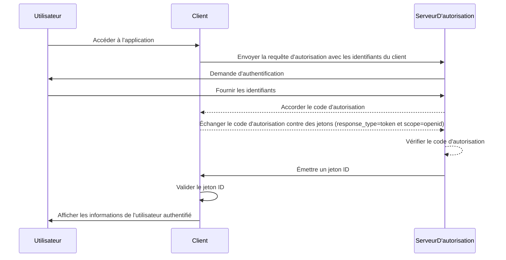

## Qu'est-ce qu'un jeton ID (ID token) ?

Un jeton ID (ID token) est un type spécifique de jeton de sécurité qui contient des informations sur l'utilisateur authentifié, délivré à l'application cliente après une <Ref slug="authentication" /> réussie. Le jeton ID (ID token) est la caractéristique clé qui distingue <Ref slug="openid-connect" /> de <Ref slug="oauth-2.0" />. Alors que OAuth 2.0 se concentre uniquement sur l'autorisation, OIDC s'appuie sur celui-ci pour ajouter l'authentification en introduisant le jeton ID.

Dans le processus d'authentification OIDC, une application cliente (partie de confiance) initie l'authentification en redirigeant l'utilisateur vers un serveur d'autorisation. Après une authentification réussie, le serveur répond avec un jeton ID, parmi d'autres jetons comme le <Ref slug="access-token" />. Le jeton ID est généralement encodé en tant que <Ref slug="jwt" /> et inclut des claims clés tels que l'identifiant de l'utilisateur (sub), l'issuer (iss), l'audience (aud) et d'autres informations spécifiques à l'utilisateur.

La fonction principale du jeton ID (ID token) est de vérifier l'identité de l'utilisateur et de transmettre cette information à l'application cliente. Cela permet à l'application d'authentifier l'utilisateur sans gérer directement les informations d'identification. Comme le client n'a reçu le jeton ID qu'après que l'utilisateur a été authentifié par le serveur d'autorisation, le jeton ID peut être utilisé comme un moyen sécurisé de vérifier l'identité de l'utilisateur.

## Comment fonctionne le jeton ID (ID token) ?

L'application cliente initie le processus d'authentification en redirigeant l'utilisateur vers le serveur d'autorisation. L'utilisateur s'authentifie auprès du serveur, qui émet ensuite un jeton ID avec d'autres jetons comme le jeton d'accès. Le jeton ID est renvoyé à l'application cliente, qui peut alors l'utiliser pour vérifier l'identité de l'utilisateur.

Étant donné que OIDC est un protocole populaire et standardisé, de nombreuses bibliothèques et frameworks offrent un support intégré pour gérer les jetons ID. Cela rend les jetons ID faciles à intégrer dans les applications clientes et largement utilisés dans les scénarios de <Ref slug="single-sign-on" /> et d'identité fédérée.

## Claims dans un jeton ID (ID token)

Un jeton ID est un JWT qui contient un ensemble de <Ref slug="claim" /> au sujet de l'utilisateur authentifié. Ces claims incluent à la fois des claims JWT standard définis dans la [spécification JWT](https://datatracker.ietf.org/doc/html/rfc7519#section-4), ainsi que des claims spécifiques à OIDC qui sont utilisés pour transmettre des informations sur l'identité de l'utilisateur.

Claims standard du token JWT :

- **iss (Issuer)**: REQUIS. Le claim issuer identifie l'issuer du jeton ID (ID token). Il s'agit généralement de l'URL du serveur d'autorisation qui a émis le jeton.
- **sub (Subject)**: REQUIS. Le claim subject identifie l'utilisateur concerné par le jeton ID. Il s'agit généralement d'un identifiant unique pour l'utilisateur.
- **aud (Audience)**: REQUIS. Le claim audience identifie l'<Ref slug="audience" /> du jeton ID. Il s'agit généralement de l'application cliente qui a demandé le jeton.
- **exp (Expiration time)**: REQUIS. Le claim expiration time identifie l'heure à laquelle le jeton expire. Après cette heure, le jeton ne doit pas être accepté pour traitement.
- **iat (Issued at)**: REQUIS. Le claim issued at identifie l'heure à laquelle le jeton a été émis.
- **auth_time (Authentication time)**: OPTIONNEL. Le claim authentication time identifie le moment où l'utilisateur a été authentifié. Ce claim n'est présent que si l'utilisateur a été authentifié lors de la session actuelle.
- **nonce**: OPTIONNEL. Le claim nonce est utilisé pour associer une session client avec un jeton ID. Il est généralement utilisé pour prévenir les attaques de relecture.

Claims standard des informations utilisateur OIDC :

- **name**: Le nom complet de l'utilisateur.
- **given_name**: Le prénom de l'utilisateur.
- **family_name**: Le nom de famille de l'utilisateur.
- **middle_name**: Le deuxième prénom de l'utilisateur.
- **nickname**: Le surnom de l'utilisateur ou un autre nom court.
- **preferred_username**: Le nom d'utilisateur préféré de l'utilisateur.
- **profile**: Une URL qui pointe vers la page de profil de l'utilisateur.
- **picture**: Une URL qui pointe vers la photo de profil de l'utilisateur.
- **website**: Une URL qui pointe vers le site web de l'utilisateur.
- **email**: L'adresse e-mail de l'utilisateur.
- **email_verified**: Une valeur booléenne indiquant si l'adresse e-mail de l'utilisateur a été vérifiée.
- **gender**: Le sexe de l'utilisateur.
- **birthdate**: La date de naissance de l'utilisateur. Représentée sous forme de chaîne au format AAAA-MM-JJ.
- **zoneinfo**: Le fuseau horaire de l'utilisateur. Chaîne de la [base de données des fuseaux horaires IANA](https://www.iana.org/time-zones).
- **locale**: La région linguistique de l'utilisateur. Représente la langue et la région préférées de l'utilisateur pour le formatage des dates, des heures et des nombres.
- **phone_number**: Le numéro de téléphone de l'utilisateur.
- **phone_number_verified**: Une valeur booléenne indiquant si le numéro de téléphone de l'utilisateur a été vérifié.
- **address**: L'adresse postale de l'utilisateur. La valeur est un objet JSON qui contient les informations d'adresse de l'utilisateur.
- **updated_at**: L'heure à laquelle les informations de l'utilisateur ont été mises à jour pour la dernière fois.

Ces claims fournissent un moyen standardisé de transmettre des informations sur l'identité de l'utilisateur dans le jeton ID. Bien que la spécification ne définisse qu'un ensemble de claims standard, des claims personnalisés peuvent également être inclus dans le jeton ID pour transmettre des informations supplémentaires spécifiques à l'utilisateur selon les besoins.

## Validation du jeton ID (ID token)

Lorsque l'application cliente reçoit un jeton ID, elle doit valider le jeton pour s'assurer de son authenticité et de son intégrité. Le processus de validation implique généralement les étapes suivantes :

1. **Vérifier la signature**: Le client doit vérifier la signature du jeton ID en utilisant la clé publique du serveur d'autorisation. Cela garantit que le jeton n'a pas été altéré et a été émis par la partie attendue.
2. **Vérifier l'issuer**: Le client doit vérifier que le claim `iss` dans le jeton ID correspond à l'URL du serveur d'autorisation qui a émis le jeton. Cela aide à prévenir les attaques de substitution de jeton.
3. **Vérifier l'audience**: Le client doit vérifier que le claim `aud` dans le jeton ID correspond à l'`client_id` de l'application cliente. Cela garantit que le jeton a été émis pour l'application cliente.
4. **Vérifier l'heure d'expiration**: Le client doit vérifier que le claim `exp` dans le jeton ID n'a pas été dépassé. Si le jeton a expiré, il ne doit pas être accepté. Les implémentations peuvent prévoir une marge pour tenir compte de l'écart d'horloge.
5. **Vérifier le nonce**: Si le client a inclus un paramètre `nonce` dans la requête d'authentification, il doit vérifier que le claim `nonce` dans le jeton ID correspond à la valeur du paramètre `nonce`. Cela aide à prévenir les attaques de relecture.

## Jeton ID (ID token) vs jeton d'accès (access token)

Bien que les jetons ID et les jetons d'accès soient largement utilisés dans OIDC, ils ont des objectifs différents et des caractéristiques distinctes :

|              | Jeton ID (ID token)                                                                   | Jeton d'accès (Access token)                                                                                                             |
| ------------ | ------------------------------------------------------------------------------------- | ---------------------------------------------------------------------------------------------------------------------------------------- |
| **Objectif** | Vérifie l'identité de l'utilisateur et transmet des informations utilisateur à l'application cliente.  | Fournit l'accès à des ressources protégées au nom de l'utilisateur.                                                                                     |
| **Format**   | Typiquement un JWT contenant des claims d'identité utilisateur.                        | Peut être soit un JWT, soit un <Ref slug="opaque-token" />.                                                                               |
| **Audience** | Destiné à l'application cliente qui a demandé le jeton.                               | Destiné au serveur de ressources qui héberge les ressources protégées.                                                                   |
| **Durée de vie** | Jeton de courte durée généralement valide pour quelques minutes. Utilisation unique. | Jeton de plus longue durée qui est valide pour une période plus longue (ex. : heures). Peut être réutilisé plusieurs fois pendant sa validité. |
| **Contenu**  | Contient des informations sur l'identité de l'utilisateur telles que le nom, l'e-mail et d'autres données spécifiques à l'utilisateur.  | Contient des informations sur les permissions de l'utilisateur (scopes) pour des ressources spécifiques.                                    |

## Meilleures pratiques pour l'utilisation des jetons ID (ID tokens)

Lors de l'utilisation de jetons ID dans OIDC, il est important de suivre les meilleures pratiques pour assurer la sécurité et l'intégrité du processus d'authentification. Certaines pratiques clés incluent :

1. **Valider les jetons ID** : Validez toujours le jeton ID reçu du serveur d'autorisation pour garantir son authenticité et son intégrité. Cela aide à prévenir les attaques de substitution de jeton et l'accès non autorisé.
2. **Utiliser des canaux sécurisés** : Assurez-vous que les jetons ID sont transmis via des canaux sécurisés (ex. : HTTPS) pour éviter l'interception et la falsification.
3. **Protéger les informations sensibles** : Comme les JWT sont généralement encodés mais non chiffrés, cela rend le contenu transparent. Évitez d'inclure des informations sensibles dans la charge utile du jeton ID pour éviter l'exposition de données sensibles en cas de fuite de jeton.
4. **Ne pas utiliser pour l'autorisation** : Les jetons ID sont destinés à l'authentification de l'utilisateur et ne doivent pas être utilisés à des fins d'autorisation. Utilisez des jetons d'accès pour l'autorisation d'accéder à des ressources protégées.
5. **Utilisation unique** : Les jetons ID sont généralement destinés à une utilisation unique. Une fois qu'une application cliente a validé un jeton ID, il ne doit pas être réutilisé pour des requêtes ultérieures ou la préservation de l'état de la session. Pour maintenir l'état de la session de l'utilisateur, les applications clientes doivent utiliser des mécanismes comme le <Ref slug="refresh-token" /> et les requêtes d'échange de jeton. (Les jetons de rafraîchissement sont des jetons opaques de longue durée qui peuvent être utilisés pour obtenir de nouveaux jetons d'accès et jetons ID lorsqu'ils expirent.)

<SeeAlso slugs={["openid-connect", "jwt", "signing-key", "access-token"]} />