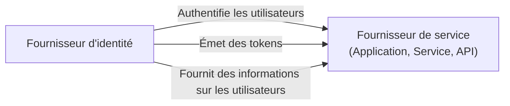
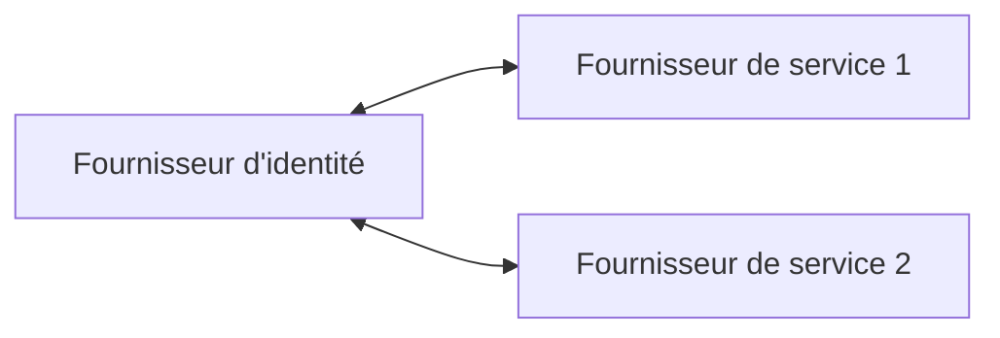

## Qu'est-ce qu'un fournisseur d'identité (IdP) ?

Dans le domaine de <Ref slug="iam" />, un fournisseur d'identité (IdP) est le service central pour la gestion des identités. Il est responsable d'authentifier les utilisateurs, d'émettre des tokens d'identité et de fournir des informations sur les utilisateurs aux <Ref slug="service-provider">fournisseurs de services</Ref> (par exemple, applications, services, API).

En plus de <Ref slug="authentication" />, les fournisseurs d'identité modernes sont également responsables de <Ref slug="authorization" /> (application des politiques de <Ref slug="access-control" />) et du support de fonctionnalités avancées telles que <Ref slug="single-sign-on" /> et <Ref slug="multi-tenancy" />.

## Normes des fournisseurs d'identité

En raison de la nature de la gestion des identités et de la nécessité d'interopérabilité, il serait impraticable et inefficace de créer des fournisseurs d'identité sans normes. Voici quelques scénarios typiques :

- Deux fournisseurs d'identité doivent communiquer entre eux pour échanger des informations sur les utilisateurs (par exemple, connexion sociale).
- Une application doit authentifier les utilisateurs en utilisant plusieurs fournisseurs d'identité (par exemple, identité fédérée).
- Un fournisseur d'identité doit prendre en charge plusieurs types de clients (par exemple, web, mobile, IoT).

Pour répondre à ces scénarios, l'industrie a développé plusieurs normes populaires pour les fournisseurs d'identité :

- <Ref slug="oauth-2.0" /> : Un cadre d'autorisation largement utilisé qui permet aux applications d'obtenir un accès au nom des utilisateurs ou des services.
- <Ref slug="openid-connect" /> : Une couche d'identité construite sur OAuth 2.0 qui fournit l'authentification et les informations des utilisateurs.
- <Ref slug="saml" /> : Une norme pour échanger des données d'authentification et d'autorisation entre domaines de sécurité.

Pour les nouvelles applications, OpenID Connect (OIDC) est la norme recommandée à utiliser, que ce soit pour créer un fournisseur d'identité ou pour s'intégrer à des fournisseurs d'identité existants.

## Architecture du fournisseur d'identité

Le terme "fournisseur d'identité" ne spécifie pas une architecture ou une implémentation particulière. Autrement dit, un fournisseur d'identité peut également être une application monolithique, un microservice ou un service cloud.

En raison de la complexité et de la criticité de la gestion des identités, les applications modernes ont tendance à utiliser des fournisseurs d'identité spécialisés qui sont des services autonomes ou des solutions de fournisseurs.

## Fonctionnalités des fournisseurs d'identité

Les fournisseurs d'identité modernes offrent un large éventail de fonctionnalités pour prendre en charge divers cas d'utilisation et exigences. Voici quelques fonctionnalités courantes :

- <Ref slug="authentication" /> : Vérifier l'identité des utilisateurs en utilisant diverses méthodes (par exemple, nom d'utilisateur/mot de passe, connexion sociale, <Ref slug="mfa" />).
- <Ref slug="authorization" /> : Appliquer des politiques de contrôle d'accès et gérer les permissions des utilisateurs (par exemple, <Ref slug="rbac" />, <Ref slug="abac" />).
- **Gestion des utilisateurs** : Créer, mettre à jour et supprimer des comptes et profils d'utilisateurs ; fournir des données utilisateurs aux <Ref slug="service-provider">fournisseurs de services</Ref>.
- **Gestion des tokens** : Émettre et gérer des tokens d'identité (par exemple, ID token, access token, refresh token).
- <Ref slug="single-sign-on" /> : Permettre aux utilisateurs de s'authentifier une fois et d'accéder à plusieurs applications.
- <Ref slug="multi-tenancy" /> : Prendre en charge plusieurs organisations ou locataires avec données et configurations utilisateur isolées.

<SeeAlso slugs={["service-provider", "iam", "openid-connect", "oauth-2.0"]} />

<Resources
  urls={[
    "https://blog.logto.io/secure-cloud-apps-with-oauth-and-openid-connect",
    "https://blog.logto.io/incorporate-identity-solution",
    "https://blog.logto.io/centralized-identity-system"
  ]}
/>
