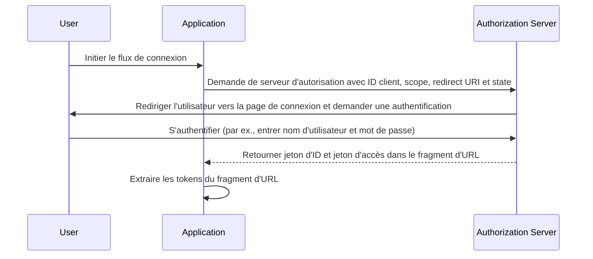

## Qu'est-ce que le flux implicite (Implicit flow)

Le flux implicite OIDC (OpenID Connect) est un processus d'authentification principalement utilisé par les applications clientes implémentées dans un navigateur utilisant un langage de script, par exemple, les applications monopage (SPAs). Il permet aux applications clientes d'obtenir directement des jetons d'ID et des jetons d'accès (access tokens) du serveur d'autorisation sans effectuer l'authentification du client (client).

## Comment fonctionne le flux implicite (Implicit flow) ?

Les étapes principales du flux implicite sont les suivantes :

1. **Envoi de la demande d'authentification (Authentication request)** : L'utilisateur initie le flux en cliquant généralement sur un lien ou un bouton dans l'application pour se connecter. L'application envoie une demande d'authentification au point d'autorisation du serveur d'autorisation. Le serveur d'autorisation valide les paramètres et redirige l'utilisateur pour s'authentifier sur la page de connexion du serveur d'autorisation.
2. **Authentification de l'utilisateur** : L'utilisateur s'authentifie sur le serveur d'autorisation (par exemple, en entrant un nom d'utilisateur et un mot de passe).
3. **Réponse du serveur d'autorisation** : Le serveur d'autorisation renvoie un jeton d'ID et, si demandé, un jeton d'accès (access token) à l'application cliente sous forme de fragment d'URL.
4. **Traitement des tokens par le client** : L'application cliente extrait les tokens du fragment d'URL.



### Demande d'authentification (Authentication request)

Les paramètres de la demande sont les suivants :
- **client_id** : REQUIS. Identifiant client valide OAuth 2.0, qui est disponible dans Logto en tant qu'ID de l'application (ou app ID).
- **scope** : REQUIS. Cette valeur spécifie un ensemble de ressources que l'utilisateur demande au serveur d'autorisation. Par exemple, `openid profile email`
- **response_type** : REQUIS. La valeur est soit `id_token` soit `id_token token`. Aucun jeton d'accès (access token) n'est retourné lorsque la valeur est `id_token`.
- **redirect_uri** : REQUIS. L'URI vers lequel la réponse d'authentification sera envoyée, et doit correspondre exactement à l'URI de redirection que le client a préenregistré dans le <Ref slug="openid-connect" headingId="openid-provider-op" />. Par exemple, `URI de redirection de connexion` dans Logto Admin Console.
- **nonce** : REQUIS. Une chaîne aléatoire utilisée pour atténuer les attaques de relecture, qui est transmise inchangée de la demande d'authentification à la déclaration du jeton d'ID (ID token claim).

### Exemple de demande d'authentification

```bash
curl -X GET "https://authorization-server.com/auth" \
  -d "response_type=id_token token" \
  -d "client_id=YOUR_APPLICATION_ID" \
  -d "redirect_uri=https://yourapp.com/callback" \
  -d "scope=openid profile email" \
  -d "nonce=RANDOM_STRING"
```

## Limitations

Le flux implicite a été développé à une époque où les navigateurs n'adoptaient pas encore largement le Cross-Origin Resource Sharing (CORS). Par conséquent, l'envoi de requêtes POST au serveur d'autorisation hébergé sur un domaine différent est interdit.

En raison de cette limitation, le serveur d'autorisation revient directement les tokens dans le fragment d'URL, ce qui peut les exposer à l'utilisateur final et aux applications ayant accès à l'agent utilisateur de l'utilisateur final.

De plus, l'authentification du client (client) n'est pas effectuée dans le flux implicite, ce qui signifie que toute application peut prétendre être ce client demandant l'authentification, car l'ID client est toujours exposé dans les applications basées sur le navigateur.

En raison des limitations ci-dessus, le flux implicite est généralement considéré comme moins sécurisé que le Flux de Code d'Autorisation (Authorization Code Flow).

## Alternatives au flux implicite (Implicit flow)

Compte tenu des limitations de sécurité du flux implicite, d'autres flux sont souvent recommandés :
- **Flux de Code d'Autorisation (Authorization Code Flow)** : Ce flux implique une étape supplémentaire où le client échange un code d'autorisation pour des tokens, fournissant une couche supplémentaire de sécurité.
- **PKCE (Proof Key for Code Exchange)** : Une extension au flux de Code d'Autorisation qui ajoute une couche supplémentaire de sécurité en utilisant un vérificateur de code et un défi de code.

<SeeAlso slugs={['device-flow', 'authorization-code-flow', 'client-credentials-flow']} />

<Resources
  urls={[
    "https://blog.logto.io/implicit-flow-is-dead",
    {
      url: "https://tools.ietf.org/html/rfc6749#section-4.2",
      result: {
        ogTitle: "The OAuth 2.0 Authorization Framework: Implicit Grant",
        ogDescription: "The implicit grant type is used to obtain access tokens (it does not support the issuance of refresh tokens) and is optimized for public clients known to operate a particular redirection URI. These clients are typically implemented in a browser using a scripting language such as JavaScript."
      }
    },
    "https://openid.net/specs/openid-connect-core-1_0.html",
  ]}
/>