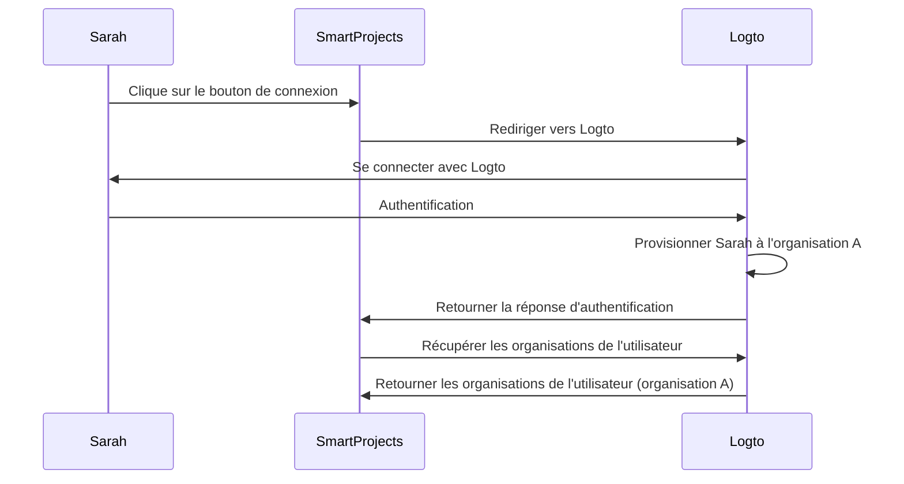
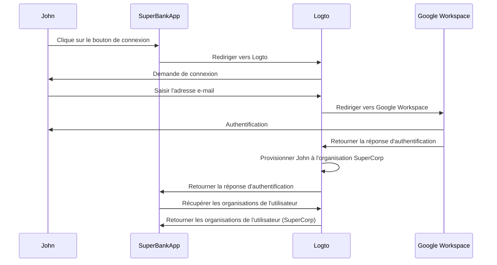

## Qu'est-ce que le provisionnement juste-à-temps ?

Le provisionnement juste-à-temps (JIT) est un processus utilisé dans <Ref slug="iam" /> où les comptes utilisateurs sont provisionnés selon l'identité de l'utilisateur et la configuration du système à la volée lorsque l'utilisateur tente de se connecter pour la première fois.

## Quels sont les cas d'utilisation du provisionnement juste-à-temps ?

Ces cas sont courants lors de la création d'une application B2B impliquant une architecture multi-locataire, Enterprise SSO (Enterprise SSO), ou nécessitant des fonctionnalités d'intégration d'équipe. Voici quelques scénarios d'exemple que vous ou votre client pouvez rencontrer.

### Intégration des employés

Imaginez que l'un de vos clients, *SuperFantasy*, connaisse des embauches fréquentes ou une croissance rapide et puisse utiliser le provisionnement JIT pour configurer rapidement les comptes utilisateurs pour les nouveaux employés. *SuperFantasy* utilise Logto pour la gestion des identités et des accès et SmartProjects pour la gestion de projet. Lorsqu'une nouvelle employée, Sarah, se connecte à SmartProjects pour la première fois, son compte est automatiquement créé et configuré en fonction de ses identifiants Logto.

Selon le diagramme ci-dessus, lorsque Sarah se connecte à SmartProjects pour la première fois, son compte est automatiquement provisionné à l'organisation A dans Logto. Ce processus garantit que Sarah dispose de l'accès nécessaire à SmartProjects sans nécessiter d'intervention manuelle de l'équipe informatique.

### Intégration des clients d'entreprise

Imaginez un autre client, *SuperBank*, une institution financière qui fournit des services bancaires en ligne à ses clients. *SuperBank* utilise Logto pour la gestion des identités et des accès et SuperBankApp pour la banque en ligne. *SuperBank* a récemment signé un contrat avec un nouveau client d'entreprise, *SuperCorp*, pour fournir des services bancaires en ligne à ses employés.

*SuperCorp* utilise Google Workspace pour ses comptes employés. SuperBankApp doit s'assurer que lorsqu'un employé de *SuperCorp* se connecte pour la première fois, son compte est automatiquement ajouté à l'organisation *SuperCorp* dans Logto.

Dans le diagramme ci-dessus, lorsque John se connecte à SuperBankApp pour la première fois, son compte est automatiquement provisionné à l'organisation SuperCorp dans Logto selon son identité Google Workspace.

## Est-ce spécifique à SAML et Enterprise SSO ?

Le provisionnement juste-à-temps (JIT) est souvent associé à <Ref slug="enterprise-sso" /> dans l'authentification SAML, mais il n'est pas exclusif à <Ref slug="saml" />. Le provisionnement JIT peut également être utilisé avec d'autres protocoles d'authentification comme <Ref slug="oauth-2.0" /> et <Ref slug="openid-connect" />, et il ne nécessite pas toujours une configuration <Ref slug="enterprise-sso" />.

Par exemple, le provisionnement JIT basé sur l'e-mail peut être utilisé lorsque votre <Ref slug="identity-provider" /> prend en charge cette fonctionnalité. Dans ce cas, l'adresse e-mail de l'utilisateur est le seul attribut requis pour le provisionnement, quel que soit le protocole d'authentification ou la configuration SSO.

## S'applique-t-il aux nouveaux utilisateurs ou aux utilisateurs existants de l'application ?

Le provisionnement juste-à-temps (JIT) se réfère généralement à la première tentative d'accès à une application. Cependant, différents produits perçoivent cette fonctionnalité différemment. Certains utilisent le provisionnement JIT uniquement pour la création d'identité et de compte, tandis que d'autres incluent également des mises à jour de compte juste-à-temps, telles que le reprovisionnement et la synchronisation des attributs.

Par exemple, le provisionnement JIT SAML permet d'accorder et de révoquer des adhésions à des groupes dans le cadre du provisionnement. Il peut également mettre à jour les utilisateurs provisionnés pour garder leurs attributs dans le magasin <Ref slug="service-provider" /> synchronisés avec les attributs du magasin utilisateur <Ref slug="identity-provider" />.

Si vous souhaitez envisager le scénario de connexion d'utilisateur existant ultérieur, assurez-vous d'avoir un système de provisionnement robuste avec votre système JIT. Par exemple :

- **Résolution des conflits** : Votre système doit avoir une stratégie pour gérer les conflits si un compte existe déjà avec des informations différentes de celles fournies par le IdP lors du processus JIT. Cela peut nécessiter un contrôle détaillé des politiques de votre organisation et de la configuration du IdP.
- **Pistes d'audit** : Il est important de conserver des journaux des créations de nouveaux comptes et des mises à jour des comptes existants via les processus JIT pour des raisons de sécurité et de conformité.
- **Performance** : Bien que le provisionnement JIT se fasse rapidement, considérez l'impact potentiel sur les temps de connexion, en particulier pour les utilisateurs existants si vous mettez à jour leurs informations à chaque connexion.
- **Cohérence des données** : Assurez-vous que votre processus de provisionnement JIT maintient la cohérence des données, en particulier lors de la mise à jour des comptes utilisateurs existants.

## Quelle est la différence entre JIT et System for Cross-domain Identity Management (SCIM) ?

SCIM est un protocole standard ouvert conçu pour simplifier et automatiser la gestion des identités des utilisateurs à travers différents systèmes et domaines. Il est couramment utilisé dans les scénarios de synchronisation de répertoire.

La principale différence entre JIT et SCIM est que JIT se réfère souvent à la première tentative d'accès à une application (ou à l'intégration de nouveaux utilisateurs), et c'est un terme large qui décrit le processus de provisionnement dynamique des comptes utilisateurs ; tandis que SCIM est un protocole spécifique pour gérer le cycle de vie des utilisateurs à travers les systèmes et n'est pas limité à la première connexion.

De plus, JIT manque d'une implémentation standardisée à travers les systèmes, tandis que SCIM est un protocole standardisé défini par [RFC 7644](https://datatracker.ietf.org/doc/html/rfc7644) pour la gestion des identités.

Certaines grandes organisations utilisent SCIM pour le provisionnement des comptes, l'intégrant à leurs propres systèmes. Cela peut être très complexe et varier selon les cas. Pour la plupart des cas d'utilisation, le provisionnement JIT est une approche plus simple et plus directe.

<Resources urls={['https://blog.logto.io/jit-provisioning', 'https://datatracker.ietf.org/doc/html/rfc7644']} />