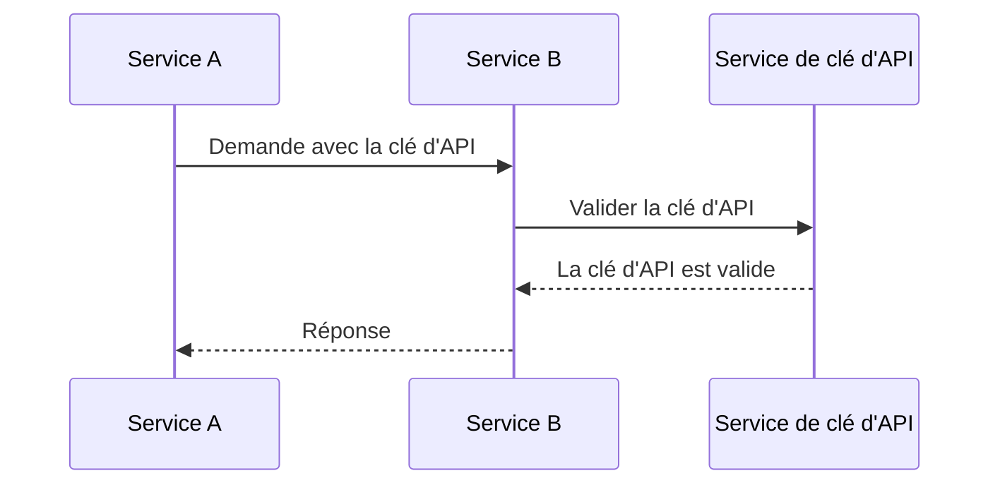
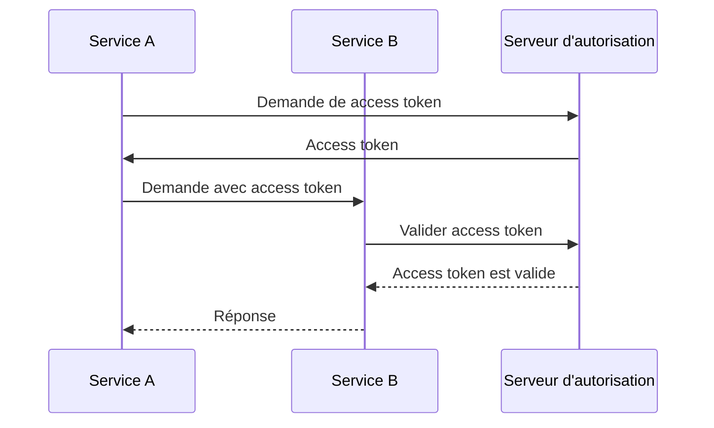
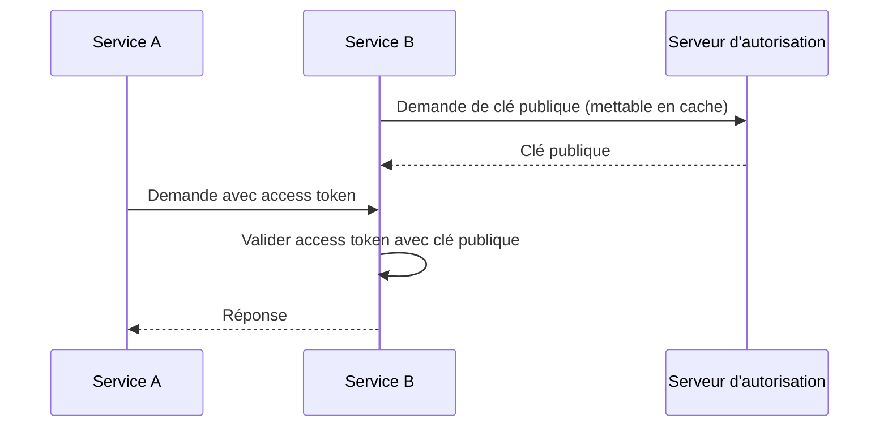

## Qu'est-ce que la communication machine à machine ?

La communication machine à machine (M2M) désigne l'échange automatisé de données entre appareils sans intervention humaine. Dans le contexte de l'authentification et de l'autorisation, la communication M2M implique souvent une application cliente qui doit accéder à des ressources, où l'application cliente est une machine (service) ou une machine agissant au nom d'un utilisateur.

## Pourquoi devons-nous gérer la communication machine à machine ?

Lorsque tu n'as qu'un seul service sans dépendances, il est probable qu'il n'ait pas besoin de communiquer avec d'autres services. Au fur et à mesure que ton système se développe ou que tu souhaites t'intégrer à un système de gestion des identités et des accès (IAM), il est nécessaire de gérer la communication machine à machine.

Cependant, cela semble encore simple : il te suffit d'identifier le service et de l'authentifier. Mais en réalité, il y a plusieurs défis à relever :

### 1. Authentification (Authentication)

Comment authentifies-tu le service ? Tu ne peux pas utiliser un nom d'utilisateur et un mot de passe, car il n'y a pas d'humain pour les entrer. Tu dois utiliser un autre mécanisme, tel que des clés d'API, des certificats clients ou les client credentials OAuth.

### 2. Autorisation (Authorization)

Une fois le service authentifié, comment détermines-tu ce que le service peut faire ? Tu dois définir les permissions et les rôles (roles) pour le service, de la même manière que tu les définis pour les utilisateurs. La dernière chose que tu souhaites est de coder en dur les permissions dans ton code.

### 3. Sécurité

Comment assures-tu que la communication entre les services est sécurisée ? Les informations d'identification seront-elles mises à jour régulièrement ? Comment surveilles-tu et audits-tu la communication ?

### 4. Évolutivité

À mesure que le nombre de services augmente, comment gères-tu l'authentification et l'autorisation pour chaque service ?

## Les approches courantes de la communication machine à machine

Face aux défis à relever, l'industrie propose plusieurs approches courantes :

### 1. Clés d'API

Les <Ref slug="api-key">clés d'API</Ref> sont un moyen simple d'authentifier les services. Chaque service peut avoir une ou plusieurs clés d'API, qui sont utilisées pour l'authentification (et parfois l'autorisation). Tu peux voir certains services te demander de fournir une clé d'API dans l'en-tête de la requête, tel que `X-API-Key: your-api-key`.

Un exemple non normatif de fonctionnement des clés d'API :

Avantages :

- Simple à implémenter et à utiliser.
- Avec une génération aléatoire sécurisée et suffisamment longue, les clés d'API sont difficiles à deviner.
- La validation est dynamique, ce qui signifie que tu peux révoquer une clé d'API à tout moment.

Inconvénients :

- Nécessite une communication réseau pour valider la clé d'API.
- Ce n'est pas autonome, ce qui signifie qu'un service est requis pour l'introspection.
- L'autre service a le même niveau d'accès que le service propriétaire de la clé d'API (cela peut être atténué en partie en utilisant une passerelle d'API).
- Il est difficile de gérer un grand nombre de clés d'API à travers les services.

### 2. Client credentials OAuth

OAuth (ou OIDC, car OpenID Connect est basé sur OAuth 2.0) <Ref slug="client-credentials-flow" /> est un moyen plus avancé d'authentifier les services. Il est basé sur le cadre OAuth 2.0, largement utilisé pour l'authentification et l'autorisation des utilisateurs. Avec les client credentials OAuth, un service peut obtenir un access token en présentant son ID client et son secret client au serveur d'autorisation (authorization server).

Un exemple non normatif de fonctionnement des client credentials OAuth :

Généralement, le access token est un JSON Web Token (JWT), qui contient des informations sur le service et ses permissions. Ensuite, l'autre service peut valider le access token sans communiquer avec le serveur d'autorisation (à condition qu'il dispose de la clé publique pour vérifier la signature du JWT). Le flux de travail devient :

Pour plus d'informations sur les JSON Web Tokens, voir <Ref slug="jwt" />.

Avantages (avec JWT) :

- Autonome, ce qui signifie que l'autre service peut immédiatement connaître les informations nécessaires comme les permissions sans communication réseau supplémentaire.
- Le access token peut avoir une durée de vie courte, réduisant ainsi le risque d'utilisation abusive.
- L'autre service n'a pas besoin de connaître le secret client, seulement la clé publique pour vérifier la signature du JWT.
- Le access token peut être utilisé pour auditer les actions du service (par exemple, quel service a accédé à quelle ressource).
- Il est plus facile de gérer un grand nombre de services, car cela établit une frontière claire entre services et permissions.

Inconvénients :

- Un peu plus complexe à implémenter et à utiliser que les clés d'API.
- Si l'autre service effectue uniquement une validation hors ligne, il peut ne pas savoir si le access token est révoqué.

### 3. Mutual TLS

Le Mutual TLS (mTLS) est un moyen d'authentifier les services en utilisant des certificats clients. Avec mTLS, chaque service détient un certificat client avec une clé privée, et l'autre service vérifie le certificat en utilisant la clé publique. Cependant, mTLS se concentre sur la couche TLS, ce qui signifie qu'il ne convient généralement pas seul pour l'authentification et l'autorisation au niveau de l'application.

Pour des cas d'utilisation avancés, mTLS peut être combiné avec des access tokens liés aux certificats pour sécuriser davantage la communication. Voir [RFC 8705: OAuth 2.0 Mutual-TLS Client Authentication and Certificate-Bound Access Tokens](https://datatracker.ietf.org/doc/html/rfc8705) pour plus d'informations.

Avantages :

- Authentification forte, car elle est basée sur la cryptographie à clé publique.
- La communication est chiffrée et sécurisée par défaut.
- Le certificat client peut être utilisé pour identifier le service, de la même manière qu'un JWT fonctionne.

Inconvénients :

- Plus complexe à implémenter et à gérer que les clés d'API et les client credentials OAuth.
- Le certificat client doit être mis à jour régulièrement.
- Une connaissance technique plus approfondie est requise pour gérer correctement les certificats clients.
- L'autre service peut ne pas supporter mTLS, ce qui signifie que tu dois prévoir un mécanisme de repli.

<SeeAlso slugs={["api-key", "client-credentials-flow", "jwt"]} />