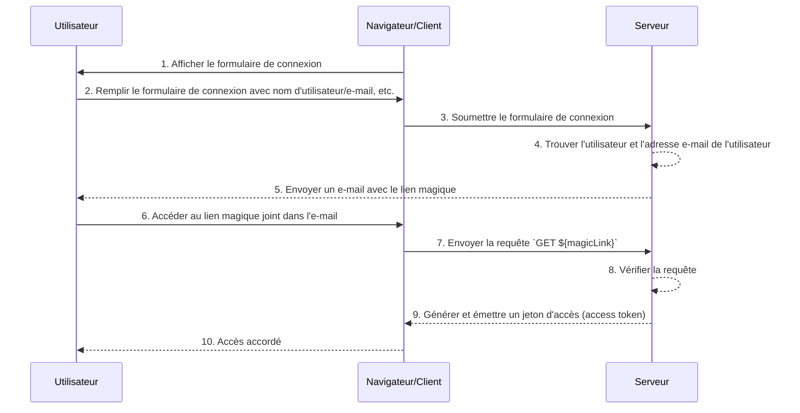

## Qu'est-ce qu'un lien magique (Magic link) ?

Un lien magique (Magic link) est un lien à usage unique envoyé à l'utilisateur pendant le processus d'authentification.

En accédant à ce lien, l'utilisateur complète le flux d'autorisation (authorization flow) requis pour accéder à la ressource souhaitée et se voit accorder l'accès approprié aux ressources. Par la suite, le lien magique devient invalide.

## Quelle est la différence entre un lien magique (Magic link) et un mot de passe à usage unique (OTP) ?

Supposons que l'utilisateur utilise un e-mail pour recevoir un lien magique (Magic link) ou un <Ref slug='otp' />.

Dans de nombreux cas, les utilisateurs utilisent un e-mail pour recevoir un OTP afin de vérifier la connexion ou comme facteur de vérification supplémentaire pour <Ref slug='mfa' />. Quelle est la différence entre l'utilisation d'un lien magique par e-mail et un OTP par e-mail ?

Avec un OTP, l'utilisateur doit vérifier son e-mail, se souvenir de l'OTP, puis le saisir dans le processus de connexion/vérification. Cela nécessite que l'utilisateur passe manuellement et de manière répétée entre différentes applications ou pages.

En utilisant un lien magique par e-mail, l'utilisateur n'a qu'à ouvrir l'e-mail contenant le lien magique dans son application de messagerie et cliquer sur le lien. Cela offre une expérience utilisateur plus simple.

De plus, l'utilisation d'un lien magique permet d'inclure des informations au-delà d'un jeton à usage unique dans le lien, telles que des informations liées à la session pour la connexion. Cela peut améliorer à la fois la sécurité et l'expérience utilisateur.

## Comment fonctionne un lien magique (Magic link) ?

Dans ce diagramme de séquence, nous illustrons comment un utilisateur se connecte et obtient l'accès aux ressources appropriées en utilisant un lien magique (Magic link).

Dans ce diagramme de séquence, nous supposons que le lien magique est envoyé par e-mail. Cependant, il existe d'autres méthodes possibles pour envoyer un lien magique, comme l'envoyer par message texte sur un téléphone mobile. Ces alternatives ne seront pas couvertes ici puisque les flux sont presque identiques.

1. **Afficher le formulaire de connexion**
Le navigateur/client initie le processus d'authentification en affichant à l'utilisateur un formulaire de connexion.
2. **L'utilisateur remplit le formulaire de connexion**
L'utilisateur entre son identifiant, tel que le nom d'utilisateur, l'adresse e-mail ou le numéro de téléphone, dans le formulaire de connexion.
Les informations fournies doivent être suffisantes pour aider le système à identifier un utilisateur unique. Par exemple, dans la plupart des systèmes, les noms d'utilisateur utilisés pour se connecter sont uniques. Dans de tels systèmes, les utilisateurs n'ont besoin de fournir que leur nom d'utilisateur pour aider le système à identifier de manière unique le compte auquel ils souhaitent se connecter.
3. **Soumettre le formulaire de connexion**
Le navigateur/client soumet le formulaire au serveur, contenant les informations de l'utilisateur décrites à l'étape 2.
4. **Trouver l'utilisateur et l'e-mail**
Le serveur traite la requête en localisant l'utilisateur unique dans la base de données et en récupérant l'adresse e-mail associée à l'utilisateur.
5. **Envoyer un e-mail avec le lien magique**
Le serveur envoie un e-mail à l'adresse e-mail de l'utilisateur. Cet e-mail contient un lien magique pour l'authentification.
6. **L'utilisateur accède au lien magique**
L'utilisateur reçoit l'e-mail et clique sur le lien magique fourni à l'intérieur.
7. **Envoyer une requête GET avec le lien magique**
Le navigateur/client envoie une requête `GET` au serveur, en utilisant l'URL du lien magique.
8. **Vérifier la requête**
Le serveur vérifie la requête pour s'assurer que le lien magique est valide, non utilisé et non expiré.
9. **Générer et émettre un jeton d'accès (access token)**
Une fois la requête vérifiée, le serveur génère un jeton d'accès et l'émet au navigateur/client.
10. **Accorder l'accès**
Le navigateur/client reçoit le jeton d'accès et permet à l'utilisateur d'accéder à la ressource demandée.

## Quels sont les avantages des liens magiques (Magic links) ?

Les liens magiques (Magic links) améliorent l'architecture de sécurité des systèmes d'authentification en utilisant un modèle d'interaction basé sur des jetons. Chaque lien est crypté de manière unique et inclut généralement un horodatage d'expiration. Étant donné leur nature éphémère, même si un lien magique est intercepté ou divulgué, sa courte fenêtre de validité limite les opportunités d'exploitation malveillante.

De plus, comme l'utilisation de liens magiques nécessite une méthode de réception contrôlée par l'utilisateur, telle qu'une adresse e-mail ou un numéro de téléphone de confiance, cela fournit une méthode de vérification supplémentaire au-delà du nom d'utilisateur et du mot de passe, offrant une sécurité supplémentaire au compte. Et puisque les liens magiques éliminent le besoin de saisir des identifiants, la sécurité des comptes des utilisateurs est mieux protégée et le processus est plus pratique.