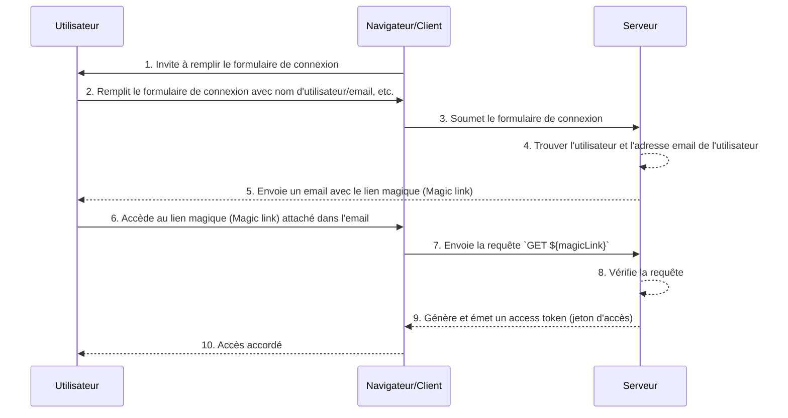

## Qu'est-ce qu'un lien magique (Magic link) ?

Un lien magique (Magic link) est un lien à usage unique envoyé à l'utilisateur pendant le processus d'authentification (authentication).

En accédant à ce lien, l'utilisateur complète le flux d'autorisation (authorization flow) requis pour accéder à la ressource souhaitée et se voit accorder un accès approprié aux ressources. Ensuite, le lien magique devient invalide.

## Quelle est la différence entre un lien magique (Magic link) et un mot de passe à usage unique (OTP) ?

Supposons que l'utilisateur utilise l'email pour recevoir un lien magique (Magic link) ou un OTP.

Dans de nombreux cas, les utilisateurs utilisent l'email pour recevoir un OTP pour vérifier la connexion ou comme facteur de vérification supplémentaire pour la MFA. Quelle est la différence entre l'utilisation d'un lien magique (Magic link) par email et un OTP par email ?

Avec l'OTP, l'utilisateur doit vérifier son email, se souvenir de l'OTP, puis l'entrer dans le processus de connexion/vérification. Cela nécessite que l'utilisateur passe manuellement à plusieurs reprises entre différentes applications ou pages.

En utilisant un lien magique (Magic link) par email, l'utilisateur n'a besoin d'ouvrir l'email contenant le lien magique (Magic link) dans son application d'email et de cliquer sur le lien. Cela offre une expérience utilisateur plus simple.

De plus, l'utilisation d'un lien magique (Magic link) permet d'inclure des informations au-delà d'un jeton à usage unique, telles que des informations relatives à la session pour la connexion. Cela peut améliorer à la fois la sécurité et l'expérience utilisateur.

## Comment fonctionne un lien magique (Magic link) ?

Dans ce diagramme de séquence, nous illustrons comment un utilisateur se connecte et obtient un accès aux ressources appropriées en utilisant un lien magique (Magic link).

Dans ce diagramme de séquence, nous supposons que le lien magique (Magic link) est envoyé par email. Cependant, il existe d'autres méthodes possibles pour envoyer un lien magique (Magic link), telles que l'envoi par message texte sur un téléphone mobile. Ces alternatives ne seront pas couvertes ici puisque les flux sont presque les mêmes.

1. **Invite à remplir le formulaire de connexion**  
Le navigateur/client initie le processus d'authentification (authentication) en invitant l'utilisateur à remplir un formulaire de connexion.

2. **L'utilisateur remplit le formulaire de connexion**  
L'utilisateur entre son identifiant, tel que son nom d'utilisateur, adresse email ou numéro de téléphone, dans le formulaire de connexion.  
Les informations fournies doivent être suffisantes pour aider le système à identifier un utilisateur unique. Par exemple, dans la plupart des systèmes, les noms d'utilisateur utilisés pour la connexion sont uniques. Dans ces systèmes, les utilisateurs n'ont qu'à fournir leur nom d'utilisateur pour aider le système à identifier de manière unique le compte auquel ils souhaitent se connecter.

3. **Soumet le formulaire de connexion**  
Le navigateur/client soumet le formulaire au serveur, contenant les informations de l'utilisateur décrites à l'étape 2.

4. **Trouver l'utilisateur et l'email**  
Le serveur traite la requête en localisant l'utilisateur unique dans la base de données et en récupérant l'adresse email associée de l'utilisateur.

5. **Envoie un email avec le lien magique (Magic link)**  
Le serveur envoie un email à l'adresse email de l'utilisateur. Cet email contient un lien magique (Magic link) pour l'authentification (authentication).

6. **L'utilisateur accède au lien magique (Magic link)**  
L'utilisateur reçoit l'email et clique sur le lien magique (Magic link) fourni à l'intérieur.

7. **Envoie la requête GET avec le lien magique (Magic link)**  
Le navigateur/client envoie une requête `GET` au serveur, en utilisant l'URL du lien magique (Magic link).

8. **Vérifie la requête**  
Le serveur vérifie la requête pour s'assurer que le lien magique (Magic link) est valide, non utilisé et non expiré.

9. **Génère et émet un access token (jeton d'accès)**  
Une fois la requête vérifiée, le serveur génère un access token (jeton d'accès) et l'émet au navigateur/client.

10. **Accès accordé**  
Le navigateur/client reçoit l'access token (jeton d'accès) et permet à l'utilisateur d'accéder à la ressource demandée.

## Quel est l'avantage des liens magiques (magic links) ?

Les liens magiques (magic links) améliorent l'architecture de sécurité des systèmes d'authentification (authentication) en utilisant un modèle d'interaction basé sur des jetons. Chaque lien est crypté de manière unique et inclut généralement un horodatage d'expiration. Compte tenu de leur nature éphémère, même si un lien magique (magic link) est intercepté ou divulgué, sa fenêtre de validité courte limite l'opportunité d'une exploitation malveillante.

De plus, parce que l'utilisation de liens magiques (magic links) nécessite une méthode de réception contrôlée par l'utilisateur, telle qu'une adresse email ou un numéro de téléphone de confiance, cela fournit une méthode de vérification supplémentaire au-delà du nom d'utilisateur et du mot de passe, offrant une sécurité supplémentaire au compte. Et puisque les liens magiques (magic links) éliminent le besoin de saisir des identifiants, la sécurité des comptes utilisateurs est mieux protégée et le processus est plus pratique.