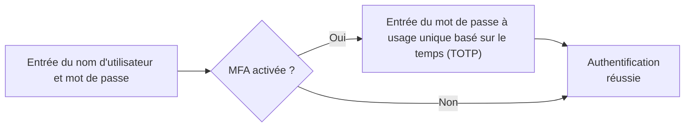

## Qu'est-ce que l'authentification multi-facteurs (MFA) ?

L'authentification multi-facteurs (MFA) améliore la sécurité en exigeant des utilisateurs de fournir plusieurs formes d'identification pour vérifier leur identité. Elle ajoute une couche de sécurité supplémentaire au processus d'<Ref slug="authentication" />, rendant plus difficile l'accès non autorisé pour les attaquants.

Voici un exemple de MFA :

### La définition de "facteur"

Dans l'exemple ci-dessus, il y a deux facteurs :

1. Nom d'utilisateur et mot de passe
2. <Ref slug="totp" /> d'une application mobile

Chaque facteur représente une catégorie différente de justificatifs pouvant être utilisés pour authentifier un utilisateur (prouver que vous êtes bien celui que vous prétendez être). En pratique, les facteurs peuvent être classés en trois types principaux :

|            | Ce que cela signifie | Facteurs de vérification                                                            |
| ---------- | -------------------- | ----------------------------------------------------------------------------------- |
| Connaissance | Quelque chose que vous savez | Mot de passe, code de vérification par email, code de sauvegarde                     |
| Possession   | Quelque chose que vous avez | Code de vérification par SMS, authentificateur OTP, OTP matériel (clé de sécurité), carte à puce |
| Inhérence    | Quelque chose que vous êtes  | Biométrie comme empreintes digitales, reconnaissance faciale                           |

Une configuration MFA courante implique la combinaison de deux facteurs de différentes catégories, comme un mot de passe (connaissance) et un <Ref slug="totp" /> d'une application d'authentification (possession).

### Pourquoi la MFA est-elle importante ?

> Il n'existe pas de sécurité parfaite, seulement des niveaux d'insécurité variables. —Salman Rushdie

L'importance de la MFA est évidente dans les chiffres : la MFA réduit le risque de compromis de 99,22 % sur l'ensemble de la population et de 98,56 % dans les cas de justificatifs divulgués[^1]. Grâce à la MFA, des actions plus critiques peuvent être effectuées avec confiance, comme accéder à des données sensibles et réaliser des transactions financières. C'est un moyen simple mais efficace d'offrir un niveau de sécurité bien supérieur à celui d'un mot de passe ou d'une authentification à facteur unique.

## MFA dans les applications modernes

Comme son nom l'indique, la MFA peut impliquer plus de deux facteurs. À mesure que le nombre de facteurs augmente, le niveau de sécurité augmente également, ainsi que la complexité du processus d'authentification qui peut être moins convivial. Alors que le <Ref slug="totp" /> est un choix populaire ces dernières années, de nouvelles technologies comme le <Ref slug="passkey" /> émergent pour offrir une expérience de MFA encore plus sécurisée et conviviale.

Par exemple, les applications modernes peuvent utiliser l'API <Ref slug="webauthn" /> pour implémenter la MFA avec des passkeys, qui sont des justificatifs résistants au phishing sécurisés par cryptographie à clé publique. Des entreprises comme Apple ont intégré les passkeys avec l'authentification biométrique (Touch ID, Face ID) pour ajouter de manière native le facteur d'inhérence au processus de MFA, augmentant ainsi la sécurité et la commodité pour l'utilisateur.

Faisons une comparaison rapide pour une meilleure compréhension. Supposons que nous ayons un utilisateur qui dispose de :

1. Une application d'authentification installée sur son téléphone pour générer des codes TOTP.
2. Un passkey intégré avec l'authentification biométrique de son appareil.

Lorsqu'il se connecte à un site web avec la MFA activée sur son ordinateur portable, les deux processus ressembleraient à ceci :

```mermaid
graph TD
  subgraph TOTP
    A[Entrée du nom d'utilisateur et mot de passe]
    A -->|MFA activée| B[Demande de code TOTP]
    B --> C[Ouvrir l'application d'authentification]
    C --> D[Trouver le TOTP pour le site web]
    D --> E[Entrer le code TOTP]
    E --> F[Authentification<br/>réussie]
  end

  subgraph WebAuthn
    G[Entrée du nom d'utilisateur et mot de passe]
    G -->|MFA activée| H[Demande d'authentification biométrique]
    H --> I["S'authentifier avec la biométrie (par exemple, Touch ID)"]
    I --> J[Authentification<br/>réussie]
  end
```

Il est clair que le processus WebAuthn prend moins d'étapes et beaucoup moins de temps pour les utilisateurs. De plus, des entreprises comme Apple prennent en charge la synchronisation des passkeys sur plusieurs appareils (par exemple, iPhone, iPad, Mac) pour rendre le processus de MFA plus fluide tout en maintenant un haut niveau de sécurité.

## Considérations de sécurité

Lors de l'implémentation de la MFA, certaines considérations de sécurité doivent être prises en compte :

- Utiliser une combinaison de facteurs de différentes catégories pour assurer un niveau de sécurité supérieur. Par exemple, combiner un mot de passe (connaissance) avec un code TOTP (possession).
- Éviter d'utiliser le SMS comme facteur de MFA en raison de sa vulnérabilité aux attaques d'échange de carte SIM.
- Les options de récupération ne doivent pas contourner la MFA. Par exemple, si un utilisateur perd son application d'authentification, il devrait être tenu d'utiliser un code de sauvegarde ou un autre facteur de MFA pour regagner l'accès.
- Imposer des périodes de refroidissement entre les tentatives de MFA échouées pour prévenir les attaques par force brute.

[^1]: [Quelle est l'efficacité de l'authentification multifactorielle pour dissuader les cyberattaques ?](https://query.prod.cms.rt.microsoft.com/cms/api/am/binary/RW166lD)

<SeeAlso slugs={["totp", "webauthn", "passkey"]} />

<Resources
  urls={[
    "https://blog.logto.io/elaborate-mfa",
    "https://blog.logto.io/web-authn-and-passkey-101",
    "https://blog.logto.io/webauthn-base-knowledge",
  ]}
/>
