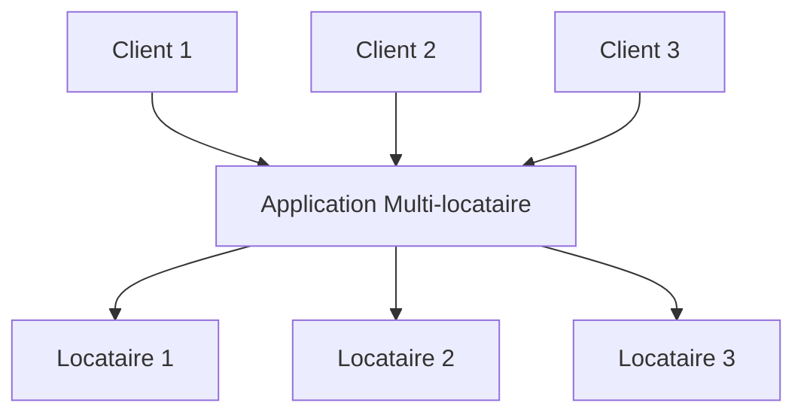
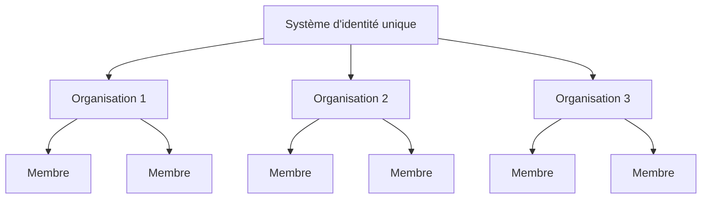

## Qu'est-ce que la multi-location (multi-tenancy) ?

La multi-location logicielle est un logiciel dans lequel une seule instance de logiciel s'exécute sur un serveur et sert plusieurs locataires. Les systèmes conçus de cette manière sont "partagés" (plutôt que "dédiés" ou "isolés").

Un locataire est un groupe d'utilisateurs qui partagent un accès commun avec des privilèges spécifiques à l'instance logicielle.

Par exemple, les systèmes CRM (Customer Relationship Management) utilisent souvent une architecture multi-locataire pour fournir le même service à tous les clients.

Un principe clé de la multi-location est le "partage". Cela ne signifie pas que **chaque** partie de la solution est partagée ; cela signifie qu'au moins **certains** composants sont réutilisés entre plusieurs locataires. Comprendre ce concept plus large peut vous aider à mieux répondre aux besoins de vos clients.

## Quels sont les cas d'utilisation des produits multi-locataires ?

Les applications multi-locataires sont couramment utilisées dans les produits software-as-a-service (SaaS) comme les outils de productivité, les logiciels de collaboration, etc. Dans cette configuration, chaque "locataire" représente généralement un client professionnel, avec plusieurs utilisateurs (généralement des employés). Dans différents produits, cela peut être appelé locataire, espace de travail ou projet, selon le contexte. Une seule entreprise peut également avoir plusieurs locataires pour représenter différentes divisions ou organisations.

Dans des cas plus complexes, comme les applications B2B au-delà du SaaS, les applications multi-locataires fournissent une plateforme partagée pour que diverses équipes, clients professionnels et entreprises partenaires accèdent à vos services.

## Pourquoi devriez-vous utiliser la multi-location dans un produit SaaS

### Mise à l'échelle avec la multi-location

Pour les entreprises, la multi-location est la clé pour répondre efficacement à leurs exigences de disponibilité, de gestion des ressources, de gestion des coûts et de sécurité des données. Sur le plan technique, adopter une approche multi-locataire simplifie vos processus de développement, minimise les défis techniques et favorise une expansion sans heurts.

### Créer une expérience unifiée

En examinant les racines des produits SaaS, c'est comme un immeuble abritant divers appartements. Tous les locataires partagent des services communs comme l'eau, l'électricité et le gaz, tout en conservant un contrôle indépendant sur la gestion de leur propre espace et de leurs ressources. Cette approche simplifie la gestion de la propriété.

### Assurer la sécurité grâce à l'isolation des locataires

Dans une architecture multi-locataire, le terme "locataire" est introduit pour créer des frontières qui séparent et sécurisent les ressources et les données des différents locataires au sein d'une instance partagée. Cela garantit que les données et les opérations de chaque locataire restent distinctes et sécurisées, même s'ils utilisent les mêmes ressources sous-jacentes.

## Comment réaliser l'isolation des locataires dans une architecture multi-locataire ?

Lorsqu'on parle d'applications multi-locataires, il est toujours nécessaire d'atteindre **l'isolation des locataires**. Cela signifie garder les données et les ressources des différents locataires séparées et sécurisées au sein d'un système partagé (par exemple, une infrastructure cloud ou une application multi-locataire). Cela empêche toute tentative non autorisée d'accéder aux ressources d'un autre locataire.

### L'isolation des locataires s'aligne avec le concept de "partage" de la multi-location

C'est parce que l'isolation des locataires n'est pas nécessairement une construction au niveau des ressources d'infrastructure. Dans le domaine de la multi-location et de l'isolation, certains considèrent l'isolation comme une division stricte entre les ressources d'infrastructure réelles. Cela conduit généralement à un modèle où chaque locataire a des bases de données, des instances de calcul, des comptes ou des clouds privés séparés. Dans les scénarios de ressources partagées, comme les applications multi-locataires, la façon d'atteindre l'isolation peut être une construction logique.

### L'authentification et l'autorisation ne sont pas égales à "l'isolation"

Utiliser l'authentification et l'autorisation pour contrôler l'accès à votre environnement SaaS est important, mais cela ne garantit pas "l'isolation". L'isolation signifie garder différents utilisateurs ou ensembles de données séparés afin qu'un utilisateur ne puisse pas interférer avec ou accéder aux données ou actions d'un autre.

Par exemple, même si vous avez configuré l'authentification et l'autorisation, où les utilisateurs se connectent et reçoivent un jeton définissant leurs permissions, cela améliore la sécurité mais ne garantit pas que les utilisateurs sont entièrement isolés les uns des autres. Un autre contexte devrait être introduit pour atteindre "l'isolation".

### Utiliser "organisation" comme contexte pour représenter le locataire du produit SaaS, pour atteindre l'isolation des locataires

L'authentification et l'autorisation seules ne permettront pas d'empêcher un utilisateur avec le bon rôle d'accéder aux ressources d'un autre locataire. Pour limiter l'accès, nous devons ajouter un contexte de "locataire", comme un ID de locataire, un ID d'organisation ou un ID d'espace de travail. Ces identifiants agissent comme des murs, des portes et des serrures, gardant les locataires séparés.

Le terme "organisation" est couramment utilisé pour l'isolation des locataires. De nombreux <Ref slug="identity-provider" /> incluent une fonctionnalité "organisation" pour aider à isoler les locataires tout en gardant un système d'identité unifié. L'utilisateur à l'intérieur de l'organisation est appelé "membre".

## Comment les identités sont-elles gérées dans les applications multi-locataires ?

La première question clé est de réfléchir à savoir si certaines parties de votre entreprise ou produit nécessitent des systèmes d'identité distincts. Cela guidera la conception de votre système. Voici deux exemples :

1. Un système d'identité : Une seule personne peut avoir deux identités au sein du même système d'identité. Par exemple, Sarah peut avoir un email personnel enregistré et également utiliser un email professionnel connecté via <Ref slug="enterprise-sso" />.
2. Plusieurs systèmes d'identité : Les utilisateurs peuvent également avoir deux identités distinctes dans des systèmes d'identité séparés pour des produits complètement non liés.

Dans la plupart des applications multi-locataires, les identités sont généralement gérées dans un seul pool, tandis que les ressources de chaque locataire sont gardées séparées.

## Considérations pour planifier et construire des applications multi-locataires

1. Concentrez-vous sur votre modèle : B2B ou B2C.
2. Qui gérera les tâches de gestion des identités : les développeurs, l'administrateur de votre client ou les clients finaux ?
3. Pour le B2B, vos clients ont-ils besoin de gérer les identités de leur organisation ?
4. Identifiez quelles permissions (<Ref slug="scope" />) et <Ref slug="role" /> doivent être définies pour l'organisation et lesquelles ne le sont pas.
5. Votre client a-t-il besoin de <Ref slug="enterprise-sso" /> ?
6. Envisagez d'ajouter des fonctionnalités de collaboration, comme des invitations.

<Resources
  urls={[
    "https://blog.logto.io/implement-multi-tenancy",
    "https://blog.logto.io/multi-tenant-ultimate-guide",
    "https://blog.logto.io/case-study-multi-tenancy",
    "https://blog.logto.io/multi-tenancy-explained",
    "https://blog.logto.io/are-multi-tenant-apps-equal-saas",
    "https://blog.logto.io/tenancy-models",
    "https://blog.logto.io/do-you-need-multiple-tenants-identity-model",
  ]}
/>