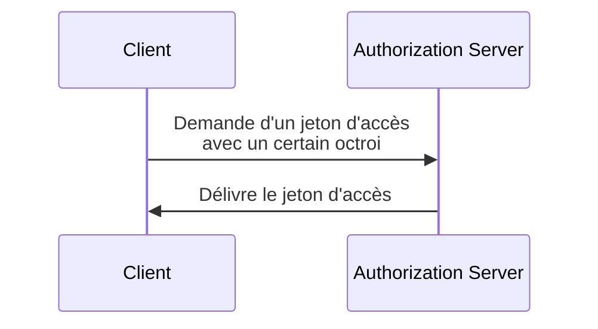

## Qu'est-ce qu'un octroi d'autorisation OAuth 2.0 ?

Un octroi d'autorisation OAuth 2.0 est un processus d'autorisation qui permet à un <Ref slug="client" /> de demander un <Ref slug="access-token" /> à un <Ref slug="authorization-server" />. Vous pouvez également entendre d'autres termes autour de ce concept, clarifions-les avant d'approfondir :

- **Octroi d'autorisation OAuth 2.0**: Également connu sous le nom de "type d'autorisation OAuth 2.0", "flux OAuth 2.0", ou "octroi d'autorisation OAuth 2.0". Dans la plupart des contextes, ces termes se réfèrent au même concept.
- <Ref slug="authorization-server" />: Le serveur qui émet des access tokens à un client. Dans OpenID Connect (OIDC), le serveur d'autorisation est le même que le <Ref slug="openid-connect" headingId="openid-provider-op" />.
- <Ref slug="authorization-request" />: La demande faite par le client au serveur d'autorisation pour obtenir un access token. Dans OpenID Connect (OIDC), cela est également appelé une <Ref slug="authentication-request" />.

Pour plus de clarté, nous utiliserons systématiquement les termes initiaux énumérés ci-dessus tout au long de cet article.

Le processus d'un octroi d'autorisation OAuth 2.0 est assez simple :

Après que le client a reçu le access token, il peut l'utiliser pour accéder à des ressources protégées (par exemple, des API) pour le compte d'un utilisateur ou en son propre nom.

Notez que selon l'octroi spécifique, le client et le serveur d'autorisation peuvent échanger des informations supplémentaires et impliquer plus d'étapes dans le processus. Par exemple, l'<Ref slug="authorization-code-flow">octroi du code d'autorisation</Ref> implique l'authentification et l'autorisation de l'utilisateur, la génération de code et l'échange de token.

## Différents octrois d'autorisation OAuth 2.0

La spécification de base d'OAuth 2.0 définit quatre octrois que les clients peuvent utiliser pour obtenir des access tokens :

1. <Ref slug="authorization-code-flow">Octroi du code d'autorisation</Ref>: L'octroi le plus sécurisé et recommandé pour la majorité des applications. Il est imposé d'utiliser <Ref slug="pkce" /> pour tous les clients dans <Ref slug="oauth-2.1" />.
2. <Ref slug="implicit-flow">Octroi implicite</Ref>: Un octroi simplifié qui est déprécié dans OAuth 2.1 en raison de préoccupations de sécurité.
3. [Octroi des informations d'identification du propriétaire de la ressource (ROPC)](https://datatracker.ietf.org/doc/html/rfc6749#section-4.3): Un octroi où les informations d'identification de l'utilisateur sont directement échangées contre un access token. Il n'est pas recommandé pour la plupart des applications en raison des risques de sécurité.
4. <Ref slug="client-credentials-flow">Octroi des informations d'identification du client</Ref>: Un octroi utilisé par un <Ref slug="client" headingId="confidential-clients" /> pour obtenir un access token sans implication de l'utilisateur.

À mesure que l'industrie évolue, les octrois implicites et ROPC [sont en train d'être dépréciés](https://blog.logto.io/oauth-2-1) au profit de flux plus sécurisés et standardisés. Pour les nouvelles applications, les choix sont simples :

- Pour l'authentification et l'autorisation des utilisateurs, utilisez l'octroi du code d'autorisation avec PKCE.
- Pour la communication <Ref slug="machine-to-machine" />, utilisez l'octroi des informations d'identification du client.

### Autres octrois d'autorisation OAuth 2.0

En plus des quatre octrois de base, il existe d'autres extensions qui définissent de nouveaux octrois pour des cas d'utilisation spécifiques. Par exemple :

- <Ref slug="device-flow">Octroi d'autorisation d'appareil</Ref> est un octroi conçu pour les appareils avec des capacités d'entrée limitées, tels que les téléviseurs intelligents et les périphériques IoT.
- <Ref slug="hybrid-flow">Flux hybride</Ref> est un octroi OpenID Connect qui combine l'octroi du code d'autorisation avec l'octroi implicite.

## Octrois dans OpenID Connect (OIDC)

Dans <Ref slug="openid-connect" />, le concept d'octrois est étendu pour inclure des <Ref slug="id-token">ID tokens</Ref> qui représentent des informations d'identité utilisateur en plus des access tokens. OIDC étend deux octrois OAuth 2.0 (code d'autorisation et implicite) pour inclure des ID tokens, et introduit un nouvel octroi appelé <Ref slug="hybrid-flow">flux hybride</Ref> qui combine les deux.

> Comme OAuth 2.0, il est seulement recommandé d'utiliser l'octroi du code d'autorisation avec PKCE dans OIDC pour l'authentification et l'autorisation des utilisateurs.

Pendant ce temps, puisque OIDC est construit sur OAuth 2.0, d'autres octrois comme l'octroi des informations d'identification du client peuvent toujours être utilisés sur le même serveur d'autorisation, tant que le serveur les prend en charge.

<SeeAlso slugs={["pkce", "oauth-2.1", "authorization-code-flow", "implicit-flow", "client-credentials-flow", "device-flow"]} />

<Resources
  urls={[
    "https://blog.logto.io/implicit-flow-is-dead",
    "https://datatracker.ietf.org/doc/html/rfc6749",
    "https://openid.net/specs/openid-connect-core-1_0.html"
  ]}
/>
