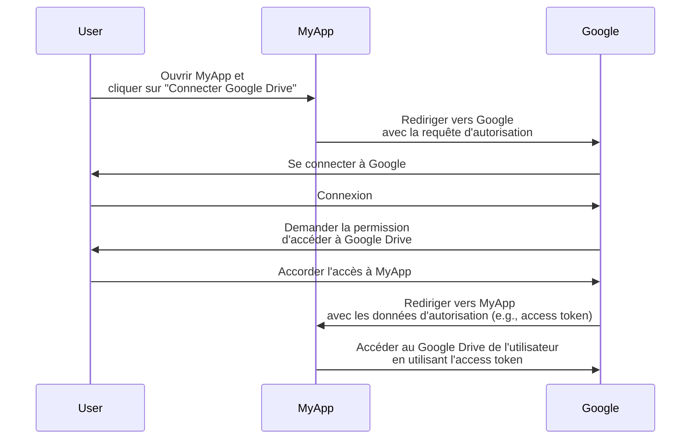
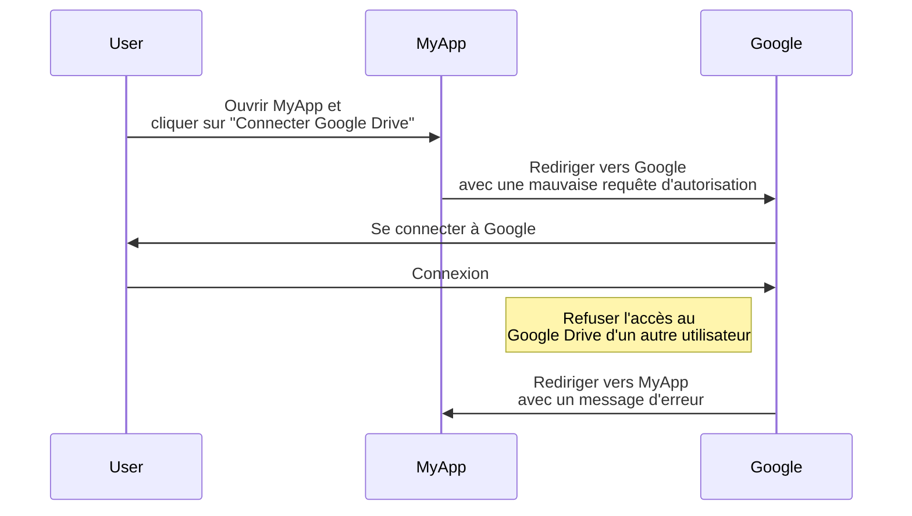
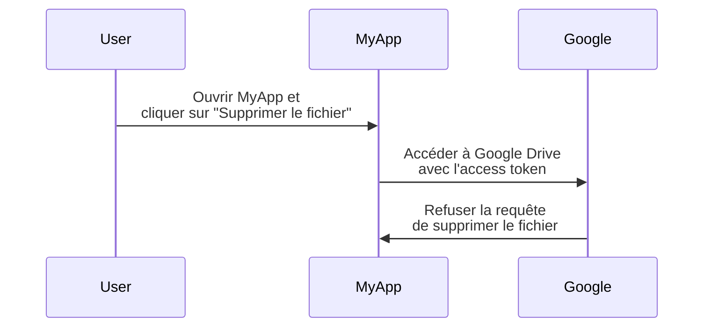

## Qu'est-ce que OAuth 2.0 ?

OAuth 2.0 est le standard de facto pour l'autorisation et est largement utilisé sur le web. Il permet à une application d'obtenir de manière sécurisée un accès limité à des ressources protégées sur une autre application, telles que le profil ou les données d'un utilisateur, sans exposer des informations confidentielles comme les mots de passe.

Voyons un exemple concret pour mieux comprendre. Vous avez une application web MyApp qui souhaite accéder au Google Drive de l'utilisateur. Au lieu de demander à l'utilisateur de partager ses informations d'identification Google Drive, MyApp peut utiliser OAuth 2.0 pour demander l'accès à Google Drive pour le compte de l'utilisateur. Voici un flux simplifié :

Dans ce flux, MyApp ne voit jamais les informations d'identification du Google Drive de l'utilisateur. À la place, il reçoit un <Ref slug="access-token" /> de Google qui lui permet d'accéder à Google Drive pour le compte de l'utilisateur.

### Composants clés de OAuth 2.0

Pour l'exemple ci-dessus, MyApp est le <Ref slug="client" />, Google est à la fois le <Ref slug="authorization-server" /> et le <Ref slug="resource-server" />, et l'utilisateur est le <Ref slug="resource-owner" />. Le flux implique tous les composants clés de OAuth 2.0 :

- **Client** : L'application qui souhaite accéder aux ressources protégées. "Client" et "application" sont souvent utilisés de manière interchangeable.
- **Resource owner** : L'utilisateur qui possède les ressources protégées. Le resource owner peut accorder (autoriser) ou refuser l'accès au client.
- **Authorization server** : Le serveur qui effectue l'autorisation (généralement avec authentification) et émet les access tokens au client.
- **Resource server** : Le serveur qui héberge les ressources protégées. Il vérifie l'access token et sert les ressources protégées au client.

## Grants (flux) OAuth 2.0

<Ref slug="oauth-2.0-grant">Grant</Ref> constitue la base de OAuth 2.0 et définit comment le client peut obtenir un access token depuis le authorization server. La spécification de base de OAuth 2.0 définit quatre types de grants : 

- <Ref slug="authorization-code-flow">Authorization code grant</Ref>
- <Ref slug="implicit-flow">Implicit grant</Ref>
- [Resource owner password credentials (ROPC) grant](https://datatracker.ietf.org/doc/html/rfc6749#section-4.3)
- <Ref slug="client-credentials-flow">Client credentials grant</Ref>

Sans entrer dans les détails de chaque type de grant, nous pouvons les classer en deux catégories :

- **Authorization grants** : Utilisés lorsque le client doit accéder à des ressources pour le compte d'un utilisateur, c'est-à-dire qu'une autorisation de l'utilisateur est requise.
- **Client credentials grant** : Utilisé lorsque le client doit accéder à des ressources en son propre nom. Ce type de grant est approprié pour la communication <Ref slug="machine-to-machine" />.

### Authorization grants

Quel que soit le type de grant, les authorization grants comportent les étapes communes suivantes :

1. Le client initie une <Ref slug="authorization-request" /> vers le authorization server.
2. Le authorization server authentifie l'utilisateur (resource owner) et demande la permission d'accéder aux ressources.
3. L'utilisateur accorde la permission au client.
4. Le authorization server émet un access token au client.
5. Le client utilise l'access token pour accéder aux ressources protégées sur le <Ref slug="resource-server" />.

Notez que les étapes exactes et les paramètres peuvent varier selon le type de grant. Par exemple, le <Ref slug="authorization-code-flow">authorization code grant</Ref> implique davantage d'étapes comme la génération et l'échange de code.

### Client credentials grant

Le <Ref slug="client-credentials-flow">client credentials grant</Ref> est beaucoup plus simple et n'implique pas d'autorisation utilisateur. Voici un flux simplifié :

1. Le client envoie une <Ref slug="token-request" /> au authorization server.
2. Le authorization server authentifie le client et émet un access token.
3. Le client utilise l'access token pour accéder aux ressources protégées sur le <Ref slug="resource-server" />.

---

Pour des discussions approfondies sur les grants de OAuth 2.0, voir <Ref slug="oauth-2.0-grant" /> et les articles spécifiques à chaque type de grant.

## Access control avec OAuth 2.0

OAuth 2.0 définit le paramètre <Ref slug="scope" /> pour spécifier les permissions demandées par le client. Le authorization server peut ignorer totalement ou partiellement les scopes demandés et accorder l'accès selon ses propres politiques d'access control.

Cependant, OAuth 2.0 laisse au authorization server sa propre discrétion sur la manière de faire respecter l'<Ref slug="access-control" />. Cela signifie que le authorization server peut décider quelles ressources le sujet (utilisateur ou client) peut accéder et quelles actions ils peuvent effectuer sur ces ressources.

Utilisons encore l'exemple de Google Drive. MyApp peut initier une requête d'autorisation pour accéder au Google Drive d'un autre utilisateur par erreur. Dans ce cas, le authorization server de Google devrait rejeter la requête car l'utilisateur n'a pas les permissions nécessaires pour accéder au Google Drive d'un autre utilisateur.

Un autre cas est lorsque MyApp reçoit un access token de Google qui lui permet de lire des fichiers depuis le Google Drive de l'utilisateur. Cependant, MyApp tente de supprimer un fichier au lieu de le lire. Le resource server (Google) devrait refuser la requête.

Ces deux cas démontrent pourquoi l'<Ref slug="access-control" /> est nécessaire lors de l'implémentation de OAuth 2.0. Le <Ref slug="authorization-server" /> et le <Ref slug="resource-server" /> doivent travailler ensemble pour faire respecter les politiques d'access control et protéger les ressources.

### Modèles d'access control

Pour gérer correctement l'access control, il est recommandé d'utiliser les modèles standards d'access control tels que <Ref slug="rbac" /> et <Ref slug="abac" />. Ces modèles ont prouvé leur efficacité dans l'industrie et offrent l'évolutivité pour les futurs besoins.

## OAuth 2.1

<Ref slug="oauth-2.1" /> est une mise à jour proposée pour la spécification OAuth 2.0 qui vise à améliorer la sécurité et l'utilisabilité selon l'expérience de l'industrie au fil des ans. Bien que OAuth 2.1 ne soit pas encore finalisé, nous pouvons tout de même apprendre sur les changements proposés et comprendre comment ils peuvent affecter les implémentations actuelles de OAuth 2.0. OAuth 2.1 peut être considéré comme une formalisation des meilleures pratiques et recommandations de sécurité qui ont été largement adoptées dans l'industrie.

## OAuth 2.0 et OpenID Connect (OIDC)

OAuth 2.0 définit uniquement le processus d'autorisation et ne couvre pas l'authentication ou l'identité de l'utilisateur. Pour cette raison, <Ref slug="openid-connect" /> a été introduit comme couche d'identité au-dessus de OAuth 2.0. OIDC étend OAuth 2.0 pour fournir l'authentication de l'utilisateur et des informations d'identité sous forme de <Ref slug="id-token" />.

OpenID Connect étend deux grants de OAuth 2.0 (authorization code et implicit) pour inclure des ID tokens, et introduit un nouveau grant appelé <Ref slug="hybrid-flow">hybrid flow</Ref> qui combine les deux.

Cela signifie que toutes vos connaissances et pratiques sur OAuth 2.0 peuvent être directement appliquées à OIDC ; toutes les extensions de OAuth 2.0 telles que <Ref slug="pkce" /> et <Ref slug="resource-indicator" /> peuvent également être utilisées dans OIDC.

<SeeAlso slugs={["oauth-2.0-grant", "oauth-2.1", "openid-connect"]} />

<Resources
  urls={[
    "https://blog.logto.io/secure-cloud-apps-with-oauth-and-openid-connect",
    "https://blog.logto.io/oauth-2-1",
    "https://datatracker.ietf.org/doc/html/rfc6749",
    "https://datatracker.ietf.org/doc/draft-ietf-oauth-v2-1/",
  ]}
/>
