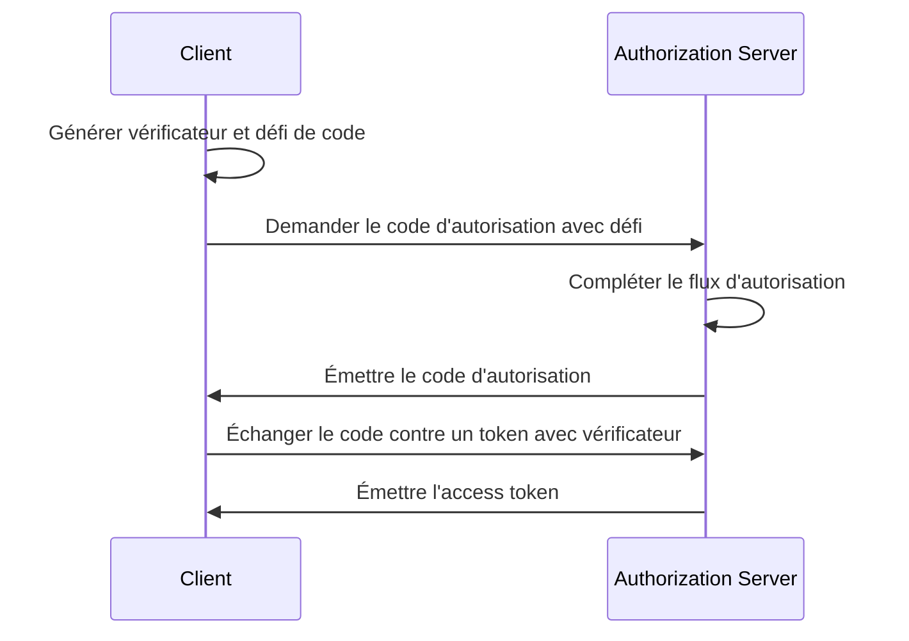

## Qu'est-ce que OAuth 2.1 ?

OAuth 2.1 est une mise à jour proposée du cadre d'autorisation <Ref slug="oauth-2.0" />. Cela implique une série de modifications et de recommandations à la spécification existante d'OAuth 2.0 qui consolident les meilleures pratiques et les améliorations de sécurité qui ont été largement adoptées dans l'industrie au fil des ans.

Les principales mises à jour de OAuth 2.1 sont de :

1. Déprécier le <Ref slug="implicit-flow">flux implicite</Ref> et le [flux Resource Owner Password Credentials (ROPC)](https://datatracker.ietf.org/doc/html/rfc6749#section-4.3) en raison de problèmes de sécurité.
2. Imposer l'utilisation de <Ref slug="pkce" /> pour tous les clients, y compris les <Ref slug="client" headingId="confidential-clients">clients confidentiels (privés)</Ref>.
3. Correspondance exacte des <Ref slug="redirect-uri">URIs de redirection</Ref>.
4. Définition claire des types de <Ref slug="client">client</Ref> (clients publics et confidentiels).
5. Exigences de sécurité pour les <Ref slug="refresh-token">jetons de rafraîchissement</Ref>.

## Dépréciation du flux implicite

Le flux implicite a été conçu pour les applications monopages (SPAs) et les applications basées sur le navigateur qui ne peuvent pas stocker en toute sécurité les secrets des clients. Cependant, ses risques de sécurité ont conduit à sa dépréciation : il renvoie le access token dans le canal frontal (fragment d'URL), ce qui peut être exposé aux attaquants via l'historique du navigateur et les en-têtes de référence.

OAuth 2.1 recommande d'utiliser le <Ref slug="authorization-code-flow">flux de code d'autorisation</Ref> avec <Ref slug="pkce" /> pour les applications basées sur le navigateur.

## Dépréciation du flux ROPC

Le flux ROPC permet au client d'échanger directement les informations d'identification de l'utilisateur contre un access token. Il a été conçu pour les applications héritées qui ne peuvent pas prendre en charge le flux de code d'autorisation. Cependant, le flux présente des risques de sécurité en :

- Exposant les informations d'identification de l'utilisateur au client.
- Contournant l'écran de consentement de l'authorization server.
- Limitant la capacité de l'authorization server à appliquer d'autres mesures de sécurité, telles que <Ref slug="mfa" />.

OAuth 2.1 recommande d'utiliser le <Ref slug="authorization-code-flow">flux de code d'autorisation</Ref> avec <Ref slug="pkce" /> pour l'authentification et l'autorisation de l'utilisateur.

## Imposition de PKCE pour tous les clients

<Ref slug="pkce" /> est une extension de sécurité du flux de code d'autorisation qui atténue le risque d'attaques par interception de code d'autorisation. Elle implique que le client génère un vérificateur de code et un défi de code, et que l'authorization server vérifie le défi lors de l'échange de token.

Voici un diagramme de séquence simplifié du flux de code d'autorisation avec PKCE :

Il avait été initialement recommandé pour les <Ref slug="client" headingId="public-clients">clients publics</Ref> d'utiliser PKCE, mais OAuth 2.1 étend cette recommandation à une exigence obligatoire pour tous les clients, y compris les <Ref slug="client" headingId="confidential-clients">clients confidentiels (privés)</Ref>.

## Correspondance exacte des URIs de redirection

Les <Ref slug="redirect-uri">URIs de redirection</Ref> sont utilisées par le client pour recevoir des réponses d'autorisation de l'authorization server. OAuth 2.1 introduit une nouvelle exigence selon laquelle l'URI de redirection utilisée dans la authorization request doit correspondre exactement à l'URI de redirection enregistrée par le client auprès de l'<Ref slug="authorization-server" />, y compris le schéma, l'hôte et le chemin.

Dans certaines implémentations d'OAuth 2.0, la correspondance des URIs de redirection était flexible, permettant des correspondances partielles ou des caractères génériques. Cependant, cette flexibilité peut introduire des risques de sécurité, tels que des vulnérabilités de redirection ouverte.

## Définition claire des types de client

OAuth 2.0 ne définit pas explicitement les types de client. Vous pouvez voir diverses catégorisations dans l'industrie, telles que par niveau d'accès (public vs. confidentiel) ou par type d'application (application web vs. application mobile). Pour le cadre OAuth, peu importe comment le client est implémenté (car il s'agit plus des attributs commerciaux du client), mais le niveau d'accès fait une différence dans les exigences de sécurité.

Ainsi, OAuth 2.1 introduit une définition claire des types de client :

- <Ref slug="client" headingId="public-clients" /> : Clients qui NE PEUVENT PAS maintenir la confidentialité de leurs informations d'identification (par exemple, SPAs, applications mobiles).
- <Ref slug="client" headingId="confidential-clients" /> : Clients qui PEUVENT maintenir la confidentialité de leurs informations d'identification (par exemple, applications web côté serveur, applications de bureau natives).

## Exigences de sécurité pour les jetons de rafraîchissement

Les <Ref slug="refresh-token">jetons de rafraîchissement</Ref> sont des jetons à longue durée de vie utilisés par le client pour obtenir de nouveaux access tokens sans interaction utilisateur. En attendant, ils sont également des cibles à haute valeur pour les attaquants. Comme les clients publics ne peuvent pas stocker de manière sécurisée les informations d'identification, OAuth 2.1 spécifie que l'<Ref slug="authorization-server" /> devrait utiliser l'une des méthodes suivantes pour sécuriser les jetons de rafraîchissement :

- Émettre des <Ref slug="refresh-token" headingId="sender-constrained-refresh-tokens">jetons de rafraîchissement contraints à l'expéditeur</Ref>.
- Utiliser la <Ref slug="refresh-token" headingId="refresh-token-rotation">rotation des jetons de rafraîchissement</Ref> pour limiter l'utilité et la durée de vie des jetons de rafraîchissement.

## OAuth 2.1 et OpenID Connect (OIDC)

Étant donné que <Ref slug="openid-connect" /> est construit sur OAuth 2.0, les modifications introduites dans OAuth 2.1 s'appliquent également à OIDC. Par exemple, tous les clients OIDC devraient utiliser le flux de code d'autorisation avec PKCE pour l'authentification et l'autorisation de l'utilisateur.

<SeeAlso slugs={["oauth-2.0", "authorization-code-flow", "pkce", "implicit-flow", "openid-connect"]} />

<Resources
  urls={[
    "https://datatracker.ietf.org/doc/draft-ietf-oauth-v2-1/",
    "https://blog.logto.io/oauth-2-1",
  ]}
/>
