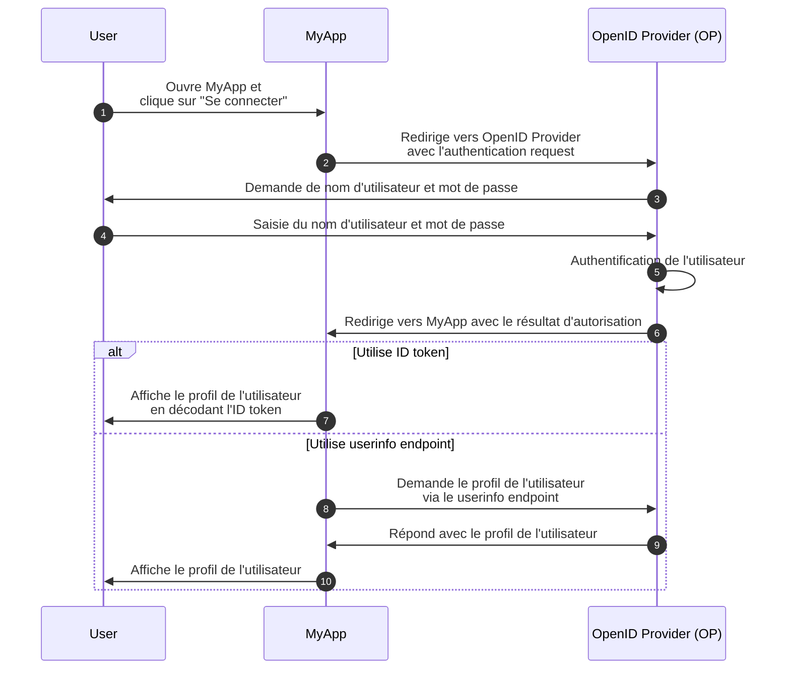
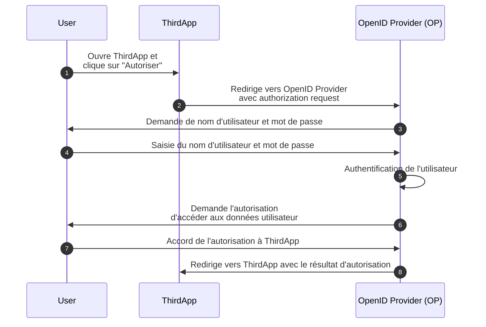

## Qu'est-ce que OpenID Connect (OIDC) ?

OpenID Connect (OIDC) ajoute des capacités d'authentification au <Ref slug="oauth-2.0" />, un cadre d'autorisation, en introduisant une couche d'identité au-dessus de celui-ci. OIDC permet aux clients d'authentifier les utilisateurs et d'obtenir des informations d'identité sous forme de <Ref slug="id-token">ID tokens</Ref> et de réponses du <Ref slug="userinfo-endpoint" />.

Prenons un exemple. Supposons que vous avez une application web appelée MyApp et que les utilisateurs peuvent se connecter en utilisant un nom d'utilisateur et un mot de passe ; après s'être connectés, ils peuvent accéder à leurs informations de profil. Voici un flux simplifié :



Certains termes peuvent être nouveaux pour vous, clarifions-les :

### OpenID Provider (OP)

Un OpenID Provider (OP) est un <Ref slug="identity-provider" /> qui implémente les spécifications OIDC et OAuth 2.0. Autrement dit, un OP est également un <Ref slug="authorization-server" /> OAuth 2.0.

Les OPs sont responsables de l'authentification des utilisateurs et de l'émission d'ID tokens et d'access tokens aux clients.

### Tokens

- Les <Ref slug="id-token">ID tokens</Ref> sont des <Ref slug="jwt">JSON Web Tokens</Ref> utilisés pour représenter des informations d'identité de l'utilisateur, telles que le nom, l'email et la photo de profil.
- Les <Ref slug="access-token">Access tokens</Ref> sont utilisés pour accéder à des ressources protégées au nom de l'utilisateur (comme dans OAuth 2.0), par exemple le userinfo endpoint.

### Authentication request et résultat

- Un <Ref slug="authentication-request" /> est une demande faite par le client à l'OP pour authentifier l'utilisateur. Elle inclut des paramètres pour spécifier certaines exigences et influencera le processus d'authentification.
- Selon l'authentication request, le résultat d'authentification peut varier. Pour l'instant, sachez simplement que le résultat contient les informations nécessaires pour que le client identifie l'utilisateur.

### Userinfo endpoint

Le <Ref slug="userinfo-endpoint" /> est un endpoint spécifique à OIDC qui permet aux clients de récupérer des informations de profil utilisateur. C'est une alternative à l'utilisation des ID tokens puisque le userinfo endpoint fournit généralement plus d'informations détaillées sur l'utilisateur que l'ID token.

OIDC laisse l'OpenID Provider (OP) décider quelles informations inclure dans l'ID token et la réponse du userinfo. Ainsi, avant d'analyser l'ID token ou d'appeler le userinfo endpoint, vous devez consulter la documentation de l'OP pour comprendre quelles informations sont disponibles.

## Différences de termes entre OAuth 2.0 et OIDC

Étant donné qu'OIDC est construit sur OAuth 2.0, de nombreux termes sont partagés entre les deux spécifications. Cependant, alors qu'OAuth 2.0 se concentre sur l'autorisation, OIDC introduit l'authentification et l'identité, rendant certains termes inappropriés dans le contexte d'OIDC. Voici quelques différences notables :

| OAuth 2.0             | OpenID Connect (OIDC)  |
|-----------------------|------------------------|
| Authorization server  | OpenID Provider (OP)   |
| Authorization request | Authentication request |
| Grant                 | Flow                   |

En substance, les termes ci-dessus peuvent désigner le même sujet, mais ils ont des significations différentes dans le contexte d'OAuth 2.0 et d'OIDC :

- **OpenID Provider (OP)** est un <Ref slug="authorization-server" /> OAuth 2.0 capable d'authentifier les utilisateurs et d'émettre des ID tokens.
- **<Ref slug="authentication-request" />** est une <Ref slug="authorization-request" /> OAuth 2.0 qui utilise des paramètres spécifiques à OIDC pour demander l'authentification de l'utilisateur final et obtenir un ID token.
- **Flow** est un terme plus général utilisé dans OIDC pour décrire le processus d'authentification et d'autorisation des utilisateurs, qui peut impliquer plusieurs étapes et interactions plutôt qu'un simple cycle de requête-réponse. C'est essentiellement la même chose qu'un <Ref slug="oauth-2.0-grant" />.

## Flows OIDC

Comme le montre l'exemple ci-dessus, les flows OIDC sont initiés par le client (par exemple, MyApp) avec un authentication request à l'OP. L'authentication request spécifie le flux à utiliser, qui peut être l'un des suivants :

- **<Ref slug="authorization-code-flow" />** : Le flux le plus sécurisé et recommandé pour l'authentification et l'autorisation des utilisateurs. <Ref slug="pkce" /> est imposé pour tous les clients dans <Ref slug="oauth-2.1" />.
- **<Ref slug="implicit-flow" />** : Un flux simplifié qui est déprécié dans OAuth 2.1 en raison de problèmes de sécurité.
- **<Ref slug="hybrid-flow" />** : Un flux OIDC qui combine l'authorization code flow avec l'implicit flow. Il n'est également pas recommandé pour les nouvelles applications en raison de problèmes de sécurité.

L'authorization code flow et l'implicit flow sont étendus d'OAuth 2.0 pour inclure des ID tokens, tandis que le hybrid flow est un flux spécifique à OIDC qui combine les deux. Cliquez sur les liens ci-dessus pour en savoir plus sur chaque flux.

## Scopes OIDC et claims

Comme OAuth 2.0, OIDC utilise des valeurs de <Ref slug="scope" /> pour spécifier les autorisations que le client demande. Étant donné que les <Ref slug="id-token">ID tokens</Ref> sont des <Ref slug="jwt">JSON Web Tokens</Ref>, ils peuvent inclure des <Ref slug="claim">claims</Ref> (paires clé-valeur) qui représentent les informations d'identité de l'utilisateur selon les scopes demandés dans le <Ref slug="authentication-request" />. Ces claims sont également renvoyées dans la réponse du <Ref slug="userinfo-endpoint" />.

OIDC définit plusieurs scopes standard et claims correspondants que les clients peuvent demander dans l'authentication request :

- **openid** : Indique que le client est un client OIDC et demande un ID token.
- **profile** : Demande l'accès aux claims de profil par défaut de l'utilisateur, qui sont : `name`, `family_name`, `given_name`, `middle_name`, `nickname`, `preferred_username`, `profile`, `picture`, `website`, `gender`, `birthdate`, `zoneinfo`, `locale`, et `updated_at`.
- **email** : Demande l'accès aux claims `email` et `email_verified` de l'utilisateur.
- **address** : Demande l'accès au claim `address` de l'utilisateur.
- **phone** : Demande l'accès aux claims `phone_number` et `phone_number_verified` de l'utilisateur.
- **offline_access** : Demande un refresh token pour permettre au client d'obtenir de nouveaux access tokens sans interaction utilisateur.

Consultez [Standard Claims](https://openid.net/specs/openid-connect-core-1_0.html#StandardClaims) et [Requesting Claims using Scope Values](https://openid.net/specs/openid-connect-core-1_0.html#ScopeClaims) dans la spécification OIDC pour plus d'informations sur les scopes et les claims. Consultez également <Ref slug="offline-access" /> pour une explication détaillée du scope `offline_access`.

> [!Note]
> Les OpenID Providers (OPs) peuvent prendre en charge des scopes et des claims supplémentaires au-delà des standards. Consultez la documentation de l'OP pour plus de détails.

## Autorisation dans OIDC

Si vous êtes familier avec OAuth 2.0, vous avez peut-être remarqué que l'exemple ci-dessus n'implique aucun processus d'<Ref slug="authorization" />. L'exemple a omis la partie consentement de l'utilisateur parce que nous avons supposé que MyApp est une application de première partie qui n'implique pas d'accès tiers aux données utilisateur. L'autorisation est toujours appliquée par l'OP, mais elle n'est pas explicitement montrée dans le flux.

La partie consentement de l'utilisateur est requise lorsqu'un client tiers (par exemple, une application qui n'est pas détenue par l'OP) demande un accès aux données utilisateur. Dans de tels cas, l'OP demandera à l'utilisateur de consentir à donner l'autorisation au client avant d'émettre l'ID token ou l'access token. Disons qu'une application tierce appelée ThirdApp souhaite accéder aux données utilisateur :



Une fois le processus d'autorisation terminé et que ThirdApp reçoit le résultat d'autorisation (généralement un <Ref slug="access-token" />), elle peut accéder aux données de l'utilisateur depuis le <Ref slug="resource-server" />.

Voir <Ref slug="oauth-2.0" /> pour plus d'informations sur OAuth 2.0 et les flows d'autorisation.

### Scopes

Semblable à OAuth 2.0, OIDC utilise des valeurs de <Ref slug="scope" /> pour spécifier les autorisations que le client demande. Nous avons couvert les scopes et claims standards dans [OIDC scopes et claims](#oidc-scopes-and-claims). Il est important de noter que ces scopes et claims doivent être traités comme des valeurs réservées dans OIDC, ce qui signifie que vous NE devez PAS les utiliser à des fins spécifiques à l'entreprise.

En pratique, votre OpenID Provider (OP) peut prendre en charge des scopes et des claims personnalisés pour vos besoins commerciaux. Consultez la documentation de l'OP pour plus d'informations sur les scopes et claims personnalisés. Si vous ne définissez pas de scopes et claims personnalisés, l'OP peut les ignorer directement ou renvoyer une réponse d'erreur.

### Indicateurs de ressources

Étant donné que le cadre comme OIDC et l'OP peuvent réserver certains scopes et claims pour des usages spécifiques, l'OP recommande généralement d'utiliser un préfixe ou un espace de noms pour éviter les conflits avec les valeurs réservées lors de la définition de scopes et claims personnalisés. Par exemple, vous pouvez préfixer vos scopes personnalisés avec `myapp:` pour indiquer qu'ils sont spécifiques à votre application.

```json
{
  "scope": "myapp:custom_scope"
}
```

Cependant, ceci ne peut garantir que vos scopes et claims personnalisés ne seront pas en conflit avec de futures valeurs réservées, et cela peut gonfler la taille du token. Une extension OAuth 2.0 appelée <Ref slug="resource-indicator">indicateurs de ressources</Ref> fournit un moyen plus flexible et évolutif pour atteindre le même objectif. Les indicateurs de ressources sont des URIs qui représentent les ressources demandées, et elles peuvent être les API endpoints réels pour refléter les ressources du monde réel. Par exemple, vous pouvez utiliser `https://api.myapp.com` comme indicateur de ressource pour représenter les ressources API que votre client souhaite accéder.

Encore une fois, étant donné qu'OIDC est construit au-dessus d'OAuth 2.0, vous pouvez utiliser des indicateurs de ressources dans les authentication requests OIDC lorsqu'ils sont correctement configurés. Voici un exemple non normatif d'une authentication request avec un indicateur de ressource :

```http
GET /authorize?response_type=code
  &client_id=YOUR_CLIENT_ID
  &redirect_uri=https%3A%2F%2Fclient.example.com%2Fcallback
  &scope=openid%20profile
  &resource=https%3A%2F%2Fapi.example.com HTTP/1.1
Host: your-openid-provider.com
```

Pour utiliser des indicateurs de ressources, vous devez d'abord confirmer que votre OP supporte cette extension (RFC 8707). Si prise en charge, vous devriez enregistrer un URI d'indicateur de ressource auprès de l'OP et l'utiliser dans le paramètre `resource` de l'authentication request.

Consultez <Ref slug="resource-indicator" /> pour des informations détaillées sur les indicateurs de ressources.

## Considérations de sécurité OIDC

### Communication sécurisée

Toutes les communications entre le client, l'OP, et le resource server doivent être sécurisées en utilisant HTTPS pour empêcher toute interception ou altération des données.

### Choisir des flows sécurisés

Lors de l'implémentation d'OIDC, il est recommandé d'utiliser :

- <Ref slug="authorization-code-flow" /> avec <Ref slug="pkce" /> pour l'authentification et l'autorisation des utilisateurs (imposé dans <Ref slug="oauth-2.1" />).
- <Ref slug="client-credentials-flow" /> pour la communication machine to machine.

L'implicit flow et le hybrid flow sont dépréciés en raison de problèmes de sécurité, donc évitez de les utiliser pour de nouvelles applications et envisagez de migrer les applications existantes vers des flows plus sécurisés.

### Validation de l'ID token

Lors de la réception d'un ID token de l'OP, le client doit valider le token pour assurer son intégrité et son authenticité. Le processus de validation devrait AU MOINS inclure les vérifications suivantes :

- **Issuer** : Le claim `iss` doit correspondre à l'URL de l'issuer de l'OP.
- **Audience** : Le claim `aud` doit correspondre au client ID du client.
- **Expiration** : Le claim `exp` doit être dans le futur.
- **Signature** : Le token doit être signé par la <Ref slug="signing-key" /> de l'OP.

### Utilisation des access tokens

Les access tokens sont utilisés pour accéder aux ressources protégées au nom de l'utilisateur. Les clients doivent traiter les access tokens comme des informations sensibles et suivre ces meilleures pratiques :

- **Stockage des tokens** : Stockez les access tokens de manière sécurisée et évitez de les exposer à des parties non autorisées.
- **Expiration des tokens** : Les access tokens doivent avoir un temps d'expiration court (par exemple, 1 heure) pour réduire le risque d'accès non autorisé si le token est compromis.
- **Révocation des tokens** : Implémentez des mécanismes de révocation de tokens pour invalider les access tokens si nécessaire.

### Consentement de l'utilisateur

Lorsqu'un client tiers demande l'accès aux données utilisateur, l'OP doit s'assurer que l'utilisateur est conscient des autorisations demandées et accorde son consentement. Le processus de consentement de l'utilisateur doit être transparent et fournir des informations claires sur les données auxquelles on accède et comment elles seront utilisées.

<SeeAlso slugs={["oauth-2.0", "authorization-code-flow", "implicit-flow", "hybrid-flow", "pkce", "resource-indicator"]} />

<Resources
  urls={[
    "https://blog.logto.io/secure-cloud-apps-with-oauth-and-openid-connect",
    "https://openid.net/specs/openid-connect-core-1_0.html",
  ]}
/>