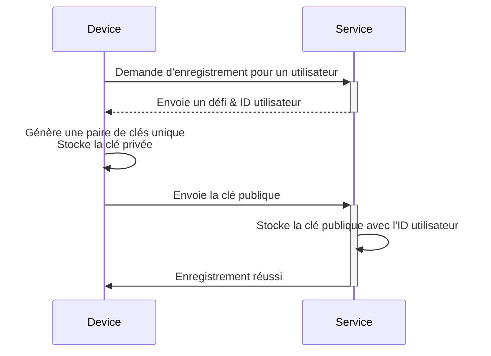
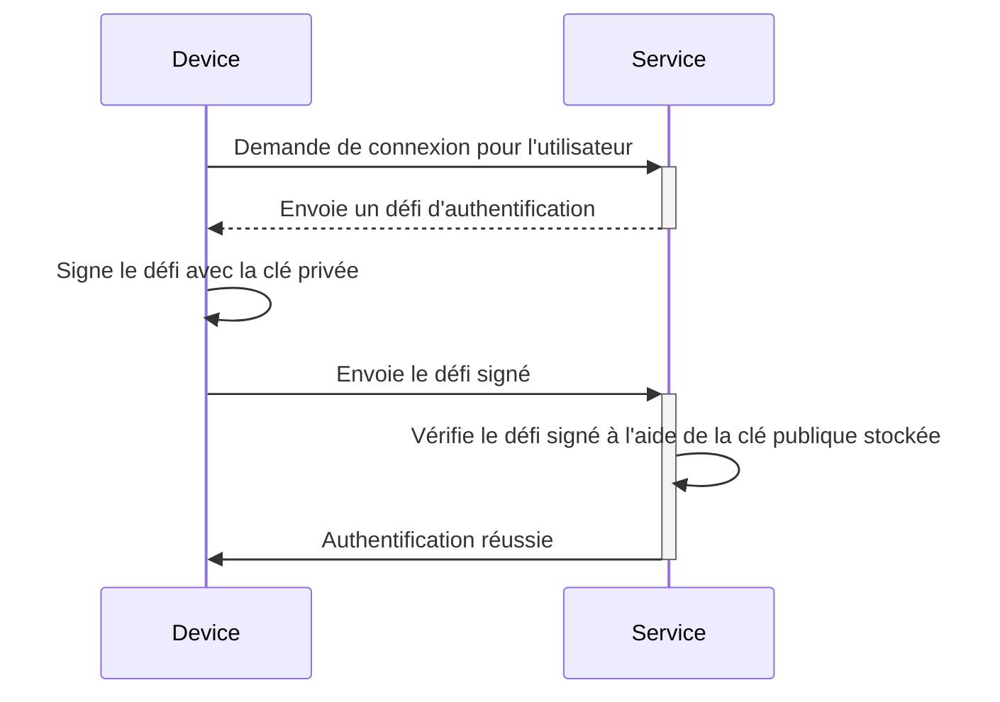

## Qu'est-ce qu'un passkey ?

**Passkey** est une alternative sécurisée et pratique aux mots de passe traditionnels basée sur [FIDO](https://fidoalliance.org/). Ils utilisent une cryptographie avancée pour protéger vos comptes contre les attaques de [phishing](https://en.wikipedia.org/wiki/Phishing).

- **Unique pour chaque service** : Lorsque vous vous inscrivez à un service, votre appareil crée un passkey unique lié au domaine spécifique de ce service.
- **Lié à l'appareil :** Les passkeys sont généralement liés à un appareil, tel qu'un téléphone, un ordinateur portable, un identifiant biométrique ou des clés de sécurité matérielles.
- **Paire de clés publique-privée :** L'appareil conserve la clé privée, tandis que la clé publique est partagée avec le service. Ces paires de clés cryptographiques sont appelées passkeys. (Cité de [FIDO](https://fidoalliance.org/how-fido-works/))
- **Multiples méthodes d'authentification :** Vous pouvez utiliser une empreinte digitale, la reconnaissance faciale, un code PIN de l'appareil, la numérisation de code QR ou des clés de sécurité pour vous authentifier avec un passkey.
- **Synchronisation entre appareils :** Les passkeys peuvent être synchronisés entre appareils à l'aide d'un stockage cloud sécurisé (par exemple, iCloud Keychain d'Apple ou Google Password Manager), vous permettant de vous connecter depuis n'importe quel appareil pris en charge.

## À quoi ressemble le flux de travail d'un passkey ?

Voici un exemple concret pour vous aider à mieux comprendre. Vous avez un service web MyApp qui souhaite implémenter la connexion par Passkey au lieu de la connexion par mot de passe. Les utilisateurs choisissent l'appareil actuel avec la numérisation d'empreintes digitales comme méthode d'authentification par Passkey.

Les **passkeys** fonctionnent en utilisant la cryptographie à clé publique pour fournir des informations d'identification sécurisées.

- **Enregistrement du passkey**
    - Lorsque vous vous inscrivez à un service, votre appareil génère une paire de clés cryptographiques unique liée à ce service.
    - La **clé privée** reste sur votre appareil, tandis que la **clé publique** est partagée avec le service.

- **Authentification par passkey**
    - Lorsque vous tentez de vous connecter, le service envoie un **défi** à votre appareil.
    - Votre appareil utilise la **clé privée** pour générer une **signature** cryptographique basée sur le défi.
    - La **signature** est renvoyée au service, qui la vérifie à l'aide de la **clé publique**.
    - Si la signature est valide, l'authentification est réussie.

Lisez <Ref slug="webauthn" />, une API pour implémenter les passkeys, pour en savoir plus.

## À quoi ressemble le flux utilisateur final d'un passkey ?

Les passkeys offrent de la flexibilité avec deux types d'authentificateurs pour une utilisation locale et cloud, et les utilisateurs peuvent activer l'un ou les deux pour le service.

- **Authentificateur de plateforme (Authentificateur interne) :** Lié à un système d'exploitation d'appareil spécifique (par exemple, téléphone, ordinateur portable), utilisant des données biométriques ou un code de l'appareil pour autoriser. C'est rapide et pratique.
    - Exemples : iCloud Keychain sur les appareils Apple (vérification via Touch ID, Face ID ou code de l'appareil), Windows Hello, Google Password Manager sur Android.
- **Authentificateur itinérant (Authentificateur externe) :** Appareils portables ou logiciels, par exemple, clés de sécurité, smartphones. Peut être utilisé sur plusieurs appareils mais peut nécessiter des étapes supplémentaires comme la numérisation de code QR ou l'appairage NFC/Bluetooth.
    - Exemples : YubiKey et comptes cloud sur smartphones. Les authentificateurs mobiles nécessitent souvent la numérisation de code QR pour se lier aux appareils de bureau, et l'authentification entre appareils doit se connecter via Bluetooth, NFC ou USB pour s'assurer que l'authentificateur est à proximité.

## Quand utiliser un passkey ?

Les passkeys sont un facteur d'authentification moderne qui peut être utilisé comme premier ou second facteur.

- **Connexion par passkey :** Les passkeys offrent une méthode d'authentification sans mot de passe plus rapide et plus sécurisée par rapport aux mots de passe traditionnels.
    - Les applications modernes présentent généralement un bouton « Se connecter avec un passkey » sur la page de connexion, incitant les utilisateurs à choisir cette option de manière proactive.
    - De plus, la page de connexion peut automatiquement afficher une fenêtre contextuelle de connexion par passkey si elle reconnaît que l'utilisateur accède au même appareil et navigateur où son passkey est enregistré.
- **Passkey MFA :** Les passkeys peuvent également servir de second facteur pour l'authentification multi-facteurs (MFA).
    - Lorsqu'un utilisateur tente de se connecter, il entre d'abord son email et son mot de passe (ou d'autres premiers facteurs), après quoi le service lui demande de compléter la vérification en deux étapes à l'aide d'un passkey.
    - S'il existe des sessions existantes dans le navigateur, le service peut directement inviter les utilisateurs à se connecter avec leur passkey sans leur demander de saisir à nouveau leur mot de passe. Ce processus, connu sous le nom de complétion MFA, car le passkey est un niveau de sécurité élevé en se liant à l'appareil actuel et en vérifiant les utilisateurs via des données biométriques, des codes PIN ou d'autres méthodes matérielles.
- **Vérification de sécurité** : Dans les environnements à haute sécurité, les passkeys sont souvent utilisés pour vérifier l'identité de l'utilisateur. Par exemple, lors de l'accès à des informations financières sensibles ou de l'exécution d'opérations critiques (banque, gouvernement, système d'entreprise).

### Pourquoi les passkeys sont-ils la méthode d'authentification la plus sécurisée ?

Les passkeys sont l'un des moyens les plus sécurisés pour les clients ordinaires de se connecter car ils utilisent la **cryptographie à clé publique**. Contrairement aux mots de passe ou aux codes à usage unique (TOTPs), votre clé privée ne quitte jamais votre appareil. Même si un attaquant vole la clé publique qui est librement disponible, il ne peut pas falsifier une tentative de connexion valide.

Voici une comparaison pour illustrer pourquoi les passkeys sont nettement plus sécurisés :

| Attaques | Passkeys | TOTP logiciel (Authentificateur) |
| --- | --- | --- |
| **Attaques de phishing** | Hautement résistant au phishing, car la clé privée ne quitte jamais l'appareil ou n'est saisie manuellement nulle part, ce qui la rend plus difficile à voler. | Vulnérable au phishing, car le TOTP logiciel est affiché sur votre écran, donc les attaquants peuvent vous tromper pour le révéler sur un faux site web. |
| **Attaques de l'homme du milieu (MitM)** | Forte protection contre MitM, car des protocoles cryptographiques robustes font que les clés privées restent uniquement sur votre appareil. | Vulnérable à MitM, car les TOTPs peuvent être interceptés par un attaquant MitM qui pourrait ensuite les utiliser pour se connecter à votre place. |
| **Attaques par rejeu** | Forte protection contre les attaques par rejeu, car chaque demande de passkey est unique, rendant inutile pour un attaquant de capturer et de rejouer plus tard. | Possible d'attaquer par rejeu, car le TOTP change périodiquement, mais s'il est intercepté avant d'expirer, il pourrait être réutilisé pour un accès non autorisé. |

<SeeAlso slugs={["webauthn", "authentication", "authorization"]} />

<Resources
  urls={[
    "https://fidoalliance.org/passkeys/",
    "https://webauthn.io/"
  ]}
/>