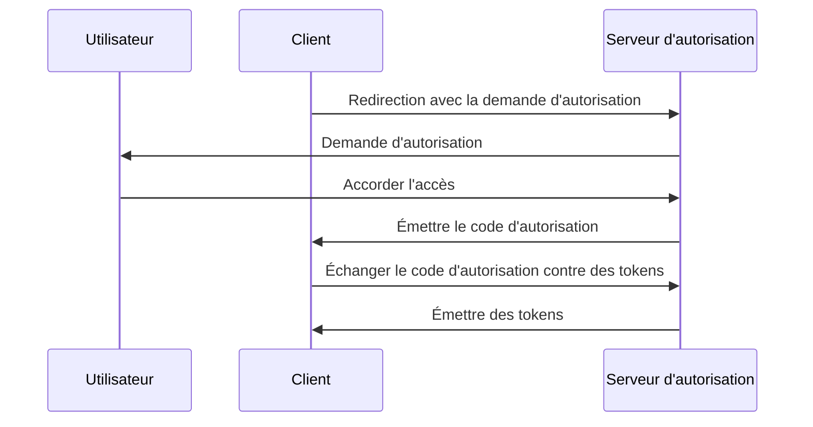

## Qu'est-ce que la clé de preuve pour l'échange de code (PKCE) ?

La clé de preuve pour l'échange de code (PKCE) sert d'extension de sécurité pour <Ref slug="authorization-code-flow" /> dans <Ref slug="oauth-2.0" />. Elle est conçue pour protéger les codes d'autorisation contre l'interception et l'utilisation abusive, en particulier dans les clients publics où le secret du client n'est pas sûr.

À partir de <Ref slug="oauth-2.1" />, PKCE est appliquée à tous les types de clients, y compris les <Ref slug="client" headingId="public-clients" /> et les <Ref slug="client" headingId="confidential-clients">clients confidentiels (privés)</Ref>.

## Comment fonctionne PKCE ?

PKCE introduit quelques étapes supplémentaires dans le processus de flux de code d'autorisation pour s'assurer que le <Ref slug="client" /> qui échange le code d'autorisation est le même client qui a initié le flux.

> [!Note]
> PKCE est également applicable aux flux <Ref slug="openid-connect" /> qui reposent sur le flux de code d'autorisation. Pour simplifier, nous nous concentrerons sur l'implémentation OAuth 2.0.

Passons rapidement en revue le flux standard de code d'autorisation avant de plonger dans PKCE :



Voyons maintenant comment PKCE améliore le flux de code d'autorisation.

### 1. Préparation de la demande d'autorisation

#### 1.1. Le client génère un vérificateur de code

Avant d'initier la <Ref slug="authorization-request" />, le client doit générer une chaîne aléatoire appelée **vérificateur de code**. Cette chaîne doit être une chaîne cryptographique aléatoire avec une haute entropie, sûre pour les URL, d'une longueur minimale de 43 caractères et maximale de 128 caractères.
  
Voici un exemple de génération d'un vérificateur de code en JavaScript :

```javascript
// `js-base64` est une bibliothèque universelle utilisable à la fois dans Node.js et les navigateurs
import { fromUint8Array } from 'js-base64';

// Le deuxième argument `true` indique que la sortie doit être sécurisée pour les URL
const codeVerifier = fromUint8Array(crypto.getRandomValues(new Uint8Array(64)), true);
```

#### 1.2. Le client crée un défi de code

Le client doit hacher le **vérificateur de code** en utilisant une fonction de hachage cryptographique, telle que SHA-256, et encoder le hachage dans une chaîne Base64 sécurisée pour les URLs. La chaîne résultante est appelée le **défi de code**.

Voici un exemple de création d'un défi de code en JavaScript :

```javascript
// `js-base64` est une bibliothèque universelle utilisable à la fois dans Node.js et les navigateurs
import { fromUint8Array } from 'js-base64';

const encodedCodeVerifier = new TextEncoder().encode(codeVerifier);
const codeChallenge = new Uint8Array(await crypto.subtle.digest('SHA-256', encodedCodeVerifier));

// Le deuxième argument `true` indique que la sortie doit être sécurisée pour les URL
return fromUint8Array(codeChallenge, true);
```

#### 1.3. Le client inclut le défi de code dans la demande d'autorisation

Lorsque le client initie la demande d'autorisation, il inclut les paramètres `code_challenge` et `code_challenge_method` dans la demande. Le paramètre `code_challenge` contient le **défi de code** généré à l'étape précédente, et le paramètre `code_challenge_method` spécifie l'algorithme de hachage utilisé pour créer le **défi de code** (par exemple, `S256` pour SHA-256).

Les valeurs de `code_challenge_method` supportées sont `plain` et `S256`, où `plain` indique que le **défi de code** est envoyé tel quel sans aucun hachage. Habituellement, `S256` est recommandé pour une meilleure sécurité.

Voici un exemple non normatif d'une demande d'autorisation avec PKCE :

```http
GET /authorize?response_type=code
  &client_id=YOUR_CLIENT_ID
  &redirect_uri=https%3A%2F%2Fclient.example.com%2Fcallback
  &scope=openid%20profile
  &code_challenge=YOUR_CODE_CHALLENGE
  &code_challenge_method=S256
  &state=abc123
  &nonce=123456 HTTP/1.1
```

### 2. Échanger le code d'autorisation contre des tokens

Le client doit sauvegarder le **vérificateur de code** pour une utilisation ultérieure et continuer le flux d'autorisation comme d'habitude. Une fois que le client reçoit le code d'autorisation, il doit envoyer la <Ref slug="token-request" /> avec le **vérificateur de code** au serveur d'autorisation.

Voici un exemple non normatif d'une demande de token avec PKCE :

```http
POST /token HTTP/1.1
Host: your-authorization-server.com
Content-Type: application/x-www-form-urlencoded

grant_type=authorization_code
  &code=YOUR_AUTHORIZATION_CODE
  &redirect_uri=https%3A%2F%2Fclient.example.com%2Fcallback
  &client_id=YOUR_CLIENT_ID
  &code_verifier=YOUR_CODE_VERIFIER
```

Le serveur d'autorisation vérifiera le **défi de code** par rapport au **vérificateur de code** pour s'assurer que le client est la même entité qui a initié le flux. Si la vérification échoue, le serveur d'autorisation rejettera la demande de token.

## Comment PKCE améliore la sécurité

Le principal avantage de sécurité de PKCE est qu'il empêche les attaques d'interception de code d'autorisation, qui peuvent se produire dans les clients publics. Par exemple, si un attaquant intercepte le code d'autorisation, il ne peut pas l'échanger contre des tokens sans le **vérificateur de code**. PKCE garantit que seul le client qui a initié le flux peut compléter l'échange de token.

<SeeAlso slugs={['oauth-2.1', 'authorization-code-flow']} />

<Resources
  urls={[
    "https://blog.logto.io/how-pkce-protects-the-authorization-code-flow-for-native-apps",
    "https://datatracker.ietf.org/doc/html/rfc7636",
  ]}
/>
