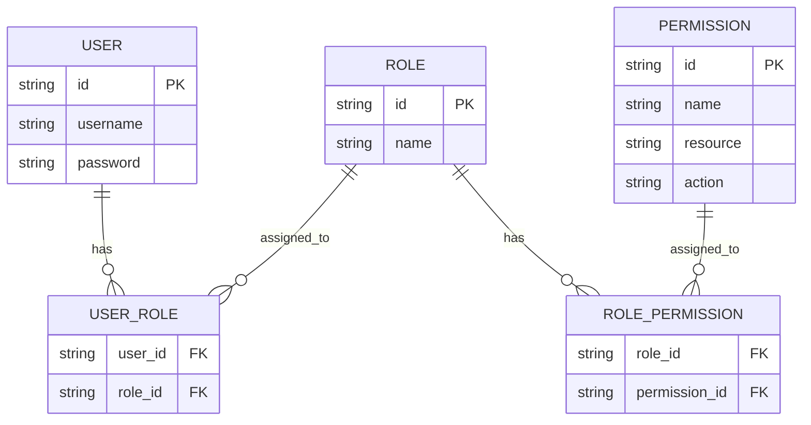
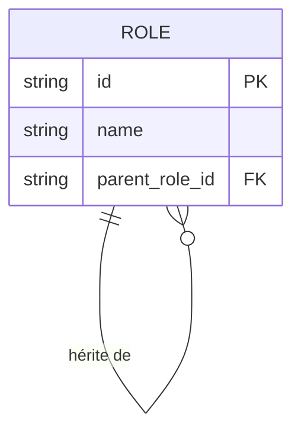
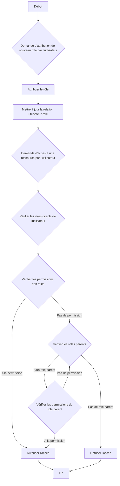
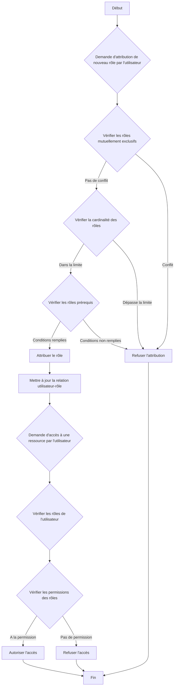

## Qu'est-ce que le contrôle d'accès basé sur les rôles (RBAC) ?

Le contrôle d'accès basé sur les rôles (RBAC) est un modèle de contrôle d'accès largement adopté qui introduit le concept de "rôles" pour découpler les utilisateurs des permissions, résultant en un système de gestion des permissions flexible et efficace.

L'idée centrale derrière le RBAC est simple mais puissante : au lieu d'attribuer directement des permissions aux utilisateurs, les permissions sont attribuées à des rôles, qui sont ensuite attribués aux utilisateurs. Cette méthode indirecte d'allocation des permissions simplifie grandement le processus de gestion des droits d'accès.

## Quels sont les concepts clés du RBAC ?

Le modèle RBAC tourne autour de quatre éléments principaux :

1. Utilisateurs : Individus au sein du système, généralement des personnes réelles.
2. Rôles : Représentations de fonctions ou responsabilités professionnelles au sein d'une organisation.
3. Permissions : Autorisations pour effectuer des opérations spécifiques sur des ressources particulières.
4. Sessions : Environnements dynamiques où les utilisateurs activent certains rôles.

Le flux de travail de base du RBAC peut être résumé comme suit :
1. Définir des rôles basés sur la structure organisationnelle ou les besoins commerciaux.
2. Attribuer des permissions appropriées à chaque rôle.
3. Attribuer un ou plusieurs rôles aux utilisateurs en fonction de leurs responsabilités.
4. Lorsqu'un utilisateur tente d'accéder à une ressource, le système vérifie si les rôles qui lui sont attribués ont les permissions nécessaires.

## Comment le RBAC est-il couramment utilisé dans les applications du monde réel ?

Lors de l'utilisation du RBAC dans une application commerciale typique, vous pouvez commencer par répondre aux trois questions de base suivantes :

1. Quelles ressources doivent être protégées dans le système ?
2. Quelles opérations doivent être contrôlées sur ces ressources ?
3. Dans des scénarios réels, quels rôles sont responsables de l'exécution de ces ressources et opérations ?

Prenons un système de commerce électronique comme exemple.

Vous pouvez d'abord identifier les ressources qui doivent être protégées :

- Produit
- Commande

Ensuite, vous pouvez déterminer quelles opérations doivent être contrôlées sur ces ressources, c'est-à-dire définir les permissions pour ces ressources :

- Produit
  - `read:product`
  - `create:product`
  - `delete:product`
- Commande
  - `read:order`
  - `create:order`
  - `delete:order`

Avec les permissions ci-dessus, vous pouvez maintenant définir le modèle de gestion des permissions suivant basé sur les rôles dans des scénarios réels :

- Administrateur de produit
  - Produit
    - `read:product`
    - `create:product`
    - `delete:product`
- Administrateur de commande
  - Commande
    - `read:order`
    - `create:order`
    - `delete:order`

Enfin, attribuez les rôles aux utilisateurs en fonction de leurs responsabilités :

- Alice : Administrateur de produit
- Bob : Administrateur de commande

Lorsqu'un utilisateur accède à une ressource, le système vérifiera si les rôles qui lui sont attribués ont les permissions nécessaires.

Par exemple, lorsque Alice tente de lire des informations sur le produit, le système récupère d'abord ses informations de rôle et découvre qu'elle a le rôle d'administrateur de produit.

Ensuite, le système interroge les permissions associées à ce rôle, qui incluent `read:product`, `create:product` et `delete:product`.

Le système vérifie ensuite si la permission requise `read:product` existe dans sa liste de permissions.

Puisque cette permission existe, le système permet à Alice d'accéder à la liste des produits. Si la permission requise n'est pas dans la liste, le système refuse la demande d'accès.

## Pourquoi ne devriez-vous pas utiliser directement les rôles pour le contrôle d'accès

Une erreur courante dans l'implémentation du RBAC est d'utiliser directement les rôles pour le contrôle d'accès :

```typescript
// ❌ Approche problématique
if (user.hasRole('product_admin')) {
  await deleteProduct(productId);
}
```

Bien que cette approche semble simple, elle crée des problèmes à mesure que votre système se développe. Par exemple :
- Lorsque l'équipe marketing doit mettre à jour les descriptions de produits, vous devrez modifier le code pour vérifier les rôles marketing.
- Lorsque vous souhaitez que certains gestionnaires de produits ne publient que mais ne suppriment pas de produits, vous devrez créer de nouvelles vérifications de rôle pour les opérations connexes.
- Lorsqu'une nouvelle équipe de contenu a besoin d'un accès partiel aux produits, vous devrez à nouveau mettre à jour votre code.

Au lieu de cela, vous devriez toujours vérifier les permissions spécifiques :

```typescript
// ✅ Approche recommandée
if (user.hasPermission('delete:product')) {
  await deleteProduct(productId);
}
```

Cette approche basée sur les permissions offre plusieurs avantages :

1. Contrôle des permissions granulaire : les permissions peuvent être précisément mappées à des opérations spécifiques sur les ressources :

- Créer un produit : `create:product`
- Mettre à jour un produit : `update:product`
- Supprimer un produit : `delete:product`
- Publier un produit : `publish:product`

2. Configuration flexible des rôles : les permissions peuvent être librement combinées en rôles sans modifications de code :

```typescript
const roles = {
  product_admin: ['create:product', 'update:product', 'delete:product', 'publish:product'],
  content_editor: ['update:product'],
  publisher: ['publish:product']  // De nouveaux rôles peuvent être facilement ajoutés
};
```

Ce design rend votre système adaptable à la croissance de l'entreprise :
- L'ajout de nouveaux rôles ne nécessite qu'une configuration des permissions
- L'ajustement des permissions des rôles se fait par configuration
- Les nouvelles fonctionnalités nécessitent juste de nouvelles entrées de permission

Rappelez-vous : les rôles ne devraient être que des conteneurs de permissions, pas la base pour les décisions de contrôle d'accès. Ce design permet au RBAC de fournir une valeur maximale.

## Modèles RBAC et leur évolution

### RBAC0 : La fondation

RBAC0 est le modèle de base qui définit les concepts clés d'utilisateurs, de rôles, de permissions et de sessions. Il sert de fondation pour tous les autres modèles RBAC.

Caractéristiques clés :
- Association utilisateur-rôle : Relation de plusieurs à plusieurs
- Association rôle-permission : Relation de plusieurs à plusieurs



Ce diagramme illustre la structure de base du RBAC0, montrant les relations entre les utilisateurs, les rôles et les permissions.

Opérations clés :
1. Attribuer des rôles aux utilisateurs
2. Attribuer des permissions aux rôles
3. Vérifier si un utilisateur a une permission spécifique

Bien que RBAC0 fournisse un bon point de départ, il présente certaines limitations :
1. Explosion des rôles : À mesure que la complexité du système augmente, le nombre de rôles peut croître rapidement.
2. Redondance des permissions : Différents rôles peuvent nécessiter des ensembles similaires de permissions, entraînant des duplications.
3. Absence de hiérarchie : Il ne peut pas représenter les relations d'héritage entre les rôles.

### RBAC1 : Introduction des hiérarchies de rôles

RBAC1 s'appuie sur RBAC0 en ajoutant le concept d'héritage de rôles.

```plaintext
RBAC1 = RBAC0 + Héritage de rôles
```

Caractéristiques clés :
- Hiérarchie de rôles : Les rôles peuvent avoir des rôles parents
- Héritage des permissions : Les rôles enfants héritent de toutes les permissions de leurs rôles parents



Ce diagramme montre comment les rôles peuvent hériter d'autres rôles dans RBAC1.

Opérations clés :



Ce diagramme de flux illustre le processus d'attribution de rôle et de vérification des permissions dans RBAC1, y compris l'aspect de l'héritage de rôle.

RBAC1 offre plusieurs avantages :
1. Réduction du nombre de rôles : Moins de rôles de base peuvent être créés grâce à l'héritage
2. Gestion simplifiée des permissions : Plus facile de refléter les hiérarchies organisationnelles

Cependant, RBAC1 présente encore certaines limitations :
1. Absence de mécanismes de contrainte : Incapacité à restreindre les utilisateurs de détenir simultanément des rôles potentiellement conflictuels
2. Considérations de performance : Les vérifications de permissions peuvent nécessiter de parcourir toute la hiérarchie des rôles

### RBAC2 : Mise en œuvre des contraintes

RBAC2 est également basé sur RBAC0 mais introduit le concept de contraintes.

```plaintext
RBAC2 = RBAC0 + Contraintes
```

Caractéristiques clés :
1. Rôles mutuellement exclusifs : Les utilisateurs ne peuvent pas être attribués à ces rôles simultanément
2. Cardinalité des rôles : Limite le nombre d'utilisateurs pouvant être attribués à un rôle particulier
3. Rôles prérequis : Les utilisateurs doivent avoir un rôle spécifique avant d'être attribués à un autre



Ce diagramme de flux démontre le processus d'attribution de rôle et de contrôle d'accès dans RBAC2, incorporant les diverses contraintes.

RBAC2 améliore la sécurité en empêchant une concentration excessive des permissions et permet un contrôle d'accès plus précis. Cependant, il augmente la complexité du système et peut impacter la performance en raison de la nécessité de vérifier plusieurs conditions de contrainte pour chaque attribution de rôle.

### RBAC3 : Le modèle complet

RBAC3 combine les caractéristiques de RBAC1 et RBAC2, offrant à la fois l'héritage de rôles et les mécanismes de contrainte :

```plaintext
RBAC3 = RBAC0 + Héritage de rôles + Contraintes
```

Ce modèle complet offre une flexibilité maximale mais présente également des défis en termes d'implémentation et d'optimisation des performances.

## Quels sont les avantages du RBAC (contrôle d'accès basé sur les rôles) ?

1. Gestion simplifiée des permissions : L'autorisation en masse via les rôles réduit la complexité de la gestion des permissions individuelles des utilisateurs.
2. Sécurité renforcée : Un contrôle plus précis des permissions des utilisateurs réduit les risques de sécurité.
3. Réduction des coûts administratifs : La modification des permissions des rôles affecte automatiquement tous les utilisateurs associés.
4. Alignement avec la logique métier : Les rôles correspondent souvent aux structures organisationnelles ou aux processus métier, les rendant plus faciles à comprendre et à gérer.
5. Support pour la séparation des tâches : Les responsabilités critiques peuvent être séparées grâce à des contraintes comme les rôles mutuellement exclusifs.

## Quelles sont les considérations pratiques pour l'implémentation ?

Lors de l'implémentation du RBAC dans des scénarios réels, les développeurs devraient considérer ces aspects clés :

1. Conception de la base de données : Utiliser des bases de données relationnelles pour stocker et interroger efficacement les structures RBAC.
2. Optimisation des performances : Mettre en œuvre des stratégies de mise en cache et optimiser les vérifications de permissions, en particulier pour les modèles RBAC3 complexes.
3. Intégration API et frontend : Concevoir des APIs claires pour gérer les utilisateurs, les rôles et les permissions, et considérer comment utiliser le RBAC dans les applications frontend.
4. Sécurité et audit : Assurer la sécurité du système RBAC lui-même et mettre en œuvre des fonctions de journalisation et d'audit détaillées.
5. Scalabilité : Concevoir en pensant aux futures extensions, comme le support de règles de permission plus complexes ou l'intégration avec d'autres systèmes.
6. Expérience utilisateur : Concevoir des interfaces intuitives pour que les administrateurs système puissent facilement configurer et maintenir la structure RBAC.

<SeeAlso slugs={['abac', 'access-control']} />

<Resources
  urls={[
    "https://blog.logto.io/rbac-and-abac",
    "https://blog.logto.io/mastering-rbac",
    "https://blog.logto.io/organization-and-role-based-access-control",
    "https://docs.logto.io/docs/recipes/rbac/",
    "https://en.wikipedia.org/wiki/Role-based_access_control"
  ]}
/>