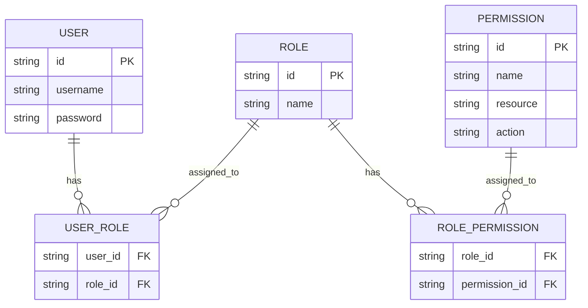
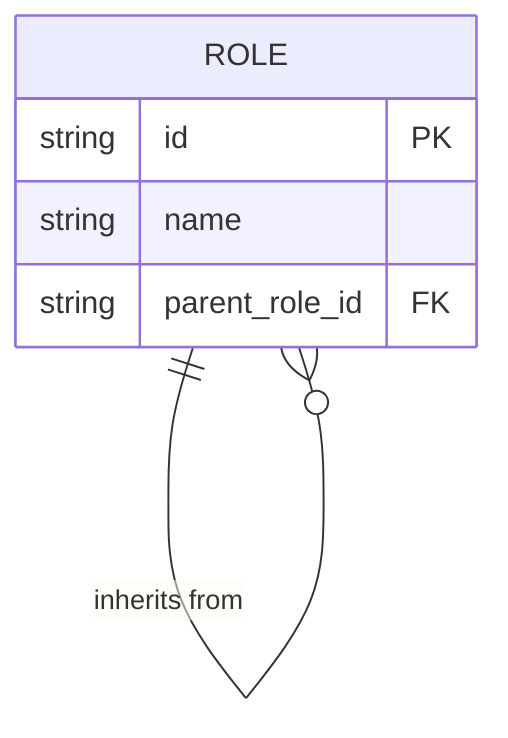
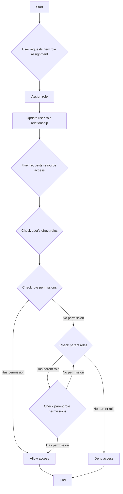
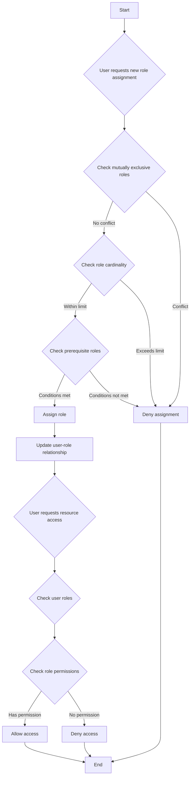

## Qu'est-ce que le contrôle d'accès basé sur les rôles (RBAC) ?

Le contrôle d'accès basé sur les rôles (RBAC) est un modèle de contrôle d'accès largement adopté qui introduit le concept de "rôles" pour découpler les utilisateurs des permissions, résultant en un système de gestion des permissions flexible et efficace.

L'idée centrale derrière le RBAC est simple mais puissante : au lieu d'attribuer directement des permissions aux utilisateurs, les permissions sont attribuées aux rôles, qui sont ensuite attribués aux utilisateurs. Cette méthode indirecte d'allocation des permissions simplifie grandement le processus de gestion des droits d'accès.

### Concepts clés dans le RBAC

Le modèle RBAC tourne autour de quatre éléments principaux :

1. Utilisateurs : Individus au sein du système, généralement des personnes réelles.
2. Rôles : Représentations de fonctions ou de responsabilités au sein d'une organisation.
3. Permissions : Autorisations pour effectuer des opérations spécifiques sur des ressources particulières.
4. Sessions : Environnements dynamiques où les utilisateurs activent certains rôles.

Le flux de travail de base du RBAC peut être résumé comme suit :
1. Définir des rôles basés sur la structure organisationnelle ou les besoins métier.
2. Attribuer les permissions appropriées à chaque rôle.
3. Attribuer un ou plusieurs rôles aux utilisateurs en fonction de leurs responsabilités.
4. Lorsqu'un utilisateur tente d'accéder à une ressource, le système vérifie si ses rôles attribués ont les permissions nécessaires.

### Types de RBAC

#### RBAC0 : La fondation

RBAC0 est le modèle de base qui définit les concepts principaux d'utilisateurs, de rôles, de permissions et de sessions. Il sert de fondation pour tous les autres modèles RBAC.

Caractéristiques clés :
- Association utilisateur-rôle : Relation de plusieurs à plusieurs
- Association rôle-permission : Relation de plusieurs à plusieurs



Ce diagramme illustre la structure de base du RBAC0, montrant les relations entre les utilisateurs, les rôles, et les permissions.

Opérations clés :
1. Attribuer des rôles aux utilisateurs
2. Attribuer des permissions aux rôles
3. Vérifier si un utilisateur possède une permission spécifique

Bien que RBAC0 offre un point de départ solide, il présente certaines limites :
1. Explosion des rôles : À mesure que la complexité du système augmente, le nombre de rôles peut croître rapidement.
2. Redondance des permissions : Différents rôles peuvent nécessiter des ensembles similaires de permissions, entraînant des duplications.
3. Absence de hiérarchie : Il ne peut pas représenter des relations d'héritage entre les rôles.

#### RBAC1 : Introduction des hiérarchies de rôles

RBAC1 s'appuie sur RBAC0 en ajoutant le concept d'héritage de rôles.

```plaintext
RBAC1 = RBAC0 + Role Inheritance
```

Caractéristiques clés :
- Hiérarchie des rôles : Les rôles peuvent avoir des rôles parent
- Héritage des permissions : Les rôles enfants héritent de toutes les permissions de leurs rôles parent



Ce diagramme montre comment les rôles peuvent hériter d'autres rôles dans RBAC1.

Opérations clés :



Ce flux de processus illustre le processus d'attribution de rôles et de vérification des permissions dans RBAC1, y compris l'aspect de l'héritage de rôles.

RBAC1 offre plusieurs avantages :
1. Réduction du nombre de rôles : Moins de rôles de base peuvent être créés grâce à l'héritage
2. Simplification de la gestion des permissions : Plus facile de refléter les hiérarchies organisationnelles

Cependant, RBAC1 présente encore certaines limites :
1. Absence de mécanismes de contrainte : Incapacité à restreindre les utilisateurs de détenir simultanément des rôles potentiellement conflictuels
2. Considérations de performance : Les vérifications des permissions peuvent nécessiter de traverser toute la hiérarchie des rôles

#### RBAC2 : Mise en œuvre des contraintes

RBAC2 est également basé sur RBAC0 mais introduit le concept de contraintes.

```plaintext
RBAC2 = RBAC0 + Constraints
```

Caractéristiques clés :
1. Rôles mutuellement exclusifs : Les utilisateurs ne peuvent pas être attribués à ces rôles simultanément
2. Cardinalité des rôles : Limite le nombre d'utilisateurs pouvant être attribués à un rôle particulier
3. Rôles prérequis : Les utilisateurs doivent avoir un rôle spécifique avant d'en être attribué un autre



Ce flux montre le processus d'attribution de rôles et de contrôle d'accès dans RBAC2, intégrant les diverses contraintes.

RBAC2 améliore la sécurité en empêchant la concentration excessive de permissions et permet un contrôle d'accès plus précis. Cependant, il augmente la complexité du système et peut impacter les performances en raison de la nécessité de vérifier plusieurs conditions de contrainte pour chaque attribution de rôle.

### RBAC3 : Le modèle complet

RBAC3 combine les caractéristiques de RBAC1 et RBAC2, offrant à la fois héritage de rôle et mécanismes de contrainte：

```plaintext
RBAC3 = RBAC0 + Role Inheritance + Constraints
```

Ce modèle complet offre une flexibilité maximale mais présente également des défis en matière de mise en œuvre et d'optimisation des performances.

## Quels sont les avantages du RBAC (contrôle d'accès basé sur les rôles) ?

1. Gestion simplifiée des permissions : L'autorisation en masse via les rôles réduit la complexité de la gestion des permissions des utilisateurs individuels.
2. Sécurité renforcée : Un contrôle plus précis des permissions des utilisateurs réduit les risques de sécurité.
3. Réduction des coûts administratifs : La modification des permissions de rôle affecte automatiquement tous les utilisateurs associés.
4. Alignement avec la logique d'entreprise : Les rôles correspondent souvent aux structures organisationnelles ou aux processus métier, ce qui les rend plus faciles à comprendre et à gérer.
5. Soutien à la séparation des tâches : Les responsabilités critiques peuvent être séparées par des contraintes telles que des rôles mutuellement exclusifs.

## Quelles sont les considérations pratiques de mise en œuvre ?

Lors de la mise en œuvre du RBAC dans des scénarios réels, les développeurs doivent prendre en compte ces aspects clés :

1. Conception de la base de données : Utiliser des bases de données relationnelles pour stocker et interroger efficacement les structures RBAC.
2. Optimisation des performances : Mettre en œuvre des stratégies de mise en cache et optimiser les vérifications des permissions, en particulier pour les modèles RBAC3 complexes.
3. Intégration API et frontend : Concevoir des APIs claires pour gérer les utilisateurs, les rôles et les permissions, et envisager comment utiliser RBAC dans les applications frontend.
4. Sécurité et audit : Assurer la sécurité du système RBAC lui-même et mettre en œuvre des fonctions de journalisation et d'audit détaillées.
5. Évolutivité : Concevoir en prévision de futures extensions, telles que la prise en charge de règles de permission plus complexes ou l'intégration avec d'autres systèmes.
6. Expérience utilisateur : Concevoir des interfaces intuitives pour que les administrateurs système puissent facilement configurer et maintenir la structure RBAC.

<SeeAlso slugs={['abac', 'access-control']} />

<Resources
  urls={[
    "https://blog.logto.io/rbac-and-abac",
    "https://blog.logto.io/mastering-rbac",
    "https://blog.logto.io/organization-and-role-based-access-control",
    "https://docs.logto.io/docs/recipes/rbac/",
    "https://en.wikipedia.org/wiki/Role-based_access_control"
  ]}
/>
