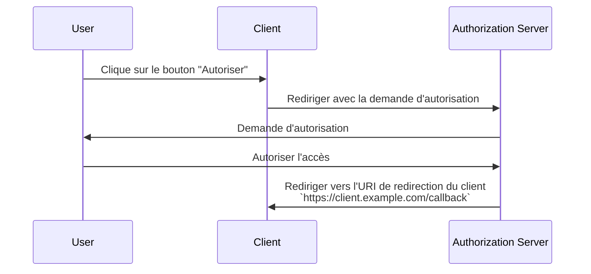

## Qu'est-ce qu'une URI de redirection ?

Une URI de redirection, également appelée URL de rappel ou URL de redirection, est une URI pour indiquer où le <Ref slug="authorization-server" /> doit rediriger l'agent utilisateur après que la <Ref slug="authorization-request" /> est complétée.

> Universal Resource Identifier (URI) est souvent confondu avec URL (Uniform Resource Locator). Pour plus d'informations, consultez [Dévoiler URI, URL, et URN](https://blog.logto.io/unveiling-uri-url-and-urn).

Jetons un coup d'œil à un exemple de demande d'autorisation qui inclut une URI de redirection :

```http
GET /authorize?response_type=code
  &client_id=YOUR_CLIENT_ID
  &redirect_uri=https%3A%2F%2Fclient.example.com%2Fcallback
  &scope=openid%20profile%20email
  &state=abc123
  &nonce=123456 HTTP/1.1
```

Dans cet exemple, la valeur brute du paramètre `redirect_uri` est `https%3A%2F%2Fclient.example.com%2Fcallback`, qui est codée en URL. La valeur réelle est `https://client.example.com/callback`.

## Comment fonctionne une URI de redirection ?

> Dans le contexte de <Ref slug="openid-connect" />, le flux de travail pour la <Ref slug="authorization-request" /> et le <Ref slug="authorization-server" /> d'OAuth 2.0 s'applique de manière similaire. L'URI de redirection fonctionne de la même manière qu'elle le fait dans OAuth 2.0, pour à la fois la <Ref slug="authentication-request" /> et la <Ref slug="openid-connect" headingId="openid-provider-op" />.

Disons que le <Ref slug="client" /> initie la demande d'autorisation à partir de l'URL `https://client.example.com`. Après que l'utilisateur termine le processus d'autorisation, le serveur d'autorisation redirigera l'agent utilisateur (navigateur) vers `https://client.example.com/callback`.



Il est évident que l'URI de redirection est essentielle pour que le serveur d'autorisation redirige l'agent utilisateur une fois le processus d'autorisation terminé. De plus, l'URI de redirection est également utilisée pour recevoir le code d'autorisation ou les jetons, selon le flux.

Voici un exemple non normatif de ce à quoi la redirection réelle dans un <Ref slug="authorization-code-flow" /> pourrait ressembler :

```http
HTTP/1.1 302 Found
Location: https://client.example.com/callback?code=AUTHORIZATION_CODE&state=abc123
```

Notez que les paramètres d'URL `code` et `state` ajoutés par le serveur d'autorisation sont inclus dans l'URI de redirection. Le client doit extraire les paramètres `code` et `state` de l'URL pour continuer le processus d'autorisation.

## Pourquoi avons-nous besoin d'une URI de redirection ?

Comme nous pouvons le voir dans l'exemple ci-dessus, le serveur d'autorisation doit savoir où rediriger après une demande d'autorisation réussie. Cela est particulièrement utile lorsqu'il y a plusieurs clients (c'est-à-dire <Ref slug="single-sign-on" />), et chaque client a une URI de redirection différente.

Avec le <Ref slug="authorization-code-flow" />, l'URI de redirection est également utilisée pour transmettre le code d'autorisation au client, au lieu d'utiliser le canal avant (navigateur) pour éviter d'exposer les jetons à d'éventuelles attaques.

Il était possible d'utiliser le [Resource Owner Password Credentials (ROPC) grant](https://datatracker.ietf.org/doc/html/rfc6749#section-4.3) pour obtenir des jetons pour l'utilisateur sans une URI de redirection. Cependant, il est obsolète dans <Ref slug="oauth-2.1" /> en raison de préoccupations de sécurité.

## Considérations de sécurité

L'URI de redirection est un paramètre critique et est une cible courante pour les attaquants. Voici quelques considérations de sécurité à garder à l'esprit :

- **Liste blanche des URIs de redirection** : Le client ne doit accepter que les URIs de redirection enregistrées auprès du serveur d'autorisation. Cela empêche les attaquants de rediriger les utilisateurs vers des sites malveillants.
- **Utiliser HTTPS** : Utilisez toujours HTTPS pour l'URI de redirection afin de sécuriser la communication entre le client et le serveur d'autorisation.
- **Correspondance exacte** : L'URI de redirection doit correspondre exactement à l'URI enregistrée. Les serveurs d'autorisation peuvent appliquer des règles de correspondance strictes qui interdisent les modèles de correspondance larges.
- **Paramètre d'état** : Utilisez le paramètre `state` pour prévenir les attaques de <Ref slug="csrf" />. Le client doit valider le paramètre `state` pour s'assurer qu'il correspond à la valeur envoyée dans la demande d'autorisation.

<SeeAlso slugs={["csrf", "oauth-2.1", "authorization-code-flow"]} />

<Resources
  urls={[
    "https://blog.logto.io/oauth-2-1",
    "https://blog.logto.io/csrf",
    "https://blog.logto.io/redirect-uri-in-authorization-code-flow",
  ]}
/>
