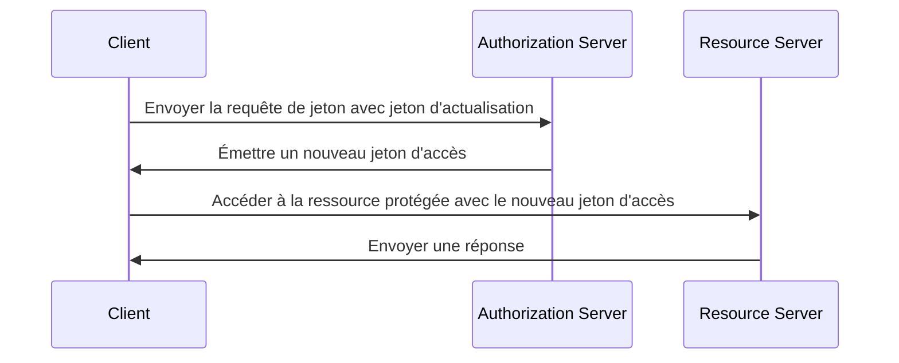

## Qu'est-ce qu'un jeton d'actualisation (refresh token) ?

Un jeton d'actualisation (refresh token) est une information d'identification à longue durée de vie, typiquement une chaîne aléatoire, qui est utilisée pour obtenir de nouveaux <Ref slug="access-token">jetons d'accès (access tokens)</Ref> sans nécessiter que l'utilisateur se ré-authentifie. Dans le contexte d'OAuth 2.0 et OpenID Connect (OIDC), les <Ref slug="authorization-server">serveurs d'autorisation (authorization servers)</Ref> peuvent émettre des jetons d'actualisation (refresh tokens) aux clients (applications) lorsque le client demande un <Ref slug="offline-access" />.

Bien que le [RFC OAuth 2.0](https://datatracker.ietf.org/doc/html/rfc6749#section-1.5) définisse le cycle de vie général d'un jeton d'actualisation, les détails de l'implémentation peuvent varier selon les serveurs d'autorisation et les clients. Nous les explorerons dans les sections suivantes.

## Comment fonctionne un jeton d'actualisation (refresh token) ?

Un jeton d'actualisation (refresh token) est généralement émis en même temps qu'un jeton d'accès lorsque le client demande un <Ref slug="offline-access" />. La norme industrielle pour demander un accès hors ligne est d'inclure le champ `offline_access` dans la <Ref slug="authorization-request">requête d'autorisation (authorization request)</Ref>, tandis que <Ref slug="openid-connect" /> définit officiellement le champ `offline_access` à cette fin (disponible dans la <Ref slug="authentication-request">requête d'authentification (authentication request)</Ref>).

Voici un exemple non normatif de requête d'autorisation incluant le champ `offline_access` :

```http
GET /authorize?response_type=code
  &client_id=YOUR_CLIENT_ID
  &redirect_uri=https%3A%2F%2Fclient.example.com%2Fcallback
  &scope=openid%20profile%20email%20offline_access
  &state=abc123
  &nonce=123456 HTTP/1.1
```

Une fois que le client reçoit le jeton d'actualisation (refresh token), il peut l'utiliser pour demander de nouveaux jetons d'accès lorsque le jeton d'accès actuel expire. Voici un exemple simplifié utilisant un jeton d'actualisation :



Comme le montre le diagramme de séquence, l'utilisation d'un jeton d'actualisation doit être prise en charge à la fois par le client et le serveur d'autorisation :

- Le client doit stocker le jeton d'actualisation de manière sécurisée et l'utiliser dans la <Ref slug="token-request">requête de jeton (token request)</Ref> pour obtenir un nouveau jeton d'accès.
- Le serveur d'autorisation doit valider le jeton d'actualisation et émettre un nouveau jeton d'accès lorsque le client présente un jeton d'actualisation valide.

Le jeton d'actualisation n'est pas destiné à être partagé avec le <Ref slug="resource-server">serveur de ressources (resource server)</Ref>. Les jetons d'accès sont les seuls jetons que le serveur de ressources doit vérifier pour l'autorisation.

Voici un exemple non normatif de requête de jeton utilisant un jeton d'actualisation :

```http
POST /token HTTP/1.1
Host: your-authorization-server.com
Content-Type: application/x-www-form-urlencoded

grant_type=refresh_token
  &refresh_token=YOUR_REFRESH_TOKEN
  &client_id=YOUR_CLIENT_ID
  &client_secret=YOUR_CLIENT_SECRET
  &scope=openid%20profile%20email
```

## Considérations de sécurité ||security-considerations||

Étant donné que les jetons d'actualisation (refresh tokens) ont une longue durée de vie (par exemple, jours, semaines) et peuvent être utilisés pour obtenir de nouveaux jetons d'accès sans interaction de l'utilisateur, ils posent un risque de sécurité plus élevé que les jetons d'accès (par exemple, minutes, heures). L'utilisation des jetons d'actualisation doit être soigneusement considérée et mise en œuvre pour atténuer les menaces potentielles à la sécurité. Voici quelques bonnes pratiques à prendre en compte :

### Stockage sécurisé

Stockez les jetons d'actualisation de manière sécurisée côté client pour empêcher tout accès non autorisé. Ces mécanismes de stockage incluent :

- **Cookies HTTP-only** : Stockez les jetons dans des cookies HTTP-only pour empêcher le JavaScript côté client d'y accéder.
- **Stockage chiffré** : Utilisez des stockages sécurisés tels que Keychain (iOS) ou KeyStore (Android) sur les appareils mobiles, ou des bases de données chiffrées sur les applications web.

### Rotation des jetons d'actualisation ||refresh-token-rotation||

Bien que les jetons d'actualisation puissent durer longtemps, les faire tourner périodiquement ou en fonction de certaines conditions (par exemple, après un échange de jetons réussi) peut réduire considérablement le risque d'accès non autorisé. La stratégie de rotation exacte peut varier en fonction des exigences de sécurité de l'application et des capacités du serveur d'autorisation.

Voici deux stratégies de rotation de jetons courantes :

- **Rotation basée sur le temps** : Faites tourner les jetons d'actualisation après une certaine période (par exemple, tous les 7 jours).
- **Rotation basée sur les événements** : Faites tourner les jetons d'actualisation après des événements spécifiques (par exemple, échange de jetons réussi, changement de mot de passe).

Lorsqu'un jeton d'actualisation est renouvelé, l'ancien jeton d'actualisation doit être invalidé pour empêcher sa réutilisation. Ces stratégies sont souvent combinées avec le TTL (temps de vie) de la session pour garantir qu'après une certaine période, quelles que soient la validité du jeton d'actualisation, l'utilisateur doit se réauthentifier.

### Jetons d'actualisation contraints par l'expéditeur ||sender-constrained-refresh-tokens||

Les jetons d'actualisation contraints par l'expéditeur sont un mécanisme de sécurité qui lie le jeton d'actualisation au client qui l'a demandé, dans le cas où le client n'est pas un <Ref slug="client" headingId="confidential-clients">client confidentiel (confidential client)</Ref>. Les méthodes courantes sont [DPoP](https://datatracker.ietf.org/doc/html/rfc9449) et [mTLS](https://datatracker.ietf.org/doc/html/rfc8705).

### Type de client

Il est bon de limiter l'utilisation des jetons d'actualisation aux <Ref slug="client" headingId="confidential-clients">clients confidentiels (clients privés)</Ref>.

- Les clients publics (par exemple, les applications monocadre) exposent le code source côté client, ce qui facilite pour les attaquants l'extraction et l'utilisation abusive des jetons d'actualisation. En général, des mécanismes plus sécurisés comme <Ref slug="pkce" /> et la rotation des jetons d'actualisation sont utilisés pour les clients publics si l'utilisation des jetons d'actualisation est nécessaire.
- Les clients confidentiels, en revanche, fonctionnent dans un environnement de serveur sécurisé où le code source et l'environnement ne sont pas exposés côté client. Les jetons d'actualisation peuvent être utilisés plus en toute sécurité dans de tels environnements.

### Révocation des jetons

Étant donné que les jetons d'actualisation sont généralement des <Ref slug="opaque-token">jetons opaques (opaque tokens)</Ref> (c'est-à-dire, sans signification pour le client) et doivent être validés par le serveur d'autorisation, le serveur d'autorisation peut facilement mettre en œuvre des mécanismes de révocation de jetons pour invalider les jetons d'actualisation en cas de besoin. Cela peut être utile dans des scénarios comme la déconnexion de l'utilisateur, la compromission du compte ou l'abus de jetons.

<SeeAlso slugs={["access-token", "id-token", "jwt", "opaque-token"]} />

<Resources urls={[
  "https://blog.logto.io/understanding-refresh-token-rotation",
  "https://blog.logto.io/understanding-tokens-in-oidc",
  {
    url: "https://openid.net/specs/openid-connect-core-1_0.html#OfflineAccess",
    result: {
      ogTitle: "Accès Hors Ligne dans OpenID Connect Core 1.0",
    }
  },
  {
    url: "https://datatracker.ietf.org/doc/html/rfc6749#section-1.5",
    result: {
      ogTitle: "Token d'Actualisation dans OAuth 2.0",
      ogDescription: "Les tokens d'actualisation sont des identifiants utilisés pour obtenir des tokens d'accès."
    },
  },
]} />
