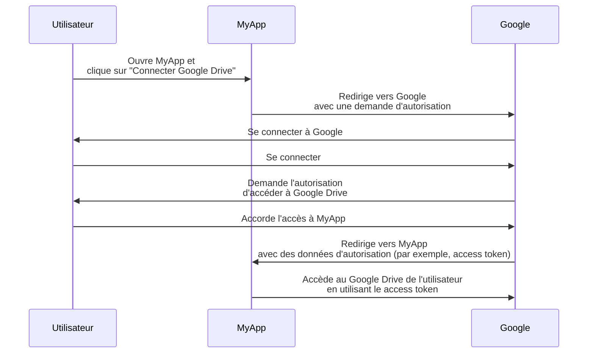

## Qu'est-ce qu'un propriétaire de ressource ?

Dans le contexte de <Ref slug="oauth-2.0" />, un propriétaire de ressource est une identité (typiquement un utilisateur) qui a la capacité d'accorder l'accès à une ressource protégée (par exemple, des données, des fichiers, ou des services).

Par exemple, vous avez une application web MyApp qui souhaite accéder au Google Drive de l'utilisateur. Voici un flux OAuth 2.0 typique :

Dans ce flux, l'**utilisateur** est le **propriétaire de ressource** qui accorde l'accès à son Google Drive à MyApp, tandis que **MyApp** est le <Ref slug="client" /> qui souhaite accéder aux ressources protégées et **Google** est à la fois le <Ref slug="authorization-server" /> et le <Ref slug="resource-server" />.

Comme le nom le suggère, le propriétaire de ressource possède des ressources dans un <Ref slug="resource-server" /> et peut autoriser les clients à y accéder en son nom dans le contexte de <Ref slug="oauth-2.0" />.

## Pourquoi le propriétaire de ressource est-il important ?

Lors d'un processus d'<Ref slug="authorization" />, le propriétaire de ressource ne peut être négligé car c'est lui qui accorde ou refuse explicitement l'accès à ses ressources. Le consentement du propriétaire de ressource est obligatoire pour des raisons à la fois techniques et de conformité :

- **Technique** : Le consentement du propriétaire de ressource garantit que le client a les autorisations nécessaires pour accéder aux ressources. Plutôt qu'un accès tout ou rien, le propriétaire de ressource peut accorder un accès partiel selon la demande du client. De l'autre côté, le propriétaire de ressource peut également révoquer explicitement l'accès à tout moment. Cette approche offre un moyen clair et auditable pour le <Ref slug="access-control" />.
- **Conformité** : Le consentement du propriétaire de ressource est une exigence légale dans de nombreuses juridictions, en particulier lorsqu'il s'agit de données sensibles. Par exemple, le Règlement général sur la protection des données (RGPD) impose que la personne concernée (propriétaire de ressource) doit donner son consentement explicite pour les activités de traitement des données.

## Propriétaire de ressource vs. serveur de ressources

Les <Ref slug="resource-server">serveurs de ressources</Ref> sont responsables de l'hébergement et de la fourniture des **ressources protégées**. Ils sont les gardiens qui vérifient les access tokens et fournissent les ressources aux clients.

Le propriétaire de ressource, en revanche, peut avoir un contrôle total ou partiel sur les ressources protégées dans le serveur de ressources selon les politiques de <Ref slug="access-control" />.

<SeeAlso slugs={["resource-server", "oauth-2.0", "resource-indicator", "access-control"]} />

<Resources
  urls={[
    "https://tools.ietf.org/html/rfc6749",
  ]}
/>
