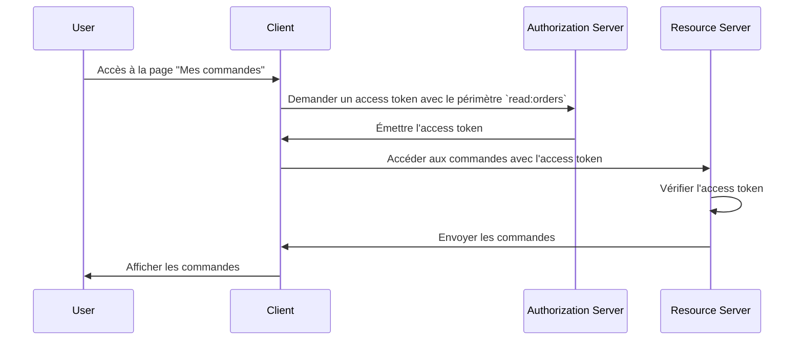

## Qu'est-ce qu'un serveur de ressources ?

Dans le contexte de <Ref slug="oauth-2.0" />, un **serveur de ressources** est un serveur qui héberge les **ressources protégées** que le <Ref slug="client" /> souhaite accéder. Le serveur de ressources est également responsable de vérifier le <Ref slug="access-token" /> et de fournir les ressources protégées au client selon les politiques de <Ref slug="access-control" />.

Par exemple, considérons une application web MyApp qui souhaite accéder au Google Drive de l'utilisateur. Dans ce scénario :

- **MyApp** est le client qui veut accéder aux ressources protégées.
- **Google** est le serveur de ressources qui héberge le Google Drive de l'utilisateur.
- **Google** est également le <Ref slug="authorization-server" /> qui émet l'access token à MyApp.

Prenons un autre exemple où un site e-commerce souhaite accéder à l'historique de commandes d'un utilisateur à partir d'un service de commande interne. Dans ce cas :

- **Site e-commerce** est le client qui veut accéder aux ressources protégées.
- **Service de commande** est le serveur de ressources qui héberge l'historique de commandes de l'utilisateur.
- Si le site e-commerce s'intègre avec un service OAuth 2.0 ou un fournisseur OpenID, ce service (fournisseur) agit comme le serveur d'autorisation.

## Comment fonctionne un serveur de ressources ?

OAuth 2.0 définit séparément les rôles du serveur de ressources et du serveur d'autorisation pour fournir une séparation claire des préoccupations. Cependant, il ne définit pas de représentation spécifique du serveur de ressources dans le cadre, se référant à cela comme un concept virtuel qui héberge les ressources protégées ; le <Ref slug="client" /> doit spécifier des <Ref slug="scope">périmètres</Ref> pour les ressources protégées qu'il souhaite accéder.

Disons que le client veut accéder à l'historique de commandes de l'utilisateur à partir du service de commande. Un exemple non normatif d'envoi d'une <Ref slug="token-request" /> pour accéder aux commandes pourrait ressembler à ceci :



Dans le diagramme de séquence ci-dessus, le client demande un access token avec le périmètre `read:orders` au serveur d'autorisation. Nous supposons que toutes les parties se sont alignées sur la signification du périmètre `read:orders` : il précise que le client souhaite effectuer des actions `read` sur les `orders` servies par le serveur de ressources. Le client utilise ensuite l'access token pour accéder aux commandes du serveur de ressources.

> [!Note]
> La signification et la structure des périmètres ne sont pas définies par OAuth 2.0 et doivent être convenues par le client, le serveur d'autorisation et le serveur de ressources.

Le serveur de ressources est responsable de vérifier l'access token et de déterminer si le client a les autorisations nécessaires pour accéder aux ressources demandées selon les politiques de <Ref slug="access-control" />. Selon l'implémentation, l'access token peut être un <Ref slug="opaque-token" /> ou un <Ref slug="jwt" />.

## Conventions de dénomination

Il est flexible de nommer le serveur de ressources selon le contexte de l'application. Étant donné qu'OAuth 2.0 ne définit pas de représentation spécifique du serveur de ressources dans le paramètre de <Ref slug="scope" />, vous pouvez voir plusieurs conventions dans l'industrie :

- Omettre le nom du serveur de ressources et n'utiliser que l'action : Par exemple, `read` et `write`.
- `[verbe]:[ressource]` : Une convention courante est d'utiliser la combinaison `verbe` et `ressource` pour spécifier les actions que le client peut effectuer sur la ressource. Par exemple, `read:orders` et `write:profile`. Parfois, ils sont inversés en `orders:read` et `profile:write`.
- `[uri]:[action]` : Une autre convention consiste à utiliser l'URI de la ressource et l'action que le client peut effectuer. Par exemple, `https://api.example.com/orders:read` et `https://api.example.com/profile:write`.

## Indicateurs de ressources

Voyons un exemple du paramètre de périmètre dans une <Ref slug="authentication-request" /> (décodée) :

```plaintext
openid profile email https://api.example.com/orders:read
```

Dans cet exemple, le paramètre `scope` inclut les périmètres `openid`, `profile` et `email`, qui sont des périmètres standard d'<Ref slug="openid-connect" />, ainsi que le périmètre `https://api.example.com/orders:read` qui précise l'emplacement du serveur de ressources et l'autorisation pour lire les ressources.

Cela semble correct dans ce cas spécifique, mais à mesure que le nombre de ressources et de périmètres augmente, il peut devenir difficile de gérer et de comprendre les périmètres. Pour répondre à ce problème, OAuth 2.0 a introduit une extension appelée <Ref slug="resource-indicator">indicateurs de ressources</Ref> (RFC 8707) qui permet aux clients d'utiliser des URIs pour spécifier les ressources qu'ils souhaitent accéder, rendant les serveurs de ressources plus explicites dans le processus.

Après avoir ajouté un paramètre d'indicateur de ressource à la demande d'authentification (`resource=https://api.example.com/orders`), le paramètre de périmètre peut être simplifié à :

```plaintext
openid profile email read
```

Ce qui semble plus propre et plus facile à gérer.

> [!Note]
> Tous les serveurs d'autorisation (fournisseurs OpenID) ne supportent pas l'extension d'indicateur de ressource. Veuillez vérifier la documentation de votre serveur d'autorisation avant de l'utiliser.

<SeeAlso slugs={["access-control", "resource-indicator", "resource-owner", "client"]} />

<Resources
  urls={[
    "https://datatracker.ietf.org/doc/html/rfc8707",
  ]}
/>
