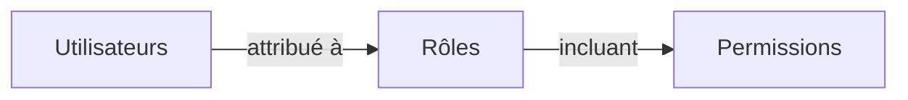

## Rôle

Un rôle est l'un des composants centraux dans <Ref slug="rbac" />. Il sert de conteneur pour les autorisations qui peuvent être attribuées aux utilisateurs, agissant comme un intermédiaire entre les utilisateurs et leurs droits d'accès.



Une structure de rôle typique contient un nom et un ensemble d'autorisations :

```typescript
const role = {
  name: 'order_admin',
  permissions: [
    'read:orders',   // Voir les détails des commandes
    'write:orders',  // Modifier les commandes
    'read:products'  // Voir les produits
  ]
}
```

> [!Note]
> Les rôles sont principalement utilisés pour la gestion des autorisations. Pour la mise en œuvre du contrôle d'accès, il est recommandé de vérifier directement les autorisations plutôt que les rôles. Voir <Ref slug="rbac" /> pour plus d'informations.

<SeeAlso slugs={["rbac", "authorization", "access-control"]} />