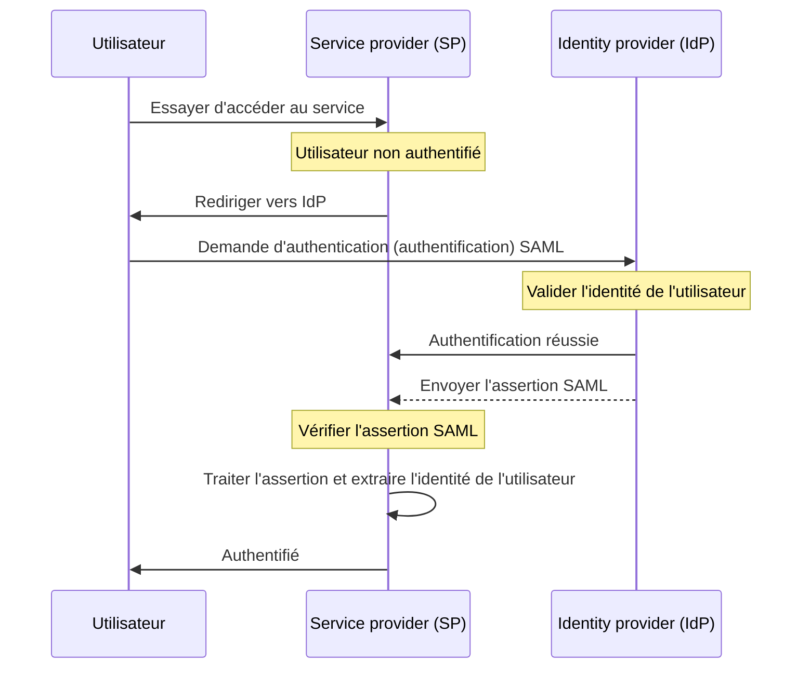

## Qu'est-ce que SAML ?

SAML (généralement appelé SAML 2.0) est une norme basée sur XML pour échanger des données d'authentication (authentification) et d'authorization (autorisation) entre deux parties : le <Ref slug="identity-provider" /> et le <Ref slug="service-provider" />. Il est largement utilisé pour la fédération d'identité et les solutions de <Ref slug="enterprise-sso" />.

Comme son nom l'indique, SAML transmet des assertions sur l'identité et les attributs de l'utilisateur. Ces assertions sont signées numériquement et éventuellement chiffrées pour assurer leur intégrité et leur confidentialité.

## Comment fonctionne SAML ?

Avant de plonger dans le flux d'authentication (authentification) SAML, nous devons comprendre comment les fournisseurs d'identité et les fournisseurs de service peuvent se reconnaître et se faire confiance. Cette confiance est établie par l'échange de métadonnées, où les deux parties partagent des informations sur :

- **Entity ID** : Un identifiant unique pour le fournisseur d'identité ou le fournisseur de service.
- **Public key** : Utilisée pour vérifier les signatures numériques dans les assertions SAML.
- **Endpoints** : URL pour différentes opérations SAML, telles que les authentication requests (demandes d'authentification) et les réponses.

Une fois la confiance établie, le flux d'authentication (authentification) SAML peut se dérouler :

### RelayState

Dans le flux SAML, le paramètre `RelayState` est utilisé pour maintenir l'état de l'utilisateur tout au long du processus d'authentication (authentification). Il agit comme une référence à la demande originale faite par l'utilisateur avant d'être redirigé vers le fournisseur d'identité. Le fournisseur de service peut utiliser ce paramètre pour rediriger l'utilisateur vers la page ou la ressource originale après une authentication (authentification) réussie.

RelayState est également utilisé pour prévenir les attaques <Ref slug="csrf" /> en s'assurant que l'utilisateur est redirigé vers la bonne page après l'authentication (authentification).

### Assertions SAML

Les assertions SAML sont le composant central du protocole SAML. Elles contiennent des informations sur l'identité de l'utilisateur, ses attributs, et son statut d'authentication (authentification). Il existe trois types d'assertions SAML :

- **Authentication assertion** : Indique que l'utilisateur a été authentifié par le fournisseur d'identité.
- **Attribute assertion** : Contient des informations supplémentaires sur l'utilisateur, telles que les rôles, les permissions, et les données de profil.
- **Authorization decision assertion** : Spécifie les droits d'accès de l'utilisateur à des ressources spécifiques.

## Considérations pour l'adoption du SAML

SAML est largement adopté dans les environnements d'entreprise depuis son apparition au début des années 2000. Voici quelques considérations clés lors de l'adoption de SAML pour vos applications :

- Complexité : Les implémentations SAML peuvent être complexes lors de l'intégration avec vos applications, surtout comparées à des frameworks modernes comme <Ref slug="oauth-2.0" /> et <Ref slug="openid-connect" />.
- Efficacité du transport : Les messages SAML peuvent être volumineux en raison du format XML, ce qui peut impacter les performances réseau.
- Sécurité : Les assertions SAML doivent être protégées contre la falsification et l'espionnage. Assurez-vous que votre implémentation SAML suit les meilleures pratiques pour le chiffrement et les signatures numériques.

Malgré ces considérations, SAML reste une norme robuste et largement utilisée pour la fédération d'identité sécurisée et les solutions de single sign-on (authentification unique) dans les environnements d'entreprise. Cependant, pour les nouvelles applications ou services, vous pouvez envisager des alternatives modernes comme OAuth 2.0 et OpenID Connect pour une approche plus légère et conviviale pour les développeurs en matière d'authentication (authentification) et d'authorization (autorisation).

<SeeAlso slugs={["enterprise-sso", "oauth-2.0", "openid-connect"]} />

<Resources
  urls={[
    "https://blog.logto.io/saml-security-cheat-sheet",
    "https://blog.logto.io/picking-your-sso-method",
    "https://blog.logto.io/differences-between-saml-and-oidc",
  ]}
/>
