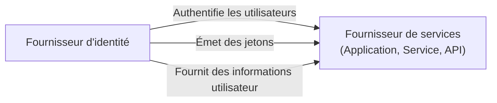

## Qu'est-ce qu'un fournisseur de services (Service provider, SP) ?

Dans le domaine de <Ref slug="iam" />, un fournisseur de services (Service provider, SP) (ou une **partie de confiance** dans le contexte de <Ref slug="openid-connect" />) est une application ou un service qui repose sur un <Ref slug="identity-provider" /> pour l'authentification et l'autorisation. Il est responsable de fournir des services aux utilisateurs et d'appliquer des politiques de <Ref slug="access-control" /> basées sur les jetons émis par le fournisseur d'identité.

## Normes du fournisseur de services

Il n'existe pas de norme stricte pour les fournisseurs de services, car ils peuvent être de tout type d'application ou de service nécessitant une gestion des identités. Toutefois, les fournisseurs de services suivent souvent les normes établies par le fournisseur d'identité sur lequel ils reposent. Par exemple, si le fournisseur d'identité prend en charge <Ref slug="openid-connect" />, le fournisseur de services utilisera généralement OIDC pour l'authentification et l'autorisation.

## Architecture du fournisseur de services

Le terme "fournisseur de services" ne spécifie pas une architecture ou une mise en œuvre particulière. En général, les fournisseurs de services doivent être enregistrés auprès du fournisseur d'identité pour établir la confiance et permettre une communication sécurisée. Le processus d'enregistrement implique généralement l'échange de métadonnées et de client credentials.

Par exemple, dans le contexte de OpenID Connect, les métadonnées du fournisseur de services incluent généralement :

- **Client ID** : Un identifiant unique pour le fournisseur de services.
- **Client secret** : Un secret partagé utilisé pour authentifier le fournisseur de services.
- **<Ref slug="redirect-uri">URI de redirection</Ref>** : Les URI où le fournisseur d'identité redirigera les utilisateurs après l'authentification et l'autorisation.

Une fois enregistré, le fournisseur de services peut initier le processus d'<Ref slug="authentication" /> en redirigeant les utilisateurs vers le point de terminaison spécifié du fournisseur d'identité.

Lorsque les fournisseurs de services sont construits pour des cas d'utilisation sans interaction, ils sont souvent appelés <Ref slug="client">clients</Ref> nécessitant une communication <Ref slug="machine-to-machine" />.

<SeeAlso slugs={["identity-provider", "openid-connect", "oauth-2.0"]} />

<Resources
  urls={[
    "https://blog.logto.io/secure-cloud-apps-with-oauth-and-openid-connect",
    "https://blog.logto.io/incorporate-identity-solution",
    "https://blog.logto.io/centralized-identity-system"
  ]}
/>
