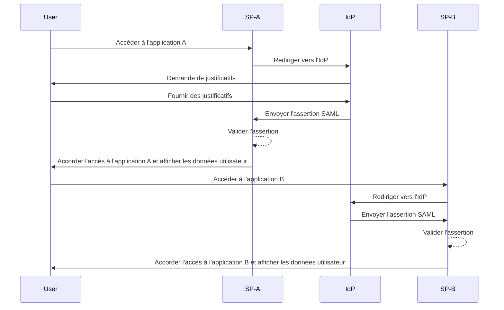
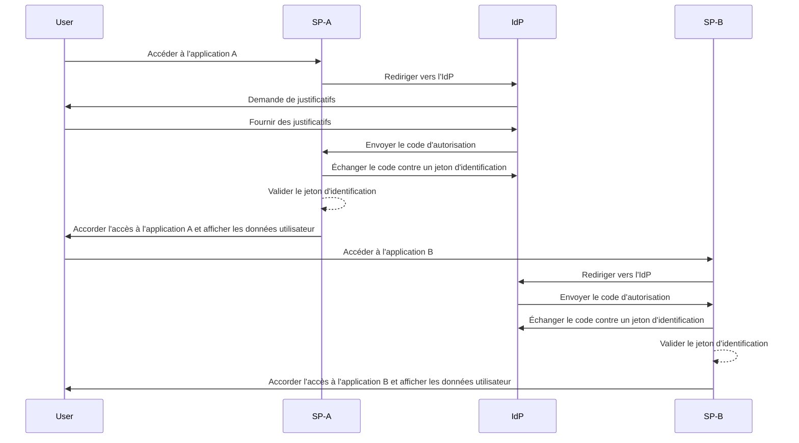

## Qu'est-ce que l'authentification unique (Single sign-on, SSO) ?

L'authentification unique (Single sign-on, SSO) est une méthode d'<Ref slug="authentication" /> qui permet aux utilisateurs d'accéder à plusieurs applications ou services avec un seul ensemble de justificatifs. Au lieu de gérer des connexions séparées pour chaque système, les utilisateurs s'authentifient une fois et sont automatiquement connectés à toutes les plateformes connectées.

Le SSO est couramment utilisé dans les environnements personnels et professionnels, notamment dans les entreprises où les employés ou les travailleurs à distance dépendent de diverses applications SaaS pour effectuer leur travail. En mettant en œuvre le SSO, les organisations peuvent améliorer la sécurité, simplifier la gestion des accès et améliorer la productivité des utilisateurs.

Un exemple bien connu de SSO est la suite de services de Google, tels que Gmail, Google Drive et Google Calendar. Après s'être connectés à leur compte Google, les utilisateurs peuvent facilement accéder à tous ces services sans ressaisir leurs justificatifs.

## Comment fonctionne l'authentification unique ?

Le SSO repose sur une relation de confiance entre une application ou un service, connu sous le nom de <Ref slug="service-provider" />, et un <Ref slug="identity-provider" />. L'IdP gère l'authentification des utilisateurs et partage en toute sécurité les informations nécessaires avec le SP pour accorder l'accès. Cette confiance est établie grâce à un processus appelé fédération, où le SP et l'IdP conviennent de normes et de protocoles spécifiques pour échanger en toute sécurité les données d'authentification.

Lorsqu'un utilisateur tente d'accéder à une application compatible SSO, le SP le redirige vers l'IdP pour l'authentification. L'IdP invite l'utilisateur à fournir ses justificatifs, vérifie son identité et génère un jeton de sécurité ou une assertion contenant les informations de l'utilisateur. Ce jeton est renvoyé au SP, qui l'utilise ensuite pour accorder l'accès.

Si l'utilisateur essaie d'accéder à une autre application compatible SSO, le processus est automatiquement répété sans qu'il ne soit nécessaire de se reconnecter. L'IdP envoie les données d'authentification requises directement au SP, permettant à l'utilisateur d'accéder sans problème à la nouvelle application.

<Ref slug="saml" /> et <Ref slug="openid-connect" /> sont deux protocoles largement utilisés pour mettre en œuvre le SSO. Ces normes définissent comment les données d'authentification sont échangées entre l'IdP et le SP, assurant une communication sécurisée et fiable.

### SSO basé sur SAML

Dans le SSO basé sur SAML, une fois l'utilisateur authentifié par l'IdP, une assertion SAML basée sur XML est générée, signée et envoyée en toute sécurité au SP. Le SP valide ensuite l'assertion et accorde l'accès en fonction de l'identité de l'utilisateur.

### SSO basé sur OIDC

OIDC, en revanche, est construit sur <Ref slug="oauth-2.0" /> et offre une approche plus moderne du SSO. Il utilise <Ref slug="jwt" /> pour échanger des informations d'identité entre l'IdP et le SP, offrant une sécurité renforcée et une plus grande flexibilité.

## Avantages de l'authentification unique

1. **Sécurité renforcée** : Le SSO réduit le risque de violations de sécurité liées aux mots de passe en diminuant le nombre de justificatifs que les utilisateurs doivent mémoriser. Il permet également aux organisations d'imposer des méthodes d'authentification plus robustes, telles que le <Ref slug="mfa" />, pour protéger les comptes utilisateurs.

2. **Amélioration de l'expérience utilisateur** : Les utilisateurs peuvent accéder à plusieurs applications sans avoir à se reconnecter à chaque fois, améliorant ainsi la productivité et réduisant la frustration. Le SSO simplifie le processus de connexion et offre une expérience utilisateur cohérente sur différentes plateformes.

3. **Gestion centralisée des accès** : Les organisations peuvent gérer de manière centralisée l'accès et les autorisations des utilisateurs via l'IdP, garantissant une cohérence des politiques de sécurité et des contrôles d'accès sur toutes les applications connectées. Cela simplifie les processus de provisionnement, de déprovisionnement et d'audit des utilisateurs.

## Quand utiliser l'authentification unique

1. **Environnements d'entreprise et organisationnels** : Le SSO est particulièrement avantageux pour les entreprises qui dépendent de plusieurs applications et services pour optimiser les flux de travail. Il simplifie l'accès des utilisateurs et réduit la charge des équipes informatiques pour gérer les comptes utilisateurs individuels. Par exemple, les entreprises utilisant plusieurs applications SaaS, telles que les outils CRM, RH et de collaboration.
2. **Applications destinées aux clients** : Le SSO peut également améliorer l'expérience utilisateur pour les clients accédant à des services en ligne ou à des plateformes de commerce électronique. Par exemple, permettre aux utilisateurs de se connecter avec leurs comptes de réseaux sociaux ou leurs adresses e-mail au lieu de créer de nouveaux comptes pour chaque service.
3. **Services multi-produits** : Les entreprises proposant une suite de produits ou services interconnectés peuvent exploiter le SSO pour offrir une expérience utilisateur fluide sur l'ensemble de leurs offres. Les utilisateurs peuvent naviguer entre différentes applications sans avoir à se reconnecter constamment. Par exemple, G Suite de Google. Les utilisateurs peuvent se connecter une fois sur leur navigateur Chrome et accéder à plusieurs services Google sans ressaisir leurs justificatifs.

L'utilisation du SSO ne se limite pas à ces scénarios et peut être adaptée à divers cas d'utilisation en fonction des besoins spécifiques d'une organisation ou d'une application. Il est largement considéré comme une meilleure pratique pour améliorer la sécurité, l'expérience utilisateur et l'efficacité opérationnelle dans les environnements numériques modernes.

<SeeAlso slugs={["enterprise-sso"]} />