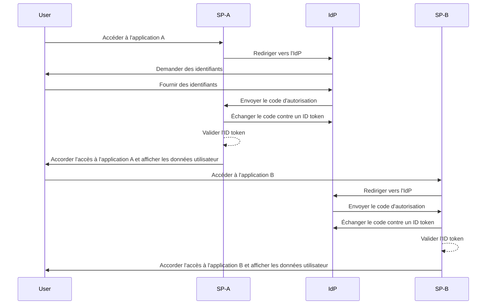

## Qu'est-ce que l'authentification unique (Single sign-on, SSO) ?

L'authentification unique (Single sign-on, SSO) est une méthode de <Ref slug="authentication" /> qui permet aux utilisateurs d'accéder à plusieurs applications ou services avec un seul ensemble d'identifiants. Au lieu de gérer des connexions séparées pour chaque système, les utilisateurs s'authentifient une fois et sont automatiquement connectés à toutes les plateformes connectées.

Le SSO est couramment utilisé dans les environnements personnels et professionnels, en particulier dans les environnements d'entreprise où les employés ou les travailleurs à distance dépendent de diverses applications SaaS pour accomplir leur travail. En mettant en œuvre le SSO, les organisations peuvent améliorer la sécurité, rationaliser la gestion des accès et augmenter la productivité des utilisateurs.

Un exemple bien connu de SSO est la suite de services de Google, tels que Gmail, Google Drive et Google Calendar. Après s'être connectés à leur compte Google, les utilisateurs peuvent facilement accéder à tous ces services sans ressaisir leurs identifiants.

## Comment fonctionne l'authentification unique ?

Le SSO repose sur une relation de confiance entre une application ou un service, connu sous le nom de <Ref slug="service-provider" />, et un <Ref slug="identity-provider" />. L'IdP gère l'authentification des utilisateurs et partage en toute sécurité les informations nécessaires avec le SP pour accorder l'accès. Cette confiance est établie par un processus appelé fédération, où le SP et l'IdP conviennent de normes et de protocoles spécifiques pour échanger en toute sécurité les données d'authentification.

Lorsqu'un utilisateur tente d'accéder à une application activée pour le SSO, le SP le redirige vers l'IdP pour l'authentification. L'IdP invite l'utilisateur à fournir des identifiants, vérifie son identité et établit une session authentifiée dans son système. Cette session est généralement maintenue à l'aide d'un cookie de session stocké en toute sécurité sous le domaine de l'IdP.

Une fois l'utilisateur authentifié, l'IdP génère un jeton de sécurité ou une assertion contenant les informations de l'utilisateur qui ont été consenties à être partagées avec le SP. Ce jeton ou assertion est transmis en toute sécurité au SP, qui le valide et accorde l'accès à l'utilisateur.

Si l'utilisateur accède à une autre application activée pour le SSO, le processus se déroule sans heurts sans nécessiter de connexions supplémentaires. Cette commodité est rendue possible par la session d'authentification de l'utilisateur maintenue par l'IdP, permettant à l'IdP de vérifier automatiquement l'identité de l'utilisateur et d'émettre un nouveau jeton de sécurité sans demander à nouveau les identifiants.

Des protocoles comme <Ref slug="saml" /> et <Ref slug="openid-connect" /> sont largement utilisés pour mettre en œuvre le SSO. Ces normes définissent comment les données d'authentification sont échangées en toute sécurité entre l'IdP et le SP, garantissant une communication fiable et sécurisée tout en maintenant l'expérience transparente de l'utilisateur à travers les applications.

### SSO basé sur SAML

Dans le SSO basé sur SAML, une fois que l'utilisateur est authentifié par l'IdP, une assertion SAML basée sur XML est générée, signée et envoyée en toute sécurité au SP. Le SP valide ensuite l'assertion et accorde l'accès en fonction de l'identité de l'utilisateur.

### SSO basé sur OIDC

OIDC, en revanche, est construit sur <Ref slug="oauth-2.0" /> et offre une approche plus moderne du SSO. Il utilise <Ref slug="jwt" /> pour échanger des informations d'identité entre l'IdP et le SP, offrant une sécurité renforcée et une plus grande flexibilité.

## Avantages de l'authentification unique

1. **Sécurité renforcée** : Le SSO réduit le risque de violations de sécurité liées aux mots de passe en minimisant le nombre d'identifiants que les utilisateurs doivent mémoriser. Il permet également aux organisations d'appliquer des méthodes d'authentification plus fortes, telles que <Ref slug="mfa" />, pour protéger les comptes utilisateurs.

2. **Amélioration de l'expérience utilisateur** : Les utilisateurs peuvent accéder à plusieurs applications de manière transparente sans avoir besoin de se reconnecter à plusieurs reprises, améliorant ainsi la productivité et réduisant la frustration. Le SSO simplifie le processus de connexion et offre une expérience utilisateur cohérente sur différentes plateformes.

3. **Gestion centralisée des accès** : Les organisations peuvent gérer de manière centralisée l'accès et les autorisations des utilisateurs via l'IdP, garantissant des politiques de sécurité et des contrôles d'accès cohérents sur toutes les applications connectées. Cela simplifie les processus de provisionnement, de déprovisionnement et d'audit des utilisateurs.

## Quand utiliser l'authentification unique

1. **Environnements d'entreprise et organisationnels** : Le SSO est particulièrement bénéfique pour les entreprises qui dépendent de plusieurs applications et services pour rationaliser les flux de travail. Il simplifie l'accès des utilisateurs et réduit la charge des équipes informatiques pour gérer les comptes utilisateurs individuels. Par exemple, les entreprises utilisant plusieurs applications SaaS, telles que les outils CRM, RH et de collaboration.
2. **Applications destinées aux clients** : Le SSO peut également améliorer l'expérience utilisateur pour les clients accédant à des services en ligne ou à des plateformes de commerce électronique. Par exemple, permettre aux utilisateurs de se connecter avec leurs comptes de réseaux sociaux ou leurs adresses e-mail au lieu de créer de nouveaux comptes pour chaque service.
3. **Services multi-produits** : Les entreprises offrant une suite de produits ou services interconnectés peuvent tirer parti du SSO pour offrir une expérience utilisateur transparente à travers leurs offres. Les utilisateurs peuvent naviguer entre différentes applications sans avoir à se reconnecter à chaque fois. Par exemple, G Suite de Google. Les utilisateurs peuvent se connecter une fois sur leur navigateur Chrome et accéder à plusieurs services Google sans ressaisir leurs identifiants.

L'utilisation du SSO ne se limite pas à ces scénarios et peut être adaptée à divers cas d'utilisation en fonction des besoins spécifiques d'une organisation ou d'une application. Il est largement considéré comme une meilleure pratique pour améliorer la sécurité, l'expérience utilisateur et l'efficacité opérationnelle dans les environnements numériques modernes.

<SeeAlso slugs={["enterprise-sso"]} />