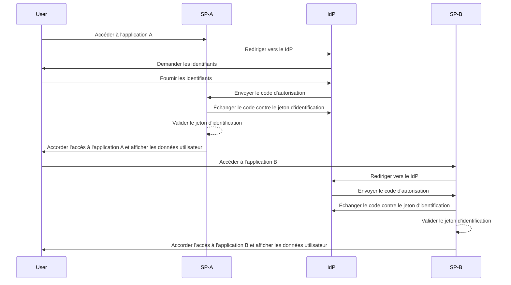

## Qu'est-ce que le single sign-on (SSO) ?

Le Single sign-on (SSO) est une méthode d'authentification qui permet aux utilisateurs d'accéder à plusieurs applications ou services avec un seul ensemble d'identifiants. Au lieu de gérer des connexions distinctes pour chaque système, les utilisateurs s'authentifient une fois et sont automatiquement connectés à toutes les plateformes connectées.

Le SSO est couramment utilisé à la fois dans les contextes personnels et professionnels, en particulier dans les environnements d'entreprise où les employés ou les travailleurs à distance dépendent de diverses applications SaaS pour réaliser leur travail. En mettant en œuvre le SSO, les organisations peuvent améliorer la sécurité, rationaliser la gestion des accès et accroître la productivité des utilisateurs.

Un exemple bien connu de SSO est la suite de services de Google, tels que Gmail, Google Drive et Google Calendar. Après s'être connectés à leur compte Google, les utilisateurs peuvent facilement accéder à tous ces services sans ressaisir leurs identifiants.

## Comment fonctionne le single sign-on ?

Le SSO fonctionne sur une relation de confiance entre une application ou un service, connu sous le nom de <Ref slug="service-provider" /> et un <Ref slug="identity-provider" />. Le IdP gère l'authentification de l'utilisateur et partage de manière sécurisée les informations nécessaires avec le SP pour accorder l'accès. Cette confiance est établie à travers un processus appelé fédération, où le SP et le IdP conviennent de normes et protocoles spécifiques pour échanger de manière sécurisée les données d'authentification.

Lorsqu'un utilisateur tente d'accéder à une application compatible SSO, le SP le redirige vers le IdP pour authentification. Le IdP invite l'utilisateur à fournir ses identifiants, vérifie son identité et génère un jeton ou une assertion de sécurité contenant les informations de l'utilisateur. Ce jeton est envoyé au SP, qui l'utilise ensuite pour accorder l'accès.

Si l'utilisateur tente d'accéder à une autre application compatible SSO, le processus est automatiquement répété sans qu'il soit nécessaire de se reconnecter. Le IdP envoie directement les données d'authentification requises au SP, permettant à l'utilisateur d'accéder de manière transparente à la nouvelle application.

SAML (Security Assertion Markup Language) et OIDC (OpenID Connect) sont deux protocoles largement utilisés pour la mise en œuvre du SSO. Ces standards définissent comment les données d'authentification sont échangées entre le IdP et le SP, garantissant une communication sécurisée et fiable.

### SSO basé sur SAML

Dans le SSO basé sur SAML, une fois que l'utilisateur est authentifié par le IdP, une assertion SAML basée sur XML est générée, signée et envoyée de manière sécurisée au SP. Le SP valide ensuite l'assertion et accorde l'accès basé sur l'identité de l'utilisateur.

### SSO basé sur OIDC

OIDC, en revanche, est construit au-dessus de OAuth 2.0 et offre une approche plus moderne du SSO. Il utilise des JSON Web Tokens (JWT) pour échanger des informations d'identité entre le IdP et le SP, offrant une sécurité renforcée et une plus grande flexibilité.

## Avantages du single sign-on

1. **Sécurité améliorée** : Le SSO réduit le risque de failles de sécurité liées aux mots de passe en minimisant le nombre d'identifiants que les utilisateurs doivent mémoriser. Il permet également aux organisations d'appliquer des méthodes d'authentification plus robustes, telles que l'authentification multi-facteurs (MFA), pour protéger les comptes utilisateurs.

2. **Expérience utilisateur améliorée** : Les utilisateurs peuvent accéder à plusieurs applications de manière fluide sans avoir besoin de se reconnecter à plusieurs reprises, améliorant ainsi la productivité et réduisant la frustration. Le SSO simplifie le processus de connexion et offre une expérience utilisateur cohérente sur différentes plateformes.

3. **Gestion centralisée des accès** : Les organisations peuvent gérer centralement l'accès et les autorisations des utilisateurs via le IdP, garantissant des politiques de sécurité et des contrôles d'accès cohérents sur toutes les applications connectées. Cela simplifie les processus de provisionnement, de déprovisionnement et d'audit des utilisateurs.

## Quand utiliser le single sign-on

1. **Environnements d'entreprise et organisationnels** : Le SSO est particulièrement bénéfique pour les entreprises qui dépendent de plusieurs applications et services pour rationaliser leurs flux de travail. Il simplifie l'accès des utilisateurs et réduit la charge sur les équipes informatiques de gérer des comptes utilisateurs individuels. Par exemple, les entreprises utilisant plusieurs applications SaaS, telles que les outils CRM, RH et de collaboration.
2. **Applications destinées aux clients** : Le SSO peut également améliorer l'expérience utilisateur pour les clients accédant à des services en ligne ou des plateformes de commerce électronique. Par exemple, permettre aux utilisateurs de se connecter avec leurs comptes de médias sociaux ou adresses e-mail au lieu de créer de nouveaux comptes pour chaque service.
3. **Services multi-produits** : Les entreprises offrant une suite de produits ou services interconnectés peuvent exploiter le SSO pour offrir une expérience utilisateur fluide à travers leurs offres. Les utilisateurs peuvent naviguer entre différentes applications sans le tracas de connexions répétées. Par exemple, G Suite de Google. Les utilisateurs peuvent se connecter une fois sur leur navigateur Chrome et accéder à plusieurs services Google sans ressaisir leurs identifiants.

L'utilisation du SSO ne se limite pas à ces scénarios et peut être adaptée à divers cas d'utilisation en fonction des besoins spécifiques d'une organisation ou d'une application. Il est largement considéré comme une bonne pratique pour améliorer la sécurité, l'expérience utilisateur et l'efficacité opérationnelle dans les environnements numériques modernes.

<SeeAlso slugs={['enterprise-sso']} />