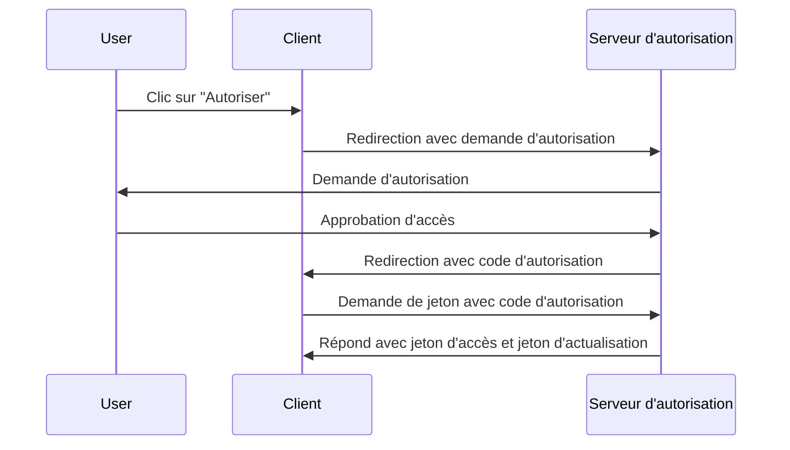
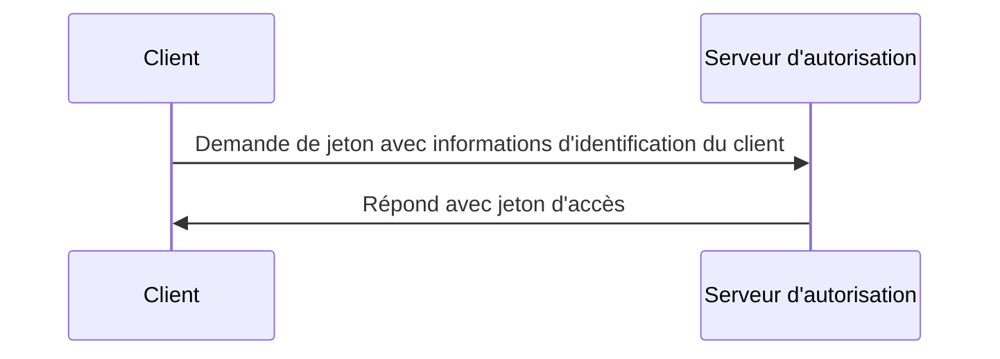

## Qu'est-ce qu'une demande de jeton (token request) ?

Dans <Ref slug="oauth-2.0" /> et <Ref slug="openid-connect" />, une demande de jeton (token request) est une demande au <Ref slug="authorization-server" /> (ou <Ref slug="openid-connect" headingId="openid-provider-op" /> en OIDC) pour échanger des informations d'identification (par exemple, code d'autorisation, jeton d'actualisation) contre un ensemble de jetons. L'ensemble de jetons inclut généralement un ou plusieurs des éléments suivants :

- <Ref slug="access-token" /> : Un jeton qui accorde l'accès aux ressources protégées.
- <Ref slug="id-token" /> : Un jeton qui contient des informations de l'utilisateur (spécifique à OIDC).
- <Ref slug="refresh-token" /> : Un jeton qui peut être utilisé pour obtenir un nouveau jeton d'accès sans interaction de l'utilisateur.

Selon le <Ref slug="oauth-2.0-grant">type de subvention (grant type)</Ref> utilisé, la demande peut inclure différents paramètres et renvoyer différents jetons.

Par exemple, dans le <Ref slug="client-credentials-flow" />, le <Ref slug="client" /> demande directement un <Ref slug="access-token" /> avec des informations d'identification de client. Voici un exemple non normatif de la demande de jeton :

```http
POST /token HTTP/1.1
Host: authorization-server.example.com
Content-Type: application/x-www-form-urlencoded

grant_type=client_credentials
  &client_id=client-id
  &client_secret=client-secret
  &scope=read
```

Si la demande est réussie, le serveur d'autorisation répond avec un jeton d'accès :

```http
HTTP/1.1 200 OK
Content-Type: application/json

{
  "access_token": "eyJhbGci...zHg",
  "token_type": "Bearer",
  "expires_in": 3600,
  "scope": "read"
}
```

## Comment fonctionne une demande de jeton (token request) ?

Comme le montre l'exemple ci-dessus, la demande de jeton (token request) elle-même est simple. Le client envoie une requête HTTP à l'endpoint de jeton du serveur d'autorisation avec les paramètres nécessaires. Le serveur d'autorisation valide la demande, la traite, et renvoie les jetons dans la réponse.

Cependant, selon le type de subvention (flow) spécifié utilisé, la demande de jeton peut nécessiter plus de préparation.

### Flux de code d'autorisation (Authorization code flow)

Dans le <Ref slug="authorization-code-flow" />, le client obtient d'abord un code d'autorisation en initiant une <Ref slug="authorization-request" /> (ou <Ref slug="authentication-request" /> en OIDC) avec le serveur d'autorisation. Une fois que l'utilisateur accorde la permission, le client échange le code d'autorisation pour un jeton d'accès et éventuellement un jeton d'actualisation via la demande de jeton.

Voici un diagramme de séquence simplifié du flux de code d'autorisation :



### Flux d'identification du client (Client credentials flow)

Comme le montre l'exemple de la première section, le <Ref slug="client-credentials-flow" /> est bien plus simple. Le client demande directement un jeton d'accès avec ses informations d'identification de client. Le serveur d'autorisation valide les informations d'identification du client et émet un jeton d'accès si cela réussit.

Voici un diagramme de séquence non normatif du flux d'identification du client :



### Jeton d'actualisation (Refresh token)

Dans certains types de subventions, le client peut également demander <Ref slug="offline-access" /> en incluant le champ `offline_access` dans la demande d'autorisation. Si cela est accordé, le serveur d'autorisation émet un jeton d'actualisation accompagné du jeton d'accès. Le client peut utiliser le jeton d'actualisation pour obtenir un nouveau jeton d'accès via la demande de jeton sans interaction de l'utilisateur.

Voici un exemple non normatif de l'utilisation d'un jeton d'actualisation pour obtenir un nouveau jeton d'accès :

```http
POST /token HTTP/1.1
Host: authorization-server.example.com
Content-Type: application/x-www-form-urlencoded

grant_type=refresh_token
  &refresh_token=refresh-token
  &client_id=client-id
  &client_secret=client-secret
```

---

D'autres <Ref slug="oauth-2.0-grant">types de subventions</Ref> peuvent également impliquer des demandes de jeton, mais l'idée de base reste la même.

## Paramètres clés dans une demande de jeton

Voici quelques paramètres clés qui sont couramment utilisés dans une demande de jeton :

- **`grant_type`** : Le type de subvention demandée. Les valeurs courantes incluent `authorization_code`, `client_credentials`, `refresh_token`, etc.
- **`client_id`** : L'identifiant du client émis par le serveur d'autorisation.
- **`client_secret`** : Le secret du client émis par le serveur d'autorisation (pour les clients confidentiels).
- **`code`** : Le code d'autorisation obtenu auprès du serveur d'autorisation (pour le flux de code d'autorisation).
- **`refresh_token`** : Le jeton d'actualisation obtenu auprès du serveur d'autorisation (pour rafraîchir les jetons d'accès).
- **`scope`** : Les <Ref slug="scope">périmètres (permissions)</Ref> demandés pour le jeton d'accès.
- **`redirect_uri`** : L'URI où le serveur d'autorisation envoie la réponse (pour le flux de code d'autorisation).
- **`code_verifier`** : Le vérificateur de code utilisé dans l'extension <Ref slug="pkce" /> (pour le flux de code d'autorisation).

Les paramètres réels et leurs valeurs dépendent du type de subvention et des exigences spécifiques de l'application. Avant de faire une demande de jeton, vous devriez vous référer à la liste complète des paramètres pour le type de subvention spécifique que vous utilisez.

<SeeAlso slugs={["oauth-2.0", "openid-connect", "authorization-request", "authentication-request"]} />