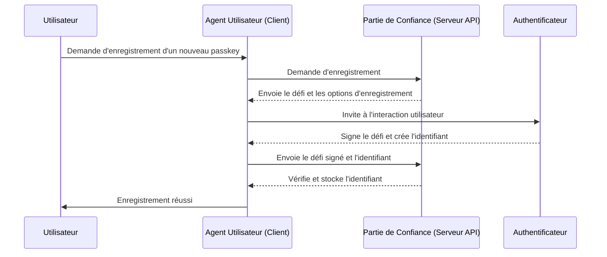
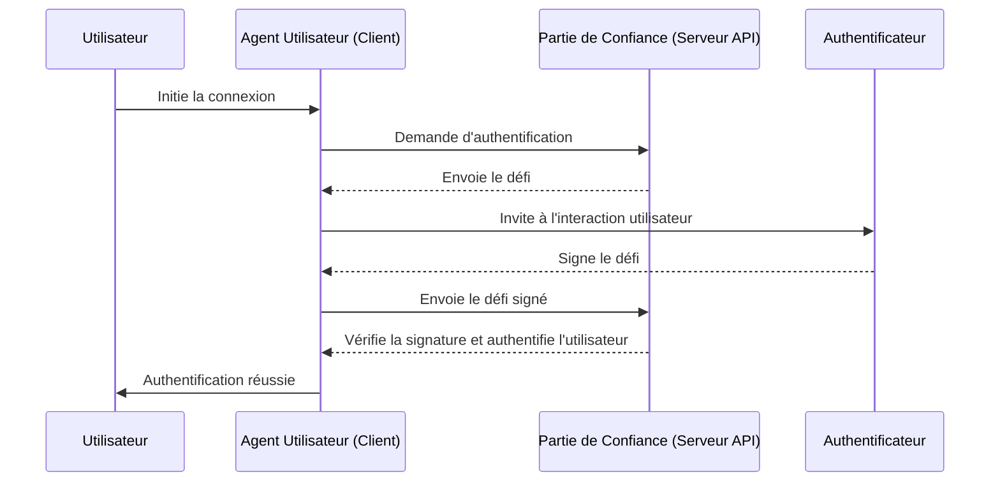

## Qu'est-ce que WebAuthn ?

WebAuthn (Web Authentication API), développé par le [W3C](https://www.w3.org/) et la [FIDO Alliance](https://fidoalliance.org/), est une spécification pour l'authentification web sécurisée utilisant les normes FIDO2. WebAuthn fournit une API permettant aux sites web de mettre en œuvre des <Ref slug="passkey" />, qui sont des informations d'identification résistantes au phishing sécurisées par la cryptographie à clé publique. Les passkeys peuvent remplacer les mots de passe pour les connexions sans mot de passe et la <Ref slug="mfa" />.

## À quoi ressemble le flux de travail WebAuthn ?

Voici un exemple concret pour mieux comprendre. Vous avez une application web MyApp qui souhaite intégrer l'API WebAuthn pour implémenter les passkeys pour l'authentification multi-facteurs.

**Phase d'enregistrement :** Après s'être inscrit avec une vérification par e-mail et avoir défini un nouveau mot de passe, cet utilisateur est invité à créer un passkey. Il choisit de lier son appareil en utilisant une empreinte digitale. Cela établit le passkey de manière sécurisée sur leur appareil.

**Phase d'authentification :** Lors de la prochaine connexion, l'utilisateur est invité à vérifier son passkey après avoir entré son mot de passe. Avec un simple scan d'empreinte digitale, il peut facilement compléter le processus d'authentification.


Pour fournir une explication plus détaillée, nous pouvons diviser le processus en deux phases : enregistrement et authentification. Tout d'abord, il est essentiel de comprendre les quatre entités clés impliquées dans le flux WebAuthn.

### 4 entités clés

1. **Utilisateur :** L'individu tentant d'accéder à une application web.
2. **Agent utilisateur :** Le navigateur web qui gère les appels API WebAuthn et gère le processus d'authentification entre l'utilisateur, la partie de confiance et l'authentificateur.
3. **Partie de confiance :** Le service, l'application ou le serveur API auquel l'utilisateur cherche à accéder.
4. **Authentificateur :** Le composant matériel ou logiciel utilisé pour vérifier l'identité de l'utilisateur. Il peut prendre diverses formes selon la plateforme ou la capacité du navigateur, telles que des clés de sécurité (comme les Yubikeys), des téléphones ou des tablettes (connectés par Bluetooth, NFC ou USB), des biométriques ou des codes PIN basés sur l'appareil, etc.

### Enregistrement WebAuthn

La cryptographie asymétrique à clé publique est le processus central.

1. **Génération de paire de clés :** 
L'agent utilisateur génère une paire de clés publique-privée. 
    - **Clé publique :** Partagée avec la partie de confiance.
    - **Clé privée :** Reste stockée en toute sécurité dans l'authentificateur de l'utilisateur.
2. **Défi d'enregistrement :** 
Lorsque l'utilisateur tente d'enregistrer un passkey, la partie de confiance envoie un défi d'enregistrement à l'agent utilisateur.
3. **Vérification de l'utilisateur :** 
L'agent utilisateur transmet le défi à l'authentificateur, qui invite l'utilisateur à la vérification (par exemple, authentification biométrique ou clé de sécurité matérielle).
4. **Signature cryptographique :** 
L'authentificateur utilise sa clé privée pour signer le défi, créant une signature cryptographique.
5. **Vérification et accès :** 
L'agent utilisateur envoie le défi signé à la partie de confiance, qui vérifie la signature en utilisant la clé publique et complète le processus d'enregistrement.



### Authentification WebAuthn

1. **Défi d'authentification :**
Lorsque l'utilisateur tente de se connecter, la partie de confiance envoie un défi d'authentification à l'agent utilisateur.
2. **Vérification de l'utilisateur :**
L'agent utilisateur envoie le défi à l'authentificateur, qui invite l'utilisateur à la vérification (par exemple, authentification biométrique ou clé de sécurité matérielle).
3. **Signature cryptographique :**
L'authentificateur utilise sa clé privée pour signer le défi, créant une signature cryptographique.
4. **Vérification et accès :**
L'agent utilisateur vérifie la signature en utilisant la clé publique et informe la partie de confiance d'une authentification réussie. L'accès est accordé si la vérification est réussie.



## Comment utiliser WebAuthn ?

L'API WebAuthn peut être utilisée pour implémenter la connexion par passkey ou la vérification en deux étapes. Référez-vous à l'expérience Passkey pour en savoir plus.

Pour utiliser l'API d'authentification Web (WebAuthn) pour une authentification sécurisée, vous devez gérer deux processus principaux : l'enregistrement et l'authentification. Voici des exemples de code simples de la façon dont vous pourriez implémenter ces processus en utilisant JavaScript.

**Enregistrement**

La partie de confiance (votre application web) initie le processus d'enregistrement en appelant la méthode `navigator.credentials.create()`.

```jsx
// Enregistrement
navigator.credentials.create({
  publicKey: {
    rp: {
      name: "Nom de votre partie de confiance",
      id: "votre-id-de-partie-de-confiance"
    },
    user: {
      id: "id-utilisateur",
      displayName: "Nom de l'utilisateur",
      name: "Nom de l'utilisateur"
    },
    challenge: "votre-valeur-de-défi",
    timeout: 60000 // 60 secondes
  }
}).then(credential => {
  // Stockez l'identifiant de l'identifiant pour une future authentification
  localStorage.setItem("credentialId", credential.id);
}).catch(error => {
  console.error("Erreur d'enregistrement :", error);
});
```

La partie de confiance initie le processus d'authentification en appelant la méthode `navigator.credentials.get()`.

```jsx
// Authentification
navigator.credentials.get({
  publicKey: {
    rp: {
      name: "Nom de votre partie de confiance",
      id: "votre-id-de-partie-de-confiance"
    },
    challenge: "votre-valeur-de-défi",
    timeout: 60000 // 60 secondes
  }
}).then(credential => {
  // Vérifiez l'identifiant de l'identifiant et d'autres propriétés
  if (credential.id === localStorage.getItem("credentialId")) {
    // Authentification réussie
    console.log("Utilisateur authentifié avec succès");
  } else {
    console.error("Identifiant invalide");
  }
}).catch(error => {
  console.error("Erreur d'authentification :", error);
});
```

Pour en savoir plus, lisez les spécifications : https://fidoalliance.org/specifications/download/.

Remarque : Dans les actions WebAuthn, que ce soit pour l'enregistrement ou l'authentification, le "rp ID" (identifiant de la partie de confiance) est un champ obligatoire. Il représente le nom de domaine de la page web actuelle. S'il ne correspond pas au domaine actuel, le navigateur rejettera la demande. Cela signifie que les passkeys sont liés à un domaine spécifique, et il n'existe actuellement aucun moyen de migrer les passkeys existants vers un domaine différent. De plus, les passkeys ne peuvent pas être utilisés sur différents domaines.

## WebAuthn et OpenID Connect (OIDC)

En combinant la sécurité renforcée de WebAuthn avec le protocole d'identité standardisé d'OIDC, nous pouvons créer une expérience d'authentification plus sécurisée et conviviale.

Découvrez comment cela fonctionne :

- **Phase d'enregistrement :** Les utilisateurs complètent un processus d'enregistrement standard <Ref slug="openid-connect" /> (par exemple, vérification par e-mail et création de mot de passe). WebAuthn génère une paire de clés publique-privée, stockant la clé publique avec le <Ref slug="identity-provider" /> OIDC et gardant la clé privée sur l'appareil de l'utilisateur.
- **Phase d'authentification :** Les utilisateurs accèdent à une ressource protégée par OIDC et sont redirigés vers la page de connexion. Après avoir fourni des informations d'identification de base (par exemple, e-mail et mot de passe), le système invoque WebAuthn pour l'authentification par passkey. Une fois le passkey vérifié, OIDC émet un Access Token ou un ID Token pour l'accès de l'utilisateur.

## Quelle est la différence entre WebAuthn et CTAP2 ?

**WebAuthn** et **CTAP2** sont tous deux des composants essentiels de la norme FIDO2, mais ils ont des objectifs distincts :

- **CTAP2 (Client to Authenticator Protocol 2) :** Ce protocole définit comment un appareil, tel qu'une clé de sécurité ou un smartphone, communique avec une application web. Il établit un canal sécurisé entre l'**authentificateur** et l'**appareil de l'utilisateur**, garantissant que les données d'authentification sensibles sont protégées.
- **WebAuthn (Web Authentication API) :** Cette API fournit un moyen standardisé pour les applications web d'interagir avec les authentificateurs conformes à CTAP2. Elle gère le processus d'authentification, y compris l'échange de données d'authentification entre l'**appareil de l'utilisateur** et la **partie de confiance**.

<SeeAlso slugs={["passkey", "mfa", "openid-connect"]} />

<Resources
  urls={[
    "https://fidoalliance.org/specs/fido-v2.0-id-20180227/fido-client-to-authenticator-protocol-v2.0-id-20180227.html",
    "https://blog.logto.io/webauthn-nextjs",
    "https://blog.logto.io/webauthn-base-knowledge"
  ]}
/>