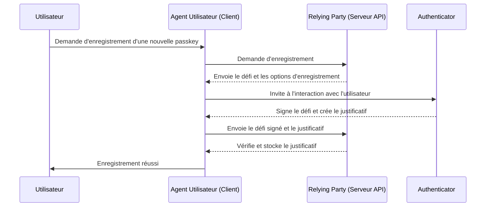
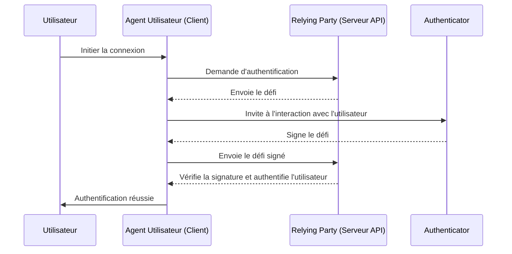

## Qu'est-ce que WebAuthn ?

WebAuthn (Web Authentication API), développée par le [W3C](https://www.w3.org/) et la [FIDO Alliance](https://fidoalliance.org/), est une spécification pour l'authentification Web sécurisée utilisant les normes FIDO2. WebAuthn fournit une API permettant aux sites Web de mettre en œuvre des <Ref slug="passkey" />, qui sont des justificatifs résistants au phishing sécurisés par cryptographie à clé publique. Les passkeys peuvent remplacer les mots de passe pour les connexions sans mot de passe et l'authentification multi-facteurs (MFA).

## À quoi ressemble le workflow de WebAuthn ?

Pour fournir une explication plus détaillée, nous pouvons diviser le processus en deux phases : l'enregistrement et l'authentification. Tout d'abord, il est essentiel de comprendre les quatre entités clés impliquées dans le flux de WebAuthn.

### 4 entités clés

1. **Utilisateur :** L'individu tentant d'accéder à une application Web.
2. **Agent utilisateur :** Le navigateur web qui gère les appels API de WebAuthn et gère le processus d'authentification entre l'utilisateur, le relying party, et l'authenticator.
3. **Relying party :** Le service, l'application, ou le serveur API auquel l'utilisateur cherche à accéder.
4. **Authenticator :** Le composant matériel ou logiciel utilisé pour vérifier l'identité de l'utilisateur. Il peut prendre diverses formes en fonction de la plate-forme ou des capacités du navigateur, telles que les clés de sécurité (comme les Yubikeys), les téléphones ou tablettes (connectés par Bluetooth, NFC ou USB), les biométries ou les PINs basés sur des dispositifs, etc.

### Enregistrement WebAuthn

La cryptographie asymétrique à clé publique est le processus central.

1. **Génération de paire de clés :**  
L'agent utilisateur génère une paire de clés publique-privée.  
   - **Clé publique :** Partagée avec le relying party.
   - **Clé privée :** Reste stockée en toute sécurité dans l'authenticator de l'utilisateur.
2. **Défi d'enregistrement :**  
Lorsque l'utilisateur tente d'enregistrer une passkey, le relying party envoie un défi d'enregistrement à l'agent utilisateur.
3. **Vérification de l'utilisateur :**  
L'agent utilisateur transmet le défi à l'authenticator, qui invite l'utilisateur à se vérifier (par exemple, une authentification biométrique ou une clé de sécurité matérielle).
4. **Signature cryptographique :**  
L'authenticator utilise sa clé privée pour signer le défi, créant une signature cryptographique.
5. **Vérification et accès :**  
L'agent utilisateur envoie le défi signé au relying party, qui vérifie la signature à l'aide de la clé publique et complète le processus d'enregistrement.



### Authentification WebAuthn

1. **Défi d'authentification :**  
Lorsque l'utilisateur tente de se connecter, le relying party envoie un défi d'authentification à l'agent utilisateur.
2. **Vérification de l'utilisateur :**  
L'agent utilisateur envoie le défi à l'authenticator, qui invite l'utilisateur à se vérifier (par exemple, une authentification biométrique ou une clé de sécurité matérielle).
3. **Signature cryptographique :**  
L'authenticator utilise sa clé privée pour signer le défi, créant une signature cryptographique.
4. **Vérification et accès :**  
L'agent utilisateur vérifie la signature à l'aide de la clé publique et informe le relying party d'une authentification réussie. L'accès est accordé si la vérification est réussie.



## Comment utiliser WebAuthn ?

L'API WebAuthn peut être utilisée pour implémenter la connexion par passkey ou la vérification en deux étapes. Consultez l'expérience Passkey pour en savoir plus.

Pour utiliser l'API Web Authentication (WebAuthn) pour une authentification sécurisée, vous devez gérer deux processus principaux : l'enregistrement et l'authentification. Voici des exemples de code simples sur la façon dont vous pourriez implémenter ces processus en utilisant JavaScript.

**Enregistrement**

Le relying party (votre application web) initie le processus d'enregistrement en appelant la méthode `navigator.credentials.create()`.

```jsx
// Enregistrement
navigator.credentials.create({
  publicKey: {
    rp: {
      name: "Nom de votre Relying Party",
      id: "votre-id-de-relying-party"
    },
    user: {
      id: "id-utilisateur",
      displayName: "Nom de l'utilisateur",
      name: "Nom de l'utilisateur"
    },
    challenge: "votre-valeur-de-défi",
    timeout: 60000 // 60 secondes
  }
}).then(credential => {
  // Stocke l'id du justificatif pour une authentification future
  localStorage.setItem("credentialId", credential.id);
}).catch(error => {
  console.error("Erreur d'enregistrement :", error);
});
```

Le relying party initie le processus d'authentification en appelant la méthode `navigator.credentials.get()`.

```jsx
// Authentification
navigator.credentials.get({
  publicKey: {
    rp: {
      name: "Nom de votre Relying Party",
      id: "votre-id-de-relying-party"
    },
    challenge: "votre-valeur-de-défi",
    timeout: 60000 // 60 secondes
  }
}).then(credential => {
  // Vérifie l'id du justificatif et ses autres propriétés
  if (credential.id === localStorage.getItem("credentialId")) {
    // Authentification réussie
    console.log("Utilisateur authentifié avec succès");
  } else {
    console.error("Justificatif invalide");
  }
}).catch(error => {
  console.error("Erreur d'authentification :", error);
});
```

Pour en savoir plus, lisez les spécifications : https://fidoalliance.org/specifications/download/.

Remarque : Dans les actions WebAuthn, que ce soit pour l'enregistrement ou l'authentification, le "rp ID" (id de relying party) est un champ obligatoire. Cela représente le nom de domaine de la page Web actuelle. S'il ne correspond pas au domaine actuel, le navigateur rejettera la demande. Cela signifie que les passkeys sont liées à un domaine spécifique, et il n'y a actuellement aucun moyen de migrer des passkeys existantes vers un domaine différent. De plus, les passkeys ne peuvent pas être utilisées sur différents domaines.

## Quelle est la différence entre WebAuthn et CTAP2 ?

**WebAuthn** et **CTAP2** sont tous deux des composants essentiels de la norme FIDO2, mais ils servent des objectifs distincts :

- **CTAP2 (Client to Authenticator Protocol 2) :** Ce protocole définit comment un appareil, tel qu'une clé de sécurité ou un smartphone, communique avec une application web. Il établit un canal sécurisé entre l'**authenticator** et l'**appareil de l'utilisateur**, garantissant que les données d'authentification sensibles sont protégées.
- **WebAuthn (Web Authentication API) :** Cette API fournit un moyen standardisé pour les applications web de communiquer avec des authenticators conformes à CTAP2. Elle gère le processus d'authentification, y compris l'échange de données d'authentification entre l'**appareil de l'utilisateur** et le **relying party**.

## Termes à connaître

- <Ref slug="passkey" />
- FIDO
- FIDO2
- CTAP2
- MFA
- Authenticator

<Resources
  urls={[
    "https://fidoalliance.org/specs/fido-v2.0-id-20180227/fido-client-to-authenticator-protocol-v2.0-id-20180227.html",
    "https://blog.logto.io/webauthn-nextjs",
    "https://blog.logto.io/webauthn-base-knowledge"
  ]}
/>