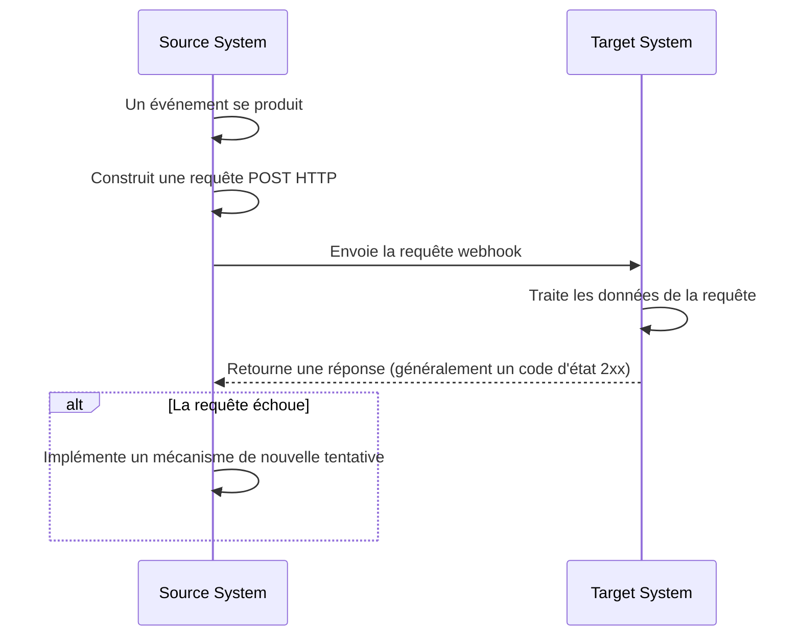
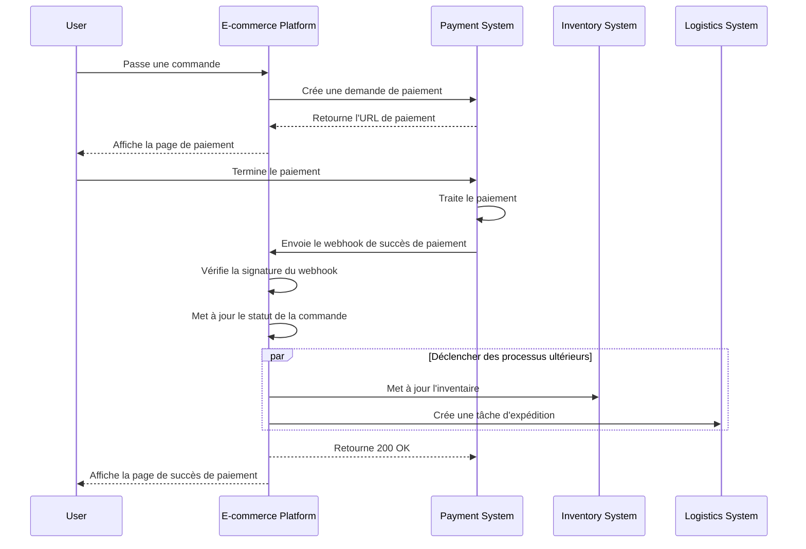

## Qu'est-ce qu'un webhook ?

Un webhook est un mécanisme de rappel HTTP qui permet aux applications d'envoyer des notifications en temps réel à des URL prédéfinies lorsque des événements spécifiques se produisent. Ce mécanisme permet un échange de données automatisé et une communication en temps réel entre les systèmes.

## Comment fonctionnent les webhooks ?



1. Un événement spécifique se produit dans le système source
2. Le système source construit une requête POST HTTP contenant les données de l'événement
3. Le système source envoie la requête à l'URL du système cible préconfigurée
4. Le système cible reçoit la requête et traite les données
5. Le système cible retourne une réponse au système source
6. Si la requête échoue, le système source peut implémenter un mécanisme de nouvelle tentative

## Quels sont les cas d'utilisation courants des webhooks ?

1. Systèmes de paiement : Notifier les changements de statut de commande
2. Systèmes de contrôle de version : Notifier les validations de code, les demandes de fusion et autres événements
3. Systèmes CRM : Notifications de mise à jour des informations client
4. Appareils IoT : Notifications de changement de statut des appareils
5. Plateformes de médias sociaux : Notifications de nouveaux messages et commentaires

## Comment fonctionnent les webhooks dans un scénario réel ?

Examinons un scénario impliquant une plateforme de commerce électronique intégrée à un système de paiement tiers :

### Scénario

Une plateforme de commerce électronique utilise un système de paiement tiers pour traiter les paiements de commande. Lorsqu'un utilisateur termine un paiement, le système de paiement doit notifier en temps réel la plateforme de commerce électronique sur le statut du paiement via un webhook, permettant à la plateforme de mettre à jour le statut de la commande et de déclencher des processus ultérieurs.

### Flux d'implémentation du webhook



1. Création de commande et demande de paiement :
   - L'utilisateur passe une commande sur la plateforme de commerce électronique.
   - La plateforme envoie une demande de paiement au système de paiement.
   - Le système de paiement retourne une URL de paiement, que la plateforme affiche à l'utilisateur.

2. Paiement de l'utilisateur :
   - L'utilisateur termine le paiement sur le système de paiement.

3. Déclenchement du webhook :
   - Le système de paiement détecte l'événement "paiement réussi".
   - Il construit une charge utile webhook contenant les détails du paiement.

4. Envoi du webhook :
   - Le système de paiement envoie une requête POST à l'URL préconfigurée de la plateforme de commerce électronique.

5. Traitement du récepteur :
   - La plateforme de commerce électronique reçoit le webhook et vérifie d'abord la signature de la requête pour garantir la sécurité.
   - Après vérification, la plateforme met à jour le statut de la commande correspondante à "payée".
   - La plateforme déclenche des processus ultérieurs, tels que la mise à jour de l'inventaire et la création de tâches d'expédition.

6. Gestion de la réponse :
   - La plateforme de commerce électronique retourne immédiatement une réponse 200 OK après avoir reçu le webhook.
   - Si des erreurs surviennent lors du traitement, la plateforme peut réessayer en arrière-plan ou impliquer une intervention manuelle.

7. Expérience utilisateur :
   - La plateforme de commerce électronique affiche une page de succès de paiement à l'utilisateur.

Cet exemple démontre comment les webhooks permettent une communication en temps réel entre un système de paiement tiers et une plateforme de commerce électronique. Grâce aux webhooks, le système de paiement peut informer instantanément la plateforme de commerce électronique lorsqu'un paiement est complété, permettant ainsi des mises à jour immédiates du statut de la commande et un déclenchement rapide des processus commerciaux ultérieurs. Cela améliore la réactivité globale du système et son efficacité, offrant finalement une meilleure expérience d'achat aux utilisateurs.

## Quelles sont les meilleures pratiques pour implémenter des webhooks ?

Lorsque vous êtes expéditeur (producteur) de webhooks, considérez les aspects suivants :

### Conception de webhook

Concevez des structures de webhook claires et cohérentes :

- Définissez des types d'événements clairs : Par exemple, `order.created`, `user.updated`, etc.
- Utilisez un format JSON standard : Assurez-vous que la structure des données est claire et facile à analyser.
- Contrôle de version : Incluez des informations de version dans les en-têtes de requêtes ou la charge utile. Par exemple :

  ```javascript
  // Dans les en-têtes de requête
  headers: {
    'Content-Type': 'application/json',
    'X-Webhook-Version': '1.0'
  }
  
  // Ou dans la charge utile
  {
    "version": "1.0",
    "event_type": "order.created",
    "data": {
      // Détails de l'événement
    }
  }
  ```

- Fournissez un contexte suffisant : Incluez les horodatages des événements, des identifiants uniques pour les ressources liées, etc.
- Maintenez la cohérence : Utilisez des conventions de nommage et des structures de données cohérentes pour tous les types d'événements.

### Mécanisme d'envoi

Implémentez un mécanisme d'envoi de webhook fiable :

- Utilisez des files d'attente de tâches asynchrones : Évitez de bloquer le programme principal et améliorez la réactivité du système.
- Implémentez des mécanismes de nouvelle tentative : Gérez les échecs de réseau ou l'indisponibilité temporaire du récepteur.

### Stratégie de nouvelle tentative

Concevez une stratégie de nouvelle tentative appropriée :

- Implémentez un retrait exponentiel : Évitez les réessais fréquents qui pourraient stresser le système et le récepteur.
- Définissez un nombre maximal de nouvelles tentatives : Évitez les réessais infinis qui consommeraient les ressources système.
- Fournissez des mécanismes de nouvelle tentative manuelle : Offrez une interface pour les nouvelles tentatives manuelles pour les webhooks qui échouent finalement.

### Implémentation de la sécurité

Implémentez un mécanisme de signature pour permettre aux récepteurs de vérifier l'authenticité des requêtes :

```javascript
const crypto = require('crypto');

function generateSignature(payload, secret) {
  return crypto.createHmac('sha256', secret)
    .update(JSON.stringify(payload))
    .digest('hex');
}

function sendWebhookWithSignature(url, payload, secret) {
  const signature = generateSignature(payload, secret);
  return axios.post(url, payload, {
    headers: { 'X-Webhook-Signature': signature }
  });
}
```

### Optimisation des performances

Optimisez les performances d'envoi des webhooks :

- Utilisez des pools de connexion : Réduisez la surcharge d'établissement de connexions et améliorez les performances.
- Implémentez le traitement par lots : Envoyez les webhooks par lots si nécessaire pour réduire le nombre d'interactions réseau.

### Documentation et outils de test

Fournissez une assistance pour les utilisateurs de webhooks :

- Documentation API détaillée : Incluez tous les types d'événements possibles, les formats de requête, et les descriptions de champs.
- Fournissez des outils de test : Implémentez des points de test de webhook pour permettre aux utilisateurs de simuler la réception de notifications webhook.
- Code d'exemple : Fournissez des exemples d'intégration dans divers langages de programmation.

## Quelles sont les meilleures pratiques pour utiliser des webhooks ?

Lorsque vous utilisez des webhooks comme récepteur (consommateur), considérez les aspects suivants :

### Sécurité

Étant donné que les points de terminaison pour recevoir des webhooks sont généralement accessibles au public, la sécurité est une préoccupation majeure. Faites attention aux points suivants :

- Vérifiez l'authenticité des requêtes : Implémentez un mécanisme de vérification de signature pour vous assurer que les requêtes proviennent d'expéditeurs attendus.
  
  ```javascript
  const crypto = require('crypto');

  function verifySignature(payload, signature, secret) {
    const expectedSignature = crypto
      .createHmac('sha256', secret)
      .update(JSON.stringify(payload))
      .digest('hex');
    
    return crypto.timingSafeEqual(
      Buffer.from(signature),
      Buffer.from(expectedSignature)
    );
  }
  ```

- Utilisez HTTPS : Assurez-vous que votre point de terminaison de réception de webhook utilise HTTPS pour empêcher que les données ne soient interceptées ou altérées pendant la transmission.
- Implémentez une liste blanche d'IP : N'acceptez que les requêtes webhook provenant d'adresses IP de confiance pour réduire le risque d'attaques.

### Fiabilité

Pour garantir une gestion fiable des webhooks reçus :

- Implémentez un traitement idempotent : Concevez votre système pour gérer correctement les notifications webhook en double, car les expéditeurs peuvent réessayer les requêtes échouées.
- Répondez rapidement : Retournez une réponse (généralement un code d'état 2xx) immédiatement après avoir reçu une requête webhook pour éviter que l'expéditeur ne considère la requête comme échouée et déclenche une nouvelle tentative.

### Performances

Maintenez un fonctionnement efficace du système :

- Traitement asynchrone : Après avoir reçu un webhook, effectuez le traitement réel des données en arrière-plan sans bloquer la réponse.
- Définissez des limites de temps : Fixez des périodes limites raisonnables pour le traitement des webhooks pour empêcher que des tâches à long terme n'affectent les performances du système.

### Gestion des erreurs

Gérez correctement les situations d'erreur potentielles :

- Journalisation : Conservez des enregistrements détaillés des requêtes webhook reçues et des procédures de traitement pour faciliter la résolution des problèmes.
- Dégradation harmonieuse : Mettez en œuvre des mécanismes de gestion des erreurs appropriés lorsque vous êtes incapable de traiter les webhooks pour vous assurer que d'autres parties du système ne sont pas affectées.

### Compatibilité des versions

Étant donné que les formats de webhook peuvent changer au fil du temps :

- Gérez les informations de version : Soyez préparé à gérer différentes versions des formats de webhook. Les informations de version sont généralement fournies dans l'URL ou les en-têtes de requête.
- Compatibilité descendante : Lors de la mise à jour de votre logique de traitement de webhook, assurez-vous de maintenir la prise en charge des versions de formats plus anciennes.

### Surveillance

Surveillez en continu la réception et le traitement des webhooks :

- Mettez en place des alertes : Implémentez une surveillance en temps réel et des alertes pour les situations anormales (comme des taux d'échec élevés ou un trafic inhabituel).
- Métriques de performance: Suivez les métriques de performance pour le traitement des webhooks, telles que le temps de réponse et le taux de succès.

<Resources
  urls={[
    "https://docs.logto.io/docs/recipes/webhooks/",
    "https://docs.logto.io/docs/recipes/webhooks/securing-your-webhooks/",
    "https://en.wikipedia.org/wiki/Webhook"
  ]}
/>