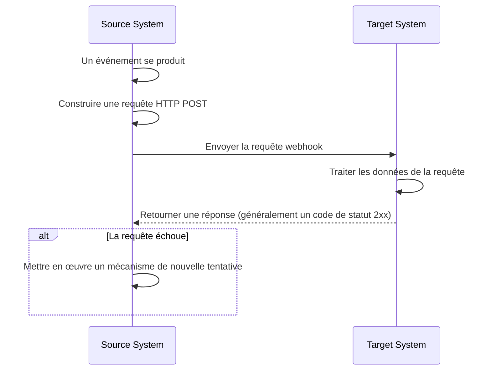
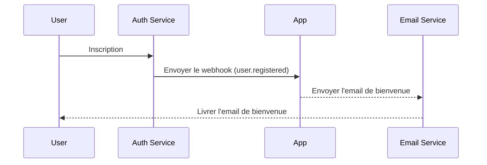

## Qu'est-ce qu'un webhook ?

Un webhook est un mécanisme de rappel HTTP qui permet aux applications d'envoyer des notifications en temps réel à des URL prédéfinies lorsque des événements spécifiques se produisent. Ce mécanisme permet un échange de données automatisé et une communication en temps réel entre les systèmes.

## Comment fonctionnent les webhooks ?



1. Un événement spécifique se produit dans le système source
2. Le système source construit une requête HTTP POST contenant les données de l'événement
3. Le système source envoie la requête à l'URL du système cible préconfigurée
4. Le système cible reçoit la requête et traite les données
5. Le système cible retourne une réponse au système source
6. Si la requête échoue, le système source peut mettre en œuvre un mécanisme de nouvelle tentative

## Comment fonctionnent les webhooks dans un scénario réel ?

Prenons une application intégrée à un service d'auth (authentification) comme exemple. Lorsqu'un nouvel utilisateur s'inscrit, l'application enverra un email de bienvenue à l'utilisateur.

En général, le service d'auth (authentification) fournit un événement webhook `user.registered` qui est déclenché lorsqu'un nouvel utilisateur termine son inscription.

La charge utile de l'événement webhook contient les informations de l'utilisateur telles que l'email et le nom d'utilisateur, qui peuvent être utilisées pour envoyer l'email de bienvenue :

```json
// Note : la structure réelle de la charge utile dépend du service d'auth (authentification).
{
  "event": "user.registered",
  "timestamp": "2024-03-21T08:00:00Z",
  "data": {
    "user_id": "u_1234567890",
    "email": "john@example.com",    // Adresse email pour envoyer l'email de bienvenue
    "username": "johndoe",          // Nom d'utilisateur pour personnaliser l'email
    "registered_at": "2024-03-21T08:00:00Z"
  }
}
```

Voici comment fonctionne le flux de webhook :



## Quelles sont les meilleures pratiques pour implémenter des webhooks ?

Lorsque vous êtes l'expéditeur (producteur) de webhooks, considérez les aspects suivants :

### Conception de webhook

Concevez des structures de webhook claires et cohérentes :

- Définissez des types d'événements clairs : Par exemple, `order.created`, `user.updated`, etc.
- Utilisez le format JSON standard : Assurez-vous que la structure des données est claire et facile à analyser.
- Contrôle de version : Incluez des informations de version dans les en-têtes de requête ou la charge utile. Par exemple :

  ```javascript
  // Dans les en-têtes de requête
  headers: {
    'Content-Type': 'application/json',
    'X-Webhook-Version': '1.0'
  }
  
  // Ou dans la charge utile
  {
    "version": "1.0",
    "event_type": "order.created",
    "data": {
      // Détails de l'événement
    }
  }
  ```

- Fournissez un contexte suffisant : Incluez des horodatages des événements, des identifiants uniques pour les ressources associées, etc.
- Maintenez la cohérence : Utilisez des conventions de nommage et des structures de données cohérentes pour tous les types d'événements.

### Mécanisme d'envoi

Implémentez un mécanisme d'envoi de webhook fiable :

- Utilisez des files d'attente de tâches asynchrones : Évitez de bloquer le programme principal et améliorez la réactivité du système.
- Implémentez des mécanismes de nouvelle tentative : Gérez les échecs de réseau ou l'indisponibilité temporaire du récepteur.

### Stratégie de nouvelle tentative

Concevez une stratégie de nouvelle tentative appropriée :

- Implémentez un backoff exponentiel : Évitez les nouvelles tentatives fréquentes qui pourraient surcharger le système et le récepteur.
- Définissez un nombre maximal de nouvelles tentatives : Empêchez les nouvelles tentatives infinies de consommer les ressources du système.
- Fournissez des mécanismes de nouvelle tentative manuelle : Offrez une interface pour les nouvelles tentatives manuelles pour les webhooks qui échouent finalement.

### Mise en œuvre de la sécurité

Implémentez un mécanisme de signature pour permettre aux récepteurs de vérifier l'authenticité des requêtes :

```javascript
const crypto = require('crypto');

function generateSignature(payload, secret) {
  return crypto.createHmac('sha256', secret)
    .update(JSON.stringify(payload))
    .digest('hex');
}

function sendWebhookWithSignature(url, payload, secret) {
  const signature = generateSignature(payload, secret);
  return axios.post(url, payload, {
    headers: { 'X-Webhook-Signature': signature }
  });
}
```

### Optimisation des performances

Optimisez les performances d'envoi de webhook :

- Utilisez des pools de connexions : Réduisez la surcharge de l'établissement de connexions et améliorez les performances.
- Implémentez le traitement par lots : Envoyez les webhooks par lots lorsque cela est approprié pour réduire le nombre d'interactions réseau.

### Documentation et outils de test

Fournissez un support pour les utilisateurs de webhook :

- Documentation API détaillée : Incluez tous les types d'événements possibles, les formats de requête et les descriptions de champs.
- Fournissez des outils de test : Implémentez des points de terminaison de test de webhook pour permettre aux utilisateurs de simuler la réception de notifications de webhook.
- Code d'exemple : Fournissez des exemples d'intégration dans divers langages de programmation.

## Quelles sont les meilleures pratiques pour utiliser les webhooks ?

Lorsque vous utilisez des webhooks en tant que récepteur (consommateur), considérez les aspects suivants :

### Sécurité

Étant donné que les points de terminaison pour recevoir des webhooks sont généralement accessibles au public, la sécurité est une préoccupation majeure. Faites attention aux points suivants :

- Vérifiez l'authenticité des requêtes : Implémentez un mécanisme de vérification de signature pour vous assurer que les requêtes proviennent des expéditeurs attendus.
  
  ```javascript
  const crypto = require('crypto');

  function verifySignature(payload, signature, secret) {
    const expectedSignature = crypto
      .createHmac('sha256', secret)
      .update(JSON.stringify(payload))
      .digest('hex');
    
    return crypto.timingSafeEqual(
      Buffer.from(signature),
      Buffer.from(expectedSignature)
    );
  }
  ```

- Utilisez HTTPS : Assurez-vous que votre point de terminaison de réception de webhook utilise HTTPS pour empêcher que les données ne soient interceptées ou altérées pendant la transmission.
- Implémentez une liste blanche d'IP : N'acceptez que les requêtes de webhook provenant d'adresses IP de confiance pour réduire le risque d'attaques.

### Fiabilité

Pour assurer un traitement fiable des webhooks reçus :

- Implémentez un traitement idempotent : Concevez votre système pour gérer correctement les notifications de webhook en double, car les expéditeurs peuvent réessayer les requêtes échouées.
- Répondez rapidement : Retournez une réponse (généralement un code de statut 2xx) immédiatement après avoir reçu une requête de webhook pour éviter que l'expéditeur ne considère la requête comme échouée et ne déclenche une nouvelle tentative.

### Performance

Maintenez un fonctionnement efficace du système :

- Traitement asynchrone : Après avoir reçu un webhook, effectuez le traitement réel des données en arrière-plan sans bloquer la réponse.
- Définissez des limites de temps : Fixez des périodes de temps raisonnables pour le traitement des webhooks afin d'éviter que les tâches de longue durée n'affectent les performances du système.

### Gestion des erreurs

Gérez correctement les situations d'erreur potentielles :

- Journalisation : Conservez des enregistrements détaillés des requêtes de webhook reçues et des procédures de traitement pour faciliter l'investigation des problèmes.
- Dégradation gracieuse : Ayez des mécanismes de gestion des erreurs appropriés lorsque vous ne pouvez pas traiter les webhooks pour vous assurer que les autres parties du système ne sont pas affectées.

### Compatibilité des versions

Étant donné que les formats de webhook peuvent changer au fil du temps :

- Gérez les informations de version : Soyez prêt à gérer différentes versions de formats de webhook. Les informations de version sont généralement fournies dans l'URL ou les en-têtes de requête.
- Compatibilité ascendante : Lors de la mise à jour de votre logique de gestion des webhooks, assurez-vous de continuer à prendre en charge les anciennes versions de format.

### Surveillance

Surveillez en continu la réception et le traitement des webhooks :

- Configurez des alertes : Implémentez une surveillance en temps réel et des alertes pour les situations anormales (telles que des taux d'échec élevés ou un trafic inhabituel).
- Mesures de performance : Suivez les mesures de performance pour le traitement des webhooks, telles que le temps de réponse et le taux de réussite.

<Resources
  urls={[
    "https://docs.logto.io/docs/recipes/webhooks/",
    "https://docs.logto.io/docs/recipes/webhooks/securing-your-webhooks/",
    "https://en.wikipedia.org/wiki/Webhook"
  ]}
/>