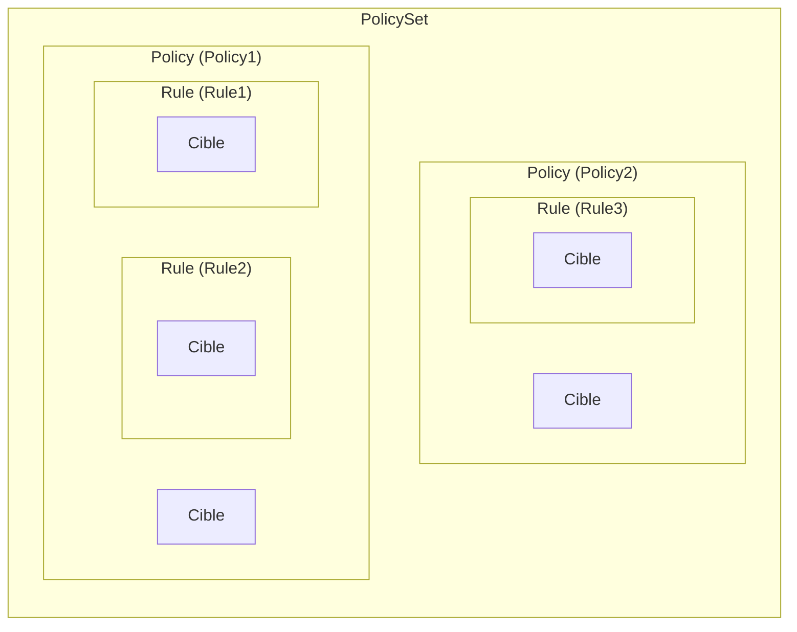
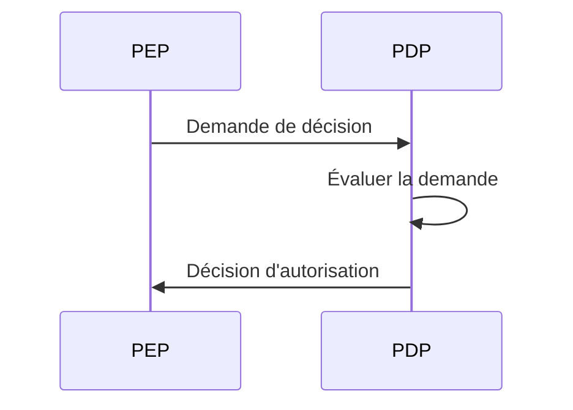
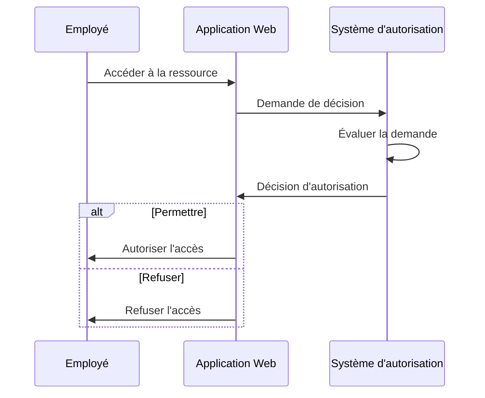
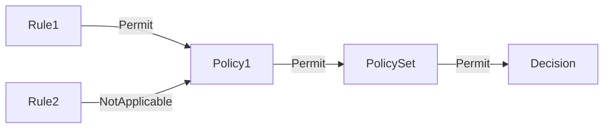
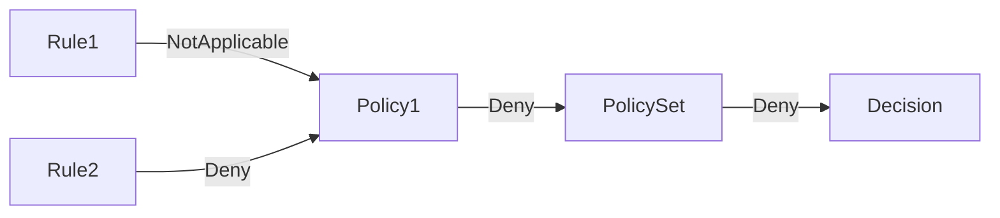

## Qu'est-ce que XACML ?

Comme son nom l'indique, le eXtensible Access Control Markup Language (XACML) est un langage basé sur XML utilisé principalement pour le contrôle d'accès. Il s'agit d'une norme définie par l'Organization for the Advancement of Structured Information Standards (OASIS).

[XACML 3.0](https://docs.oasis-open.org/xacml/3.0/xacml-3.0-core-spec-os-en.html) est la dernière version de la norme, publiée en 2013. Bien qu'elle ne spécifie pas un modèle de contrôle d'accès particulier, XACML est souvent utilisé pour mettre en œuvre des politiques <Ref slug="abac" />. Voyons un exemple simple de la manière dont XACML peut être utilisé pour représenter des politiques ABAC :

```xml
<PolicySet PolicySetId="ABAC_Policies" PolicyCombiningAlgId="urn:oasis:names:tc:xacml:3.0:policy-combining-algorithm:deny-overrides">
  <Description>Politiques ABAC</Description>
  <Policy PolicyId="Policy1" RuleCombiningAlgId="urn:oasis:names:tc:xacml:3.0:rule-combining-algorithm:deny-overrides">
    <Description>Les employés peuvent lire les données</Description>
    <Target>
      <AnyOf>
        <AllOf>
          <Match MatchId="urn:oasis:names:tc:xacml:1.0:function:string-equal">
            <AttributeValue DataType="http://www.w3.org/2001/XMLSchema#string">read</AttributeValue>
            <AttributeDesignator
              AttributeId="urn:oasis:names:tc:xacml:1.0:action:action-id"
              Category="urn:oasis:names:tc:xacml:3.0:attribute-category:action"
              DataType="http://www.w3.org/2001/XMLSchema#string"
              MustBePresent="true"
            />
          </Match>
        </AllOf>
      </AnyOf>
    </Target>
    <Rule RuleId="Rule1" Effect="Permit">
      <Target>
        <AnyOf>
          <AllOf>
            <Match MatchId="urn:oasis:names:tc:xacml:1.0:function:string-equal">
              <AttributeValue DataType="http://www.w3.org/2001/XMLSchema#string">employee</AttributeValue>
              <AttributeDesignator
                AttributeId="urn:oasis:names:tc:xacml:1.0:subject:subject-id"
                Category="urn:oasis:names:tc:xacml:1.0:subject-category:access-subject"
                DataType="http://www.w3.org/2001/XMLSchema#string"
                MustBePresent="true"
              />
            </Match>
          </AllOf>
        </AnyOf>
      </Target>
    </Rule>
    <Rule RuleId="Rule2" Effect="Deny">
      <Target>
        <AnyOf>
          <AllOf>
            <Match MatchId="urn:oasis:names:tc:xacml:1.0:function:string-equal">
              <AttributeValue DataType="http://www.w3.org/2001/XMLSchema#string">user</AttributeValue>
              <AttributeDesignator
                AttributeId="urn:oasis:names:tc:xacml:1.0:subject:subject-id"
                Category="urn:oasis:names:tc:xacml:1.0:subject-category:access-subject"
                DataType="http://www.w3.org/2001/XMLSchema#string"
                MustBePresent="true"
              />
            </Match>
          </AllOf>
        </AnyOf>
      </Target>
    </Rule>
  </Policy>
  <!-- ...autres politiques... -->
</PolicySet>
```

XACML utilise des conventions de nommage explicites et est conçu pour être lisible par les humains et facile à comprendre.

En bref, cette politique stipule que les employés sont autorisés à lire les données, tandis que les utilisateurs sont refusés de lire les données. Décomposons la politique en analysant ses composants clés :

- `<PolicySet>`: L'élément racine de l'ensemble de politiques. Un `PolicySet` peut contenir plusieurs éléments `Policy` et `PolicySet`, formant une hiérarchie de politiques.
- `<Policy>`: Une politique qui contient une ou plusieurs règles. Chaque politique peut avoir :
  - Un élément `Target` qui spécifie les conditions sous lesquelles la politique s'applique.
  - Plusieurs éléments `Rule` qui définissent les règles de contrôle d'accès.
  - Un attribut `RuleCombiningAlgId` qui spécifie comment les règles sont combinées pour prendre une décision.
- `<Rule>`: Une règle qui définit les conditions sous lesquelles l'accès est accordé ou refusé. Chaque règle a :
  - Un élément `Target` qui spécifie les conditions sous lesquelles la règle s'applique.
  - Un attribut `Effect` qui spécifie si la règle permet ou refuse l'accès.

> [!Note]
> Les composants et attributs disponibles dans XACML ne se limitent pas à ceux que nous venons de mentionner. Consultez la [spécification XACML 3.0](https://docs.oasis-open.org/xacml/3.0/xacml-3.0-core-spec-os-en.html) pour une liste complète des éléments et des attributs.

Une représentation graphique de la relation entre les différents composants clés est montrée ci-dessous :



Une explication détaillée des autres éléments et attributs de l'exemple sera fournie dans les sections suivantes.

## Comment fonctionne XACML

Pour simplifier, supposons qu'une seule politique soit définie dans l'ensemble de politiques ci-dessus. Pour déclencher le processus d'évaluation de la politique, une **demande de décision** doit être envoyée depuis un **point d'application de la politique (PEP)** à un **point de décision de la politique (PDP)**. Le PDP évalue la demande par rapport à la politique et renvoie une **décision d'autorisation** au PEP.



- PEP : Le composant qui envoie la demande de décision au PDP et applique la décision d'autorisation (c'est-à-dire exécute <Ref slug="access-control" />).
- PDP : Le composant qui évalue la demande de décision par rapport à la politique et renvoie la décision d'autorisation.

Utilisons un exemple du monde réel pour remplacer le langage shakespearien. Supposons qu'il existe une application web qui permet aux employés d'accéder à certaines ressources, et que l'application est intégrée à un système d'autorisation basé sur XACML.

Lorsqu'un employé tente d'accéder à une ressource, l'application web (**PEP**) envoie une **demande de décision** au système d'autorisation (**PDP**). Une fois que le système d'autorisation évalue la demande par rapport à la politique XACML, il renvoie une **décision d'autorisation** à l'application web.



## Demande de décision

Une demande de décision dans XACML se compose des composants clés suivants :

- **Sujet** : L'entité demandant l'accès à une ressource. Il peut s'agir d'un utilisateur, d'un appareil ou de toute autre entité.
- **Ressource** : La ressource étant accédée. Il peut s'agir d'un fichier, d'une base de données, d'un point de terminaison d'API ou de toute autre ressource.
- **Action** : L'action effectuée sur la ressource. Elle peut être lire, écrire, supprimer ou toute autre action.
- **Environnement** : Le contexte dans lequel la demande d'accès est faite. Il peut inclure des informations telles que l'heure du jour, l'emplacement ou toute autre information contextuelle.

Voici un exemple de demande de décision dans XACML :

```xml
<Request>
  <Attributes Category="urn:oasis:names:tc:xacml:3.0:attribute-category:resource">
    <Attribute AttributeId="urn:oasis:names:tc:xacml:1.0:resource:resource-id" DataType="http://www.w3.org/2001/XMLSchema#string">
      <AttributeValue>http://example.com/data</AttributeValue>
    </Attribute>
  </Attributes>
  <Attributes Category="urn:oasis:names:tc:xacml:3.0:attribute-category:action">
    <Attribute AttributeId="urn:oasis:names:tc:xacml:1.0:action:action-id" DataType="http://www.w3.org/2001/XMLSchema#string">
      <AttributeValue>read</AttributeValue>
    </Attribute>
  </Attributes>
  <Attributes Category="urn:oasis:names:tc:xacml:3.0:attribute-category:subject">
    <Attribute AttributeId="urn:oasis:names:tc:xacml:1.0:subject:subject-id" DataType="http://www.w3.org/2001/XMLSchema#string">
      <AttributeValue>employee</AttributeValue>
    </Attribute>
  </Attributes>
</Request>
```

## Processus d'évaluation

Une fois que le PDP récupère l'ensemble de politiques, il évalue la demande de décision comme suit :

1. **Correspondance de cible** : Pour chaque politique, le PDP vérifie si la demande correspond à la cible de la politique. Si la demande correspond à la cible, le PDP procède à l'évaluation des règles.
2. **Évaluation des règles** : Le PDP évalue chaque règle de la politique. Si la cible d'une règle correspond à la demande, le PDP évalue la condition de la règle. Si la condition évalue à `true`, le PDP renvoie l'effet de la règle (permettre ou refuser). Si la condition évalue à `false`, le PDP continue à évaluer la règle suivante.
3. **Combinaison de règles** : Le PDP combine les effets de toutes les règles de la politique en fonction de l'attribut `RuleCombiningAlgId` de la politique. L'effet combiné est ensuite renvoyé comme décision de la politique.
4. **Combinaison de politiques** : Si l'ensemble de politiques contient plusieurs politiques, le PDP combine les décisions de toutes les politiques en fonction de l'attribut `PolicyCombiningAlgId` de l'ensemble de politiques. La décision combinée est ensuite renvoyée comme décision d'autorisation finale.

### Exemple 1

Par exemple, dans l'ensemble de politiques donné, supposons que la demande de décision est comme ci-dessus. Le PDP évaluerait la demande par rapport à la politique `Policy1` comme suit :

#### Correspondance de cible

La `Target` de la politique spécifie que tout sujet ayant un identifiant d'action `read` doit être évalué par la politique. Puisque l'action de la demande est `read`, la demande correspond à la cible de la politique.

#### Évaluation des règles

La politique contient deux règles :

1. `Rule1` : Puisque l'identifiant de sujet de la demande est `employee`, la condition de la règle évalue à `true`, et l'effet de la règle est `Permit`.
2. `Rule2` : Puisque l'identifiant de sujet de la demande n'est pas `user`, la condition de la règle évalue à `false`, et l'effet de la règle est `NotApplicable`.

#### Combinaison de règles et de politique

- Puisque `Policy1` utilise l'algorithme de combinaison de règles `deny-overrides`, la décision de la politique est `Permit` car `Rule1` permet l'accès et son effet l'emporte sur l'effet `NotApplicable` de `Rule2`.
- L'ensemble de politiques utilise également l'algorithme de combinaison de politiques `deny-overrides`, et la décision finale est `Permit` car la décision de la politique est `Permit`.

Voici une représentation graphique non normative du processus d'évaluation :



### Exemple 2

Considérons maintenant une demande de décision différente où tous les autres attributs sont les mêmes, mais l'identifiant de sujet est `user` au lieu de `employee`.

#### Correspondance de cible

Puisque l'action est inchangée, la demande correspond toujours à la cible de la politique.

#### Évaluation des règles

- `Rule1` : L'identifiant de sujet de la demande n'est pas `employee`, donc la condition de la règle évalue à `false`, et l'effet de la règle est `NotApplicable`.
- `Rule2` : L'identifiant de sujet de la demande est `user`, donc la condition de la règle évalue à `true`, et l'effet de la règle est `Deny`.

#### Combinaison de règles et de politique

- La décision de la politique est `Deny` car `Rule2` refuse l'accès, et son effet l'emporte sur l'effet `NotApplicable` de `Rule1`.
- La décision finale est `Deny` car l'algorithme de combinaison de politiques `deny-overrides` de l'ensemble de politiques renvoie la décision la plus restrictive.

Voici une représentation graphique non normative du processus d'évaluation :



### Exemple 3

Enfin, considérons une demande de décision où l'action est `write` au lieu de `read`. Tous les autres attributs restent les mêmes que dans l'exemple 1.

#### Correspondance de cible

La demande ne correspond plus à la cible de la politique car l'action est `write`, non `read`. Par conséquent, la politique n'est pas évaluée.

#### Combinaison de règles et de politique

Étant donné que la politique n'est pas évaluée, la décision finale est `NotApplicable`.

Voici une représentation graphique non normative du processus d'évaluation :


## Algorithmes de combinaison

XACML définit plusieurs algorithmes de combinaison standard qui déterminent comment les effets de plusieurs règles ou politiques sont combinés pour prendre une décision. Dans les exemples ci-dessus, nous avons mentionné l'algorithme de combinaison `deny-overrides` pour les règles et les politiques.

Comme le nom le suggère, l'algorithme `deny-overrides` privilégie les décisions de `Deny` par rapport aux décisions de `Permit`. Voici une explication simplifiée du fonctionnement de l'algorithme `deny-overrides` :

- si une règle ou politique refuse l'accès, la décision finale est `Deny` ;
- si aucune règle ou politique ne refuse l'accès et qu'AU MOINS une règle ou politique permet l'accès, la décision finale est `Permit` ;
- si aucune règle ou politique ne refuse l'accès et qu'AUCUNE règle ou politique ne permet l'accès, la décision finale est `NotApplicable`.

L'algorithme réel est plus complexe et prend en compte d'autres décisions "indéterminées" telles que `Indeterminate{D}` et `Indeterminate{P}`.

> [!Note]
> Cet algorithme ne fournit pas de décision de "secours" dans le cas où aucune règle ou politique ne correspond à la demande. Dans de tels cas, la décision est `NotApplicable`.

Pour une liste complète des algorithmes de combinaison et de leur comportement, reportez-vous à la [spécification XACML 3.0](https://docs.oasis-open.org/xacml/3.0/xacml-3.0-core-spec-os-en.html#_Toc325047268).

## Considérations pour la mise en œuvre

XACML est un langage puissant pour exprimer des politiques de contrôle d'accès basé sur les attributs. Avant de mettre en œuvre XACML dans votre système, prenez en compte les éléments suivants :

- Conception du contrôle d'accès : XACML est flexible et expressif, mais exige une conception soignée car elle peut impliquer des ensembles de politiques complexes qui peuvent conduire à des conséquences inattendues.
- Complexité : Les politiques XACML sont souvent complexes et peuvent être difficiles à gérer. Pour la plupart des applications, des modèles de contrôle d'accès plus simples comme <Ref slug="rbac" /> peuvent être plus appropriés.
- Performance : L'évaluation des politiques XACML peut être coûteuse en calcul, en particulier lorsqu'il s'agit de grands ensembles de politiques. Considérez les implications en termes de performance de l'utilisation de XACML dans votre système.

<SeeAlso slugs={['abac', 'rbac', 'access-control', 'authorization']} />

<Resources
  urls={[
    'https://docs.oasis-open.org/xacml/3.0/xacml-3.0-core-spec-os-en.html',
  ]}
/>