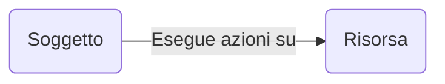
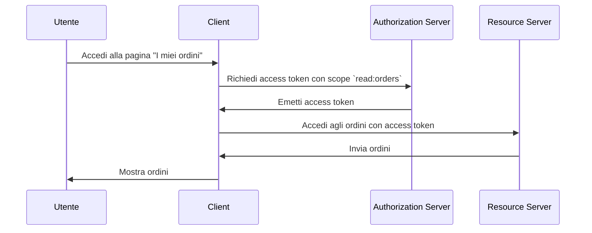

## Che cos'è il controllo degli accessi?

Il controllo degli accessi coinvolge tre componenti principali:

- **Soggetto**: Un'entità che esegue azioni sulle risorse. I soggetti possono essere utenti, servizi o dispositivi.
- **Risorsa**: Un'entità protetta dal controllo degli accessi. Le risorse possono essere file, database, API o qualsiasi altro asset digitale.
- **Azione**: Un'operazione che un soggetto può eseguire su una risorsa. Le azioni possono essere lettura, scrittura, esecuzione o qualsiasi altra operazione.

> Il controllo degli accessi definisce la restrizione selettiva dell'accesso alle **risorse** in base al **soggetto** e all'**azione**.

Ecco alcuni esempi reali di controllo degli accessi:

- Un utente (soggetto) **può** leggere (azione) i propri ordini (risorsa) in un sistema di e-commerce.
- Un utente (soggetto) **non può** eliminare (azione) il profilo di un altro utente (risorsa) in un social network.
- Un servizio (soggetto) **può** scrivere (azione) dati in un database (risorsa) in un'architettura a microservizi.

A volte, la risorsa viene ignorata nelle implementazioni tecniche e il controllo degli accessi è definito come la restrizione di chi (soggetto) può eseguire quali azioni. Ad esempio, il framework base di OAuth 2.0 specifica solo le azioni utilizzando gli scope (permessi) e non definisce le risorse.

Il supporto per il controllo degli accessi può variare a seconda del <Ref slug="authorization-server" /> o del <Ref slug="identity-provider" />. Alcuni sistemi possono supportare [Resource Indicators for OAuth 2.0](https://datatracker.ietf.org/doc/html/rfc8707), un'estensione di OAuth 2.0 che consente ai client di specificare le risorse a cui vogliono accedere.

## Modelli di controllo degli accessi ||access-control-models||

Decidere le restrizioni tra pochi soggetti e risorse è semplice, ma non scalabile. Pertanto, l'industria ha sviluppato molti modelli di controllo degli accessi per gestirlo efficacemente. Nel contesto di <Ref slug="iam" />, i seguenti sono alcuni modelli comuni di controllo degli accessi:

- <Ref slug="rbac" />: Un modello che assegna permessi ai ruoli e poi assegna ruoli ai soggetti. Ad esempio, un ruolo di amministratore potrebbe avere accesso a tutte le risorse, mentre un ruolo utente potrebbe avere accesso a risorse limitate.
- <Ref slug="abac" />: Un modello che utilizza attributi (proprietà) del soggetto, della risorsa e dell'ambiente per prendere decisioni di controllo degli accessi. Ad esempio, un utente con l'attributo "dipartimento=ingegneria" potrebbe avere accesso alle risorse di ingegneria.

Esistono anche altri modelli di controllo degli accessi come [policy-based access control (PBAC)](https://csrc.nist.gov/glossary/term/policy_based_access_control). Ogni modello ha i propri punti di forza e debolezza, e la scelta del modello dipende dal tuo caso d'uso e dai requisiti.

## Controllo degli accessi in OAuth 2.0

Nel contesto di OAuth 2.0, il controllo degli accessi è tipicamente implementato utilizzando <Ref slug="scope">scope</Ref>. Di solito, il valore di uno scope è una stringa che combina la risorsa e l'azione. Ad esempio, `read:orders` o `write:profile`.

> [!Nota]
> Il termine "scope" è intercambiabile con "permessi" nella maggior parte dei casi.

Vale la pena notare che OAuth 2.0 non definisce la struttura e il significato degli scope. L'interpretazione degli scope è lasciata al <Ref slug="resource-server" />, e l'emissione degli scope è lasciata al <Ref slug="authorization-server" />.

Ad esempio, un utente (soggetto) ha bisogno di accedere ai propri ordini (risorsa) in un sistema di e-commerce. Sfruttando OAuth 2.0, puoi definire uno scope `read:orders` e un'applicazione web (client) richiederà questo scope al server di autorizzazione. Ecco un flusso semplificato:

In questo flusso, a seconda dell'architettura tecnica, il resource server può essere un servizio API o può essere il client (applicazione web) stesso purché abbia la capacità di accedere alla risorsa (ordini).

### Il parametro resource indicator

Sebbene spesso si definiscano gli scope con risorsa e azione (ad esempio, `read:orders`, dove `orders` è la risorsa e `read` è l'azione), la scalabilità di questo approccio è limitata quando il numero di risorse e azioni cresce. RFC 8707 introduce il parametro `resource` (cioè <Ref slug="resource-indicator">resource indicators</Ref>) in OAuth 2.0, che consente ai client di specificare le risorse a cui vogliono accedere.

L'RFC specifica che il parametro `resource` dovrebbe essere un URI che rappresenta la risorsa. Ad esempio, invece di usare semplicemente `orders`, potresti usare `https://api.example.com/orders`. Questo metodo aiuta a prevenire conflitti di denominazione e migliora la precisione del matching delle risorse consentendo l'uso dell'URL effettivo della risorsa.

### Supporto del server di autorizzazione

OAuth 2.0 non definisce come il server di autorizzazione dovrebbe condurre il controllo degli accessi. Lascia i dettagli dell'implementazione alla discrezione del server di autorizzazione. Pertanto, la scelta del server di autorizzazione può influenzare notevolmente il meccanismo di controllo degli accessi. Ad esempio, alcuni server di autorizzazione possono supportare i resource indicators, mentre altri no. È importante decidere quale modello di controllo degli accessi utilizzare in base ai requisiti aziendali, quindi scegliere un server di autorizzazione che supporti quel modello. Se non sei sicuro del modello di controllo degli accessi, <Ref slug="rbac" /> è sufficiente per la maggior parte dei casi.

<SeeAlso slugs={["rbac", "abac", "resource-indicator", "authorization"]} />

<Resources
  urls={[
    "https://blog.logto.io/mastering-rbac",
    "https://blog.logto.io/rbac-and-abac",
    "https://datatracker.ietf.org/doc/html/rfc8707",
    "https://blog.logto.io/organization-and-role-based-access-control",
  ]}
/>
