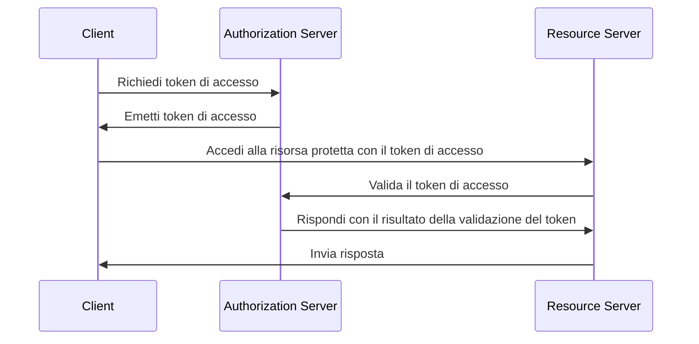
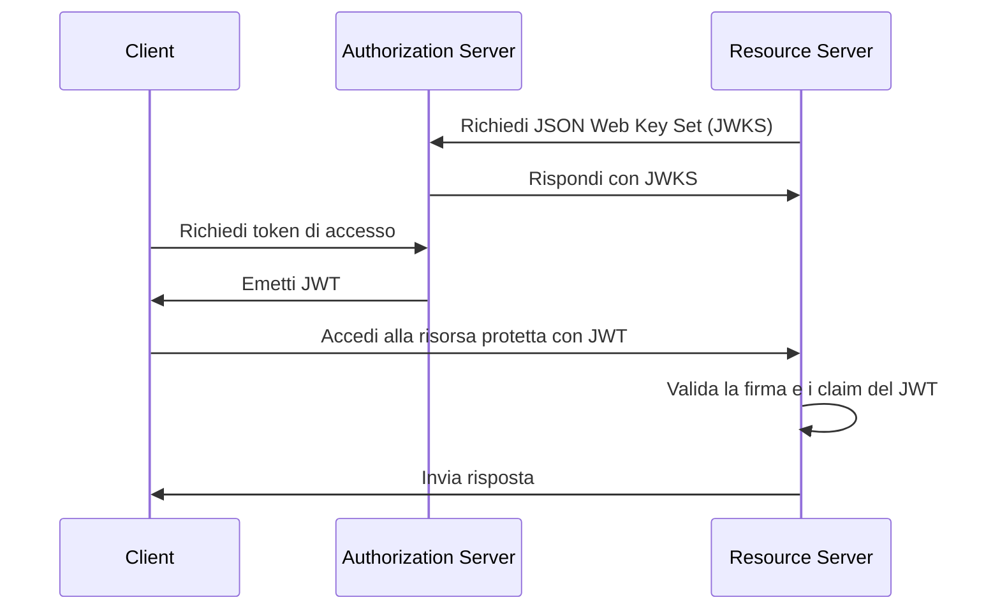
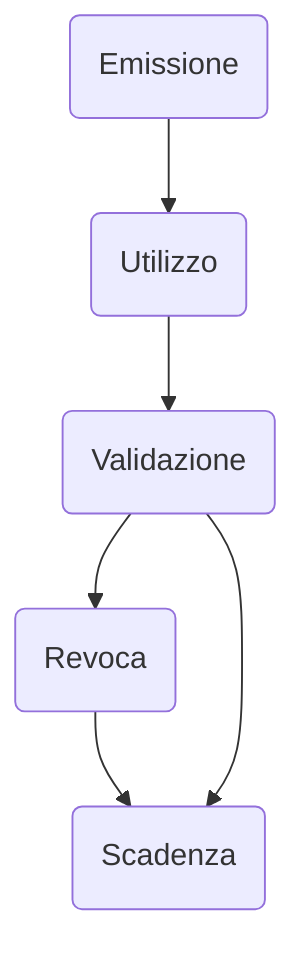

## Che cos'è un token di accesso (access token)?

Un token di accesso (access token) è una credenziale, tipicamente una stringa di caratteri, utilizzata per accedere a risorse protette. Nel contesto di OAuth 2.0 e OpenID Connect (OIDC), i <Ref slug="authorization-server">authorization server</Ref> possono emettere token di accesso ai client (applicazioni) dopo un'autenticazione e autorizzazione riuscite.

Sebbene gli RFC per OAuth 2.0 e OIDC non specifichino i dettagli di implementazione dei token di accesso, ci sono due tipi comuni di token di accesso utilizzati nella pratica:

- <Ref slug="opaque-token" />: Una stringa casuale che non ha significato ("opaco") per il client. Il client presenta il token al resource server, che valida il token con l'authorization server.
- <Ref slug="jwt" />: Un token autonomo che contiene <Ref slug="claim">claim</Ref> (ad esempio, ID utente, tempo di scadenza) con una firma digitale. Il resource server può validare il token senza effettuare una richiesta aggiuntiva all'authorization server.

## Come funziona un token di accesso (access token)?

A seconda del tipo di token di accesso, il flusso di utilizzo di un token di accesso può variare.

Ecco un esempio semplificato di utilizzo di un token di accesso opaco:

Ecco un esempio semplificato di utilizzo di un JWT:

La differenza tra i due tipi di token di accesso è come il resource server valida il token:

- Il resource server deve effettuare una richiesta aggiuntiva all'authorization server per validare un token opaco ogni volta che riceve un token.
- Il resource server può validare un JWT senza effettuare una richiesta aggiuntiva all'authorization server perché il token contiene tutte le informazioni necessarie e il resource server può memorizzare nella cache la chiave pubblica dal JSON Web Key Set (JWKS) dell'authorization server.

I token di accesso sono tipicamente di breve durata e hanno un tempo di scadenza (ad esempio, 1 ora). I client devono richiedere un nuovo token di accesso quando il token corrente scade.

## Quale tipo di token dovrei usare?

La scelta tra un token opaco e un JWT dipende dal caso d'uso e dai requisiti di sicurezza dell'applicazione. Ecco un confronto tra i due tipi di token:

|                | Token Opaco                    | JWT                                                           |
|----------------|--------------------------------|---------------------------------------------------------------|
| Formato        | Stringa casuale                | Oggetti JSON autonomi                                         |
| Prestazioni    | Richiede una richiesta aggiuntiva | Validazione più veloce                                        |
| Autonomo       | No                             | Sì                                                            |
| Dimensione del token | Più piccolo                    | Più grande                                                     |
| Revoca         | Immediata                      | Richiede la scadenza del token o l'interazione con l'authorization server |
| Estensibilità  | Limitata                       | Claim personalizzati                                          |
| Senza stato    | No                             | Sì                                                            |
| Sicurezza      | Richiede la validazione del token | Richiede la validazione della firma                           |
| Standard       | No                             | Sì (RFC 7519)                                                 |

Per ulteriori informazioni sulla scelta tra i due tipi di token, vedi [Opaque token vs JWT](https://blog.logto.io/opaque-token-vs-jwt).

## I ruoli dell'authorization server e del resource server

Nella maggior parte dei casi, l'<Ref slug="authorization-server" /> ha le seguenti responsabilità:

- Emette token di accesso ai client dopo un'autenticazione e autorizzazione riuscite. L'authorization server può ridurre gli scope (ridurre gli scope a un sottoinsieme) o rifiutare la richiesta di token in base alle politiche di access control (ad esempio, consenso dell'utente, <Ref slug="rbac" />, <Ref slug="abac" />).
- Verifica se il token di accesso è stato emesso dall'authorization server e non è scaduto o revocato (<Ref slug="token-introspection" />).
- Fornisce le informazioni sul token (ad esempio, scope, tempo di scadenza) tramite introspezione del token o <Ref slug="userinfo-endpoint" />.

Potresti notare che l'authorization server non interpreta il significato del token di accesso. Ad esempio, il token di accesso può contenere uno scope `read:orders`, ma l'authorization server non sa cosa significhi lo scope. Il resource server è responsabile dell'interpretazione del token di accesso e dell'applicazione dell'<Ref slug="access-control" /> in base agli scope del token. Vale a dire, il <Ref slug="resource-server" /> di solito ha le seguenti responsabilità:

- Valida i <Ref slug="claim">claim</Ref> nel token di accesso (ad esempio, tempo di scadenza, resource indicator, scope).
- Applica l'access control basato sui claim del token (di solito scope).
- Fornisce le risorse protette se il token di accesso è valido.

## Ciclo di vita del token di accesso

Il ciclo di vita di un token di accesso tipicamente coinvolge le seguenti fasi:

<SeeAlso slugs={['opaque-token', 'jwt', 'token-introspection', 'userinfo-endpoint', 'access-control']} />

<Resources
  urls={[
    "https://blog.logto.io/opaque-token-vs-jwt",
    "https://blog.logto.io/oauth2-token-introspection",
    "https://blog.logto.io/understanding-tokens-in-oidc",
    {
      url: "https://datatracker.ietf.org/doc/html/rfc6749#section-1.4",
      result: {
        ogTitle: "OAuth 2.0 Access Token",
      },
    },
    "https://datatracker.ietf.org/doc/html/rfc7662",
  ]}
/>