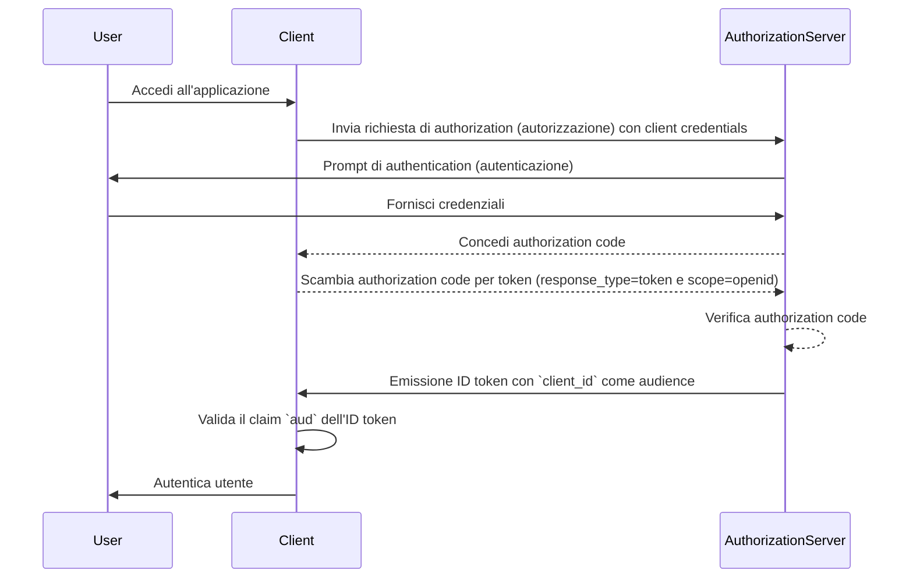
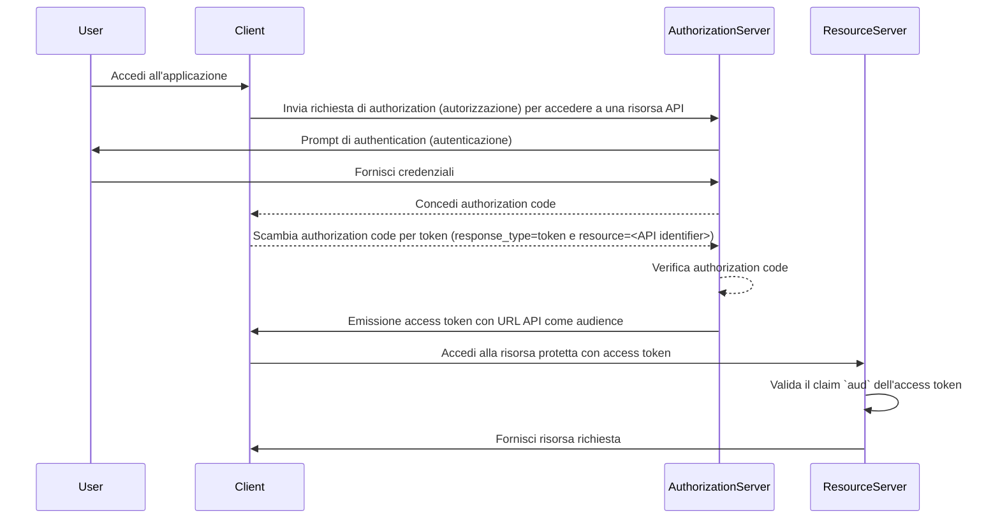

## Che cos'è l'audience?

Nel contesto di <Ref slug="authentication" /> e <Ref slug="authorization" />, l'audience (audience) è un componente chiave che definisce i destinatari previsti di un token di autorizzazione. Riferito come il claim [aud](https://datatracker.ietf.org/doc/html/rfc7519#section-4.1.3) in <Ref slug="jwt" />, questo claim garantisce che il token sia accettato solo dal servizio o dall'applicazione designati. Tipicamente, il claim di audience contiene o il client_id dell'applicazione per cui il token è destinato o un URL che rappresenta l'API o la risorsa a cui il token è autorizzato ad accedere. Specificando l'audience, funge da controllo di sicurezza per prevenire l'uso improprio da parte di servizi o utenti non autorizzati.

## Come funziona l'audience?

Quando un client richiede un <Ref slug="access-token" /> da un authorization server, il claim di audience è incluso nella risposta del token. Questo valore di audience viene quindi validato dal resource server quando il token viene presentato. Il resource server verifica se il claim di audience nel token corrisponde al proprio identificatore o all'identificatore del servizio che sta proteggendo. Se non corrisponde, il token verrà rifiutato, migliorando la sicurezza nei sistemi distribuiti, in particolare negli scenari che coinvolgono più microservizi o API. Controllando il claim di audience, gli sviluppatori possono garantire che i token siano utilizzati nel contesto corretto, aggiungendo un ulteriore livello di protezione ai flussi di lavoro di authentication (autenticazione) e authorization (autorizzazione) della loro applicazione.

- **Richiedente**: L'applicazione client specifica il valore di audience quando richiede un token.
- **Issuer (Issuer)**: L'authorization server include il claim di audience nella risposta del token.
- **Verificatore**: Il destinatario del token controlla il claim di audience rispetto al proprio identificatore. Se il claim di audience corrisponde all'identificatore del destinatario, il token è considerato valido. Altrimenti, viene rifiutato.

## Esempio di audience in JWT

### Claim di audience in un ID token di OpenID Connect (OIDC)

```json
{
  "header": {
    "alg": "RS256",
    "typ": "JWT",
    "kid": "abc123"
  },
  "payload": {
    "iss": "https://auth.logto.io",
    "sub": "test_user",
    "aud": "client_id_foo",
    "exp": 1516239022,
    "iat": 1516239022,
    "nonce": "n-0S6_WzA2Mj",
    "primary_email": "foo@logto.io",
    "email_verified": true,
    "username": "foo"
  },
  "signature": "..."
}
```

Un <Ref slug="id-token" /> in <Ref slug="openid-connect" /> è un token di sicurezza che contiene informazioni sull'utente autenticato, consegnato all'applicazione client dopo un'autenticazione riuscita. A differenza degli access token, che vengono utilizzati per concedere il permesso di accedere alle risorse, gli ID token sono specificamente progettati per trasmettere informazioni sull'identità dell'utente alla relying party (client). Questi token sono tipicamente codificati come JWT e includono claim come l'identificatore dell'utente (claim sub), l'issuer (claim iss) e l'audience (claim aud) tra gli altri.

In questo caso, il claim `aud` specifica l'audience prevista per l'ID token, che è l'applicazione client. Il valore del claim `aud` di solito corrisponde al `client_id` dell'applicazione che ha richiesto il token. Quando l'applicazione client riceve l'ID token, può verificare il claim di audience per garantire che il token sia stato emesso per il suo consumo. Questo passaggio di validazione aiuta a prevenire l'uso improprio del token e l'accesso non autorizzato alle informazioni dell'utente, migliorando la sicurezza del processo di authentication (autenticazione).



### Claim di audience in un access token

```json
{
  "header": {
    "alg": "RS256",
    "typ": "JWT",
    "kid": "abc123"
  },
  "payload": {
    "iss": "https://auth.logto.io",
    "sub": "test_user",
    "aud": "https://example.logto.app/api/users",
    "exp": 1516239022,
    "iat": 1516239022,
    "scope": "read write",
    "client_id": "client_id_foo"
  },
  "signature": "..."
}
```

A differenza degli ID token, gli <Ref slug="access-token" /> vengono utilizzati per autorizzare l'accesso a risorse protette, come API o servizi. Il claim `aud` in un access token specifica il destinatario previsto del token, che è tipicamente l'API o il servizio a cui il token è autorizzato ad accedere. Tipicamente, il resource server che ospita l'API ha un dominio diverso dall'applicazione client che ha richiesto il token. In questo caso, invece di un `client_id`, il claim `aud` contiene l'URL dell'endpoint API per cui il token è destinato. Questo URL è spesso noto come resource indicator o API identifier che identifica univocamente la risorsa target.

Quando il resource server riceve un access token, valida il claim `aud` per garantire che il token sia destinato al suo consumo. Verificando l'audience, il resource server può prevenire l'accesso non autorizzato alle sue risorse e applicare politiche di access control basate sull'audience prevista del token. Questo meccanismo aiuta a proteggere i dati sensibili e garantisce che gli access token siano utilizzati nel contesto appropriato, migliorando la sicurezza del sistema complessivo.



## FAQ

### Perché il claim di audience è importante nella validazione del token?

Il claim di audience è cruciale nella validazione del token perché garantisce che il token sia accettato solo dal destinatario previsto. Verificando il claim di audience, il destinatario può prevenire l'uso improprio del token e l'accesso non autorizzato alle risorse. Questo controllo di sicurezza è particolarmente importante nei sistemi distribuiti in cui più servizi interagiscono tra loro, poiché aiuta ad applicare politiche di access control e proteggere i dati sensibili.

### Un token può avere più audience?

Per motivi di sicurezza, si raccomanda che un token abbia una singola audience per prevenire ambiguità e garantire che il token sia utilizzato nel contesto corretto. Tuttavia, alcuni scenari possono richiedere token con più audience, come quando un token è destinato a più servizi o API all'interno dello stesso dominio. In tali casi, gli sviluppatori dovrebbero considerare attentamente le implicazioni dell'utilizzo di token multi-audience e implementare misure di sicurezza appropriate per mitigare i potenziali rischi.

### Cosa dovrei usare come identificatore API nel claim di audience?

Quando si specifica il claim di audience in un access token che rappresenta un'API o un servizio, si raccomanda di utilizzare un URI assoluto che identifichi univocamente la risorsa. Questo URI può essere l'URL di base dell'endpoint API o un percorso di risorsa specifico a cui il token è autorizzato ad accedere. Utilizzando un URI come identificatore API, puoi garantire che il claim di audience sia non ambiguo e rappresenti accuratamente il destinatario previsto del token.