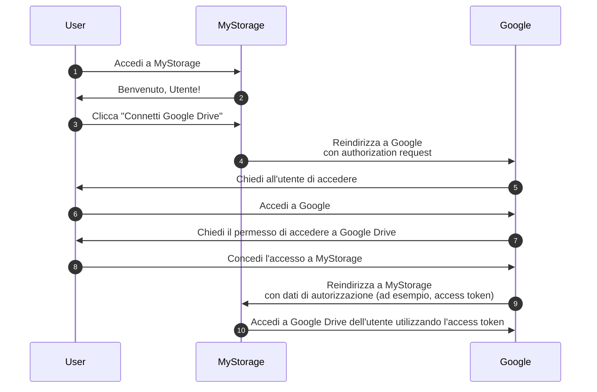

## Auth

Questa pagina è una disambiguazione per il termine "auth". È spesso usato come abbreviazione per:

- <Ref slug="authentication" />: Il processo di verifica della proprietà dell'identità (ad esempio, utente o servizio). Risponde alla domanda "Quale identità possiedi?"
- <Ref slug="authorization" />: Il processo di determinazione delle azioni che un'identità può eseguire su una risorsa. Risponde alla domanda "Cosa puoi fare?"

> [!Note]
> A volte, authentication (autenticazione) e authorization (autorizzazione) sono indicate rispettivamente come "AuthN" e "AuthZ".

Questi due concetti sono entrambi essenziali nel regno di <Ref slug="iam" />, ma sono fondamentalmente diversi. Vediamo un esempio: un'applicazione web MyStorage ha la capacità di caricare file e connettersi a Google Drive. Un tipico flusso utente sarebbe:

In questo flusso, l'utente esegue due passaggi di authentication (autenticazione): uno con MyStorage (passaggio 1) e un altro con Google (passaggio 6); e un passaggio di authorization (autorizzazione): concedere l'accesso a Google Drive (passaggio 8).

## A quale ti riferisci?

Quando vedi il termine "auth", è importante chiarire se si riferisce a authentication (autenticazione) o authorization (autorizzazione); altrimenti, potresti aspettarti che entrambi i processi siano coperti (proprio come fa questo sito web).

<SeeAlso slugs={["authentication", "authorization", "iam", "oauth-2.0", "openid-connect"]} />