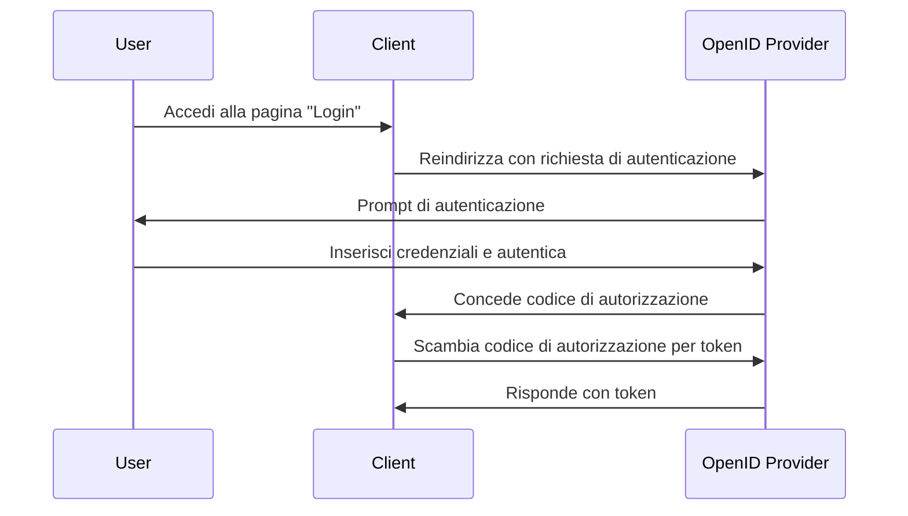

## Cos'è una richiesta di autenticazione (authentication request)?

Sebbene il significato di una richiesta di autenticazione (authentication request) possa variare a seconda del contesto, ci concentreremo sulla definizione nella specifica OpenID Connect (OIDC). In OIDC, una richiesta di autenticazione è una <Ref slug="authorization-request" /> al server di autorizzazione per autenticare un utente.

La definizione standard sembra molto confusa perché vengono utilizzati termini simili, come "richiesta di autorizzazione" (authorization request). Questo perché OIDC è costruito sopra OAuth 2.0, che è progettato principalmente per l'autorizzazione, e OIDC eredita la terminologia di OAuth 2.0 e la estende per supportare l'autenticazione.

Per chiarire, aggiungiamo un po' di contesto alla definizione:

> Una richiesta di autenticazione (OpenID Connect) è una richiesta di autorizzazione (OAuth 2.0) al server di autorizzazione (OpenID Connect) per autenticare un utente.

Diventa ancora più lunga! Ora rimuoviamo tutte le parentesi:

> Una richiesta di autenticazione è una richiesta al server per autenticare un utente.

Dopo aver rimosso tutti gli attributi, la definizione diventa semplice. Ecco la scomposizione dei termini:

- **Richiesta di autenticazione (Authentication request)**: Il termine dalla specifica OIDC.
- <Ref slug="authorization-request" />: Il termine dalla specifica OAuth 2.0. OIDC riutilizza la specifica e la estende.
- <Ref slug="authorization-server" />: Il termine dalla specifica OAuth 2.0. OIDC utilizza anche il termine <Ref slug="openid-connect" headingId="openid-provider-op" /> per riferirsi alla stessa entità in grado di autenticare gli utenti.

Nelle sezioni seguenti, useremo "OpenID Provider (OP)" per riferirci al server di autorizzazione che supporta OIDC.

## Come funziona una richiesta di autenticazione (authentication request)?

Quando un'applicazione client vuole autenticare un utente, avvia una richiesta di autenticazione all'OpenID Provider (OP). Come abbiamo detto in precedenza, la richiesta di autenticazione è anche una richiesta di autorizzazione in OAuth 2.0; quindi, alcuni tipi di concessione (grant types) di OAuth 2.0 possono essere utilizzati per completare il processo di autenticazione.

OIDC definisce tre tipi di concessione (grant types) per supportare l'autenticazione:

1. <Ref slug="authorization-code-flow" />: Il flusso di autenticazione più raccomandato. Di solito viene utilizzato con <Ref slug="pkce" /> per una maggiore sicurezza ed è adatto per la maggior parte delle applicazioni.
2. <Ref slug="implicit-flow" />: Un flusso semplificato che è deprecato in <Ref slug="oauth-2.1" /> a causa di problemi di sicurezza.
3. <Ref slug="hybrid-flow" />: Una combinazione del flusso del codice di autorizzazione e del flusso implicito.

La richiesta di autenticazione è il primo passo nel flusso di autenticazione OIDC. I parametri effettivi da includere e i passaggi da seguire dipendono dal flusso scelto. Clicca sui nomi dei flussi sopra per saperne di più su ciascun flusso.

Ecco un esempio semplificato di una richiesta di autenticazione utilizzando il flusso del codice di autorizzazione:

Una volta che il client riceve i token, può usarli (ad esempio, <Ref slug="access-token" />) per accedere a risorse protette (ad esempio, un'API) per conto dell'utente.

### Parametri chiave in una richiesta di autenticazione (authentication request)

Ecco alcuni parametri chiave in una richiesta di autenticazione:

- **`response_type`**: Il tipo di risposta che il client si aspetta dal server di autorizzazione. Può essere `code` per il flusso del codice di autorizzazione, `id_token` per il flusso implicito, o `code id_token` per il flusso ibrido.
- **`client_id`**: L'identificatore del client emesso dall'OpenID Provider (OP).
- **`redirect_uri`**: L'URI a cui il server di autorizzazione reindirizzerà l'user-agent dopo la richiesta di autenticazione.
- **`scope`**: Gli <Ref slug="scope">scope</Ref> (permessi) richiesti per il <Ref slug="id-token" /> e il <Ref slug="access-token" />.
- **`resource`**: Il parametro opzionale che specifica il <Ref slug="resource-indicator" /> per le risorse richieste. Il server di autorizzazione deve supportare [RFC 8707](https://datatracker.ietf.org/doc/html/rfc8707) per utilizzare questo parametro.

Nota che i parametri sopra non sono esaustivi. Prima di effettuare una richiesta di autenticazione, dovresti fare riferimento all'elenco completo dei parametri per il flusso specifico che stai utilizzando.

<SeeAlso slugs={["openid-connect", "oauth-2.0", "authorization-code-flow", "implicit-flow", "hybrid-flow"]} />

<Resources
  urls={[
    "https://openid.net/specs/openid-connect-core-1_0.html",
  ]}
/>