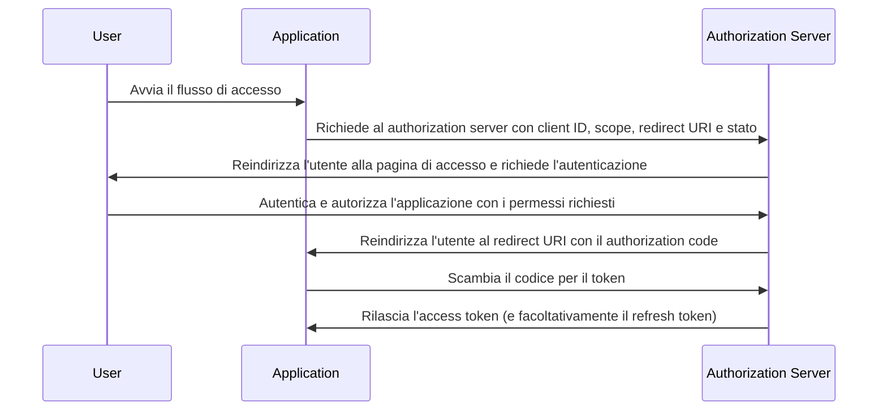

## Cos'è il flusso del codice di autorizzazione (authorization code flow)?

Il flusso del codice di autorizzazione (authorization code flow) (noto anche come concessione del codice di autorizzazione), definito in [OAuth 2.0 RFC 6749, sezione 4.1](https://datatracker.ietf.org/doc/html/rfc6749#section-4.1), è un meccanismo di autorizzazione OAuth 2.0 ampiamente utilizzato che consente alle applicazioni di ottenere un access token per conto di un utente. Questo flusso è particolarmente adatto per applicazioni riservate (ad esempio, applicazioni web tradizionali lato server) dove il client secret può essere memorizzato in modo sicuro.

Il flusso del codice di autorizzazione (authorization code flow) è un metodo robusto e sicuro per ottenere access token in OAuth 2.0, rendendolo una scelta preferita per molte applicazioni web. Comprendere questo flusso è essenziale per gli sviluppatori che lavorano con OAuth 2.0 e integrazioni API.

## Come funziona il flusso del codice di autorizzazione (authorization code flow)?

Il flusso del codice di autorizzazione (authorization code flow) coinvolge i seguenti passaggi:

1. **Inizio del flusso**: L'utente avvia il flusso facendo tipicamente clic su un link o un pulsante nell'applicazione per accedere. L'applicazione reindirizza l'utente all'endpoint di autorizzazione del authorization server, passando il client ID, lo scope richiesto, un redirect URI e un parametro di stato. Il authorization server convalida i parametri e invita l'utente ad autenticarsi sulla pagina di accesso del authorization server.
2. **Autenticazione e autorizzazione dell'utente**: L'utente si autentica con il authorization server e concede all'applicazione il permesso di accedere alle risorse richieste.
3. **Generazione del codice e reindirizzamento**: Il authorization server genera un authorization code e reindirizza l'utente all'applicazione utilizzando il redirect URI fornito in precedenza. Il authorization code è incluso nella stringa di query del redirect URI.
4. **Scambio del codice**: L'applicazione estrae il authorization code dalla stringa di query e effettua una richiesta POST all'endpoint del token del authorization server per scambiare il authorization code con un access token. L'applicazione deve anche includere il client ID, il client secret, il redirect URI e il authorization code nella richiesta.
5. **Recupero dell'access token**: Il authorization server convalida il authorization code e rilascia un access token (e facoltativamente un refresh token) all'applicazione al termine della convalida. L'applicazione può quindi utilizzare l'access token per effettuare richieste API autorizzate per conto dell'utente.

I passaggi possono essere illustrati dal seguente diagramma di sequenza:



## Richiesta di autenticazione (Authentication request)

I parametri della richiesta sono i seguenti:

- **client_id**: OBBLIGATORIO. Identificatore valido del client OAuth 2.0.
- **scope**: OBBLIGATORIO. Questo valore specifica un insieme di risorse che l'utente richiede dal authorization server. Ad esempio, `openid profile email`.
- **response_type**: OBBLIGATORIO. Il valore deve essere `code` per indicare che l'applicazione si aspetta un authorization code.
- **redirect_uri**: OBBLIGATORIO. L'URI a cui verrà inviata la risposta di autenticazione e deve corrispondere esattamente al redirect URI che il client ha pre-registrato presso il authorization server.
- **state**: RACCOMANDATO. Un valore opaco utilizzato per mantenere lo stato tra la richiesta e il callback. È anche usato per prevenire attacchi <Ref slug="csrf" />.
- **nonce**: OPZIONALE. Una stringa casuale utilizzata per associare una sessione client con un ID token e per mitigare attacchi di replay.
- **prompt**: OPZIONALE. Elenco di valori stringa delimitati da spazi e case-sensitive che specifica se il authorization server richiede all'utente finale di ri-autenticarsi e dare il consenso. I valori definiti sono:
  - **none**: Il authorization server NON DEVE visualizzare alcuna pagina di interfaccia utente di autenticazione o consenso. Viene restituito un errore se un utente finale non è già autenticato o il client non ha un consenso pre-configurato per i Claims richiesti o non soddisfa altre condizioni per elaborare la richiesta. Il codice di errore sarà tipicamente `login_required`, `interaction_required`. Questo può essere utilizzato come metodo per verificare l'esistenza di autenticazione e/o consenso.
  - **login**: Il authorization server DOVREBBE richiedere all'utente finale di ri-autenticarsi. Se non può ri-autenticare l'utente finale, DEVE restituire un errore, tipicamente `login_required`.
  - **consent**: Il authorization server DOVREBBE richiedere all'utente finale di dare il consenso prima di restituire informazioni al client. Se non può ottenere il consenso, DEVE restituire un errore, tipicamente `consent_required`.
  - **select_account**: Il authorization server DOVREBBE richiedere all'utente finale di selezionare un account utente. Questo consente a un utente finale che ha più account presso il authorization server di selezionare tra i vari account per cui potrebbe avere sessioni correnti. Se non può ottenere una scelta di selezione dell'account fatta dall'utente finale, DEVE restituire un errore, tipicamente `account_selection_required`.

[Definizione completa dei parametri della richiesta](https://openid.net/specs/openid-connect-core-1_0.html#AuthRequest)

### Esempio di richiesta di autenticazione (Authentication request)

```bash
curl -X GET "https://authorization-server.com/auth" \
  -d "response_type=code" \
  -d "client_id=YOUR_APPLICATION_ID" \
  -d "redirect_uri=https://yourapp.com/callback" \
  -d "scope=openid profile email" \
  -d "state=RANDOM_STRING_FOR_STATE"
```

Una tipica risposta di successo:

```http
HTTP/1.1 302 Found
Location: https://yourapp.com/callback?
  code=YOUR_AUTHORIZATION_CODE
  &state=RANDOM_STRING_FOR_STATE
```

## Richiesta di scambio del token

Una volta che la richiesta di autenticazione sopra è stata risolta con successo, il client verrà automaticamente reindirizzato al callback URI `https://yourapp.com/callback`, con il codice come parametro URI.

Il client è tenuto a ottenere e elaborare il `code` con una successiva richiesta di scambio del token, al fine di scambiare per l'access token.

### Esempio di richiesta di scambio del token

```bash
curl -X POST "https://authorization-server.com/token" \
  -H "Content-Type: application/x-www-form-urlencoded" \
  -d "client_id=YOUR_CLIENT_ID" \
  -d "code=YOUR_AUTHORIZATION_CODE" \
  -d "redirect_uri=https://yourapp.com/callback" \
  -d "grant_type=authorization_code" \
```

## Vantaggi

- **Sicurezza migliorata**: Il client secret non è mai esposto al browser dell'utente, riducendo il rischio di impersonificazione del client.
- **Codice di autorizzazione monouso**: Il authorization code ha una breve durata e può essere utilizzato solo una volta, riducendo il rischio di intercettazione e attacchi di replay.
- **Token a breve durata**: Gli access token emessi in questo flusso hanno una breve durata (tipicamente 1 ora), riducendo il rischio di accesso non autorizzato se il token viene compromesso.
- **Refresh token**: Il authorization server può facoltativamente emettere un refresh token, consentendo all'applicazione di ottenere un nuovo access token senza richiedere l'interazione dell'utente.

## Qual è la differenza tra il flusso del codice di autorizzazione (authorization code flow) e il flusso implicito (implicit flow)?

La principale differenza tra il flusso del codice di autorizzazione (authorization code flow) e il flusso implicito (implicit flow) è come viene ottenuto l'access token:

- **Flusso del codice di autorizzazione (authorization code flow)**: L'applicazione client riceve prima un authorization code dall'endpoint di autorizzazione, quindi lo scambia per un access token in una successiva richiesta POST all'endpoint del token.
- **Flusso implicito (implicit flow)**: L'applicazione client riceve direttamente l'access token dall'endpoint di autorizzazione.

## Qual è la differenza tra il flusso del codice di autorizzazione (authorization code flow) e il flusso delle credenziali del client (client credentials flow)?

La principale differenza tra il flusso del codice di autorizzazione (authorization code flow) e il flusso delle credenziali del client (client credentials flow) è il contesto in cui viene utilizzato il flusso:

- **Flusso del codice di autorizzazione (authorization code flow)**: Utilizzato quando l'applicazione client deve accedere a risorse per conto di un utente. Il flusso coinvolge l'autenticazione e l'autorizzazione dell'utente.
- **Flusso delle credenziali del client (client credentials flow)**: Utilizzato quando l'applicazione client deve accedere a risorse per conto proprio. Il flusso coinvolge l'autenticazione del client ma non l'autenticazione dell'utente, ed è più adatto per la comunicazione machine-to-machine.

## Quali sono i casi d'uso tipici per il flusso del codice di autorizzazione (authorization code flow)?

- Applicazioni web tradizionali che richiedono l'autenticazione dell'utente e l'accesso alle API.
- Applicazioni che necessitano di accedere in modo sicuro ai dati degli utenti da servizi di terze parti.

<SeeAlso slugs={['device-flow', 'implicit-flow', 'client-credentials-flow']} />

<Resources urls={['https://datatracker.ietf.org/doc/html/rfc6749']} />