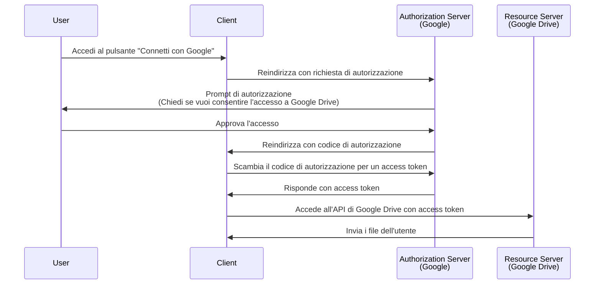

## Che cos'è una richiesta di autorizzazione (authorization request)?

A seconda del contesto, il termine "richiesta di autorizzazione" (authorization request) può riferirsi a cose diverse. In questo articolo, ci concentreremo sulla definizione nella specifica <Ref slug="oauth-2.0" />.

In OAuth 2.0, ci sono diversi tipi di concessione (flussi) che definiscono come un <Ref slug="client" /> può ottenere l'autorizzazione da un utente per accedere a risorse protette.

> ![Nota]
> Le "richieste di autorizzazione" (authorization requests) sono spesso confuse con le "richieste di autenticazione" (authentication requests) nel contesto di <Ref slug="openid-connect" />. Vedi <Ref slug="authentication-request" /> per i dettagli specifici di OIDC.

## Come funziona una richiesta di autorizzazione (authorization request)?

Quando un client (applicazione) vuole accedere a risorse protette per conto di un utente, avvia una richiesta di autorizzazione al <Ref slug="authorization-server" />. Il client dovrebbe indicare il tipo di concessione richiesto insieme ai parametri necessari nella richiesta.

Ecco alcuni tipi di concessione (flussi) tipici per l'autorizzazione degli utenti finali in OAuth 2.0:

- <Ref slug="authorization-code-flow" />: Il flusso più raccomandato per l'autorizzazione degli utenti finali. È solitamente utilizzato con <Ref slug="pkce" /> per una maggiore sicurezza ed è adatto per la maggior parte delle applicazioni.
- <Ref slug="implicit-flow" />: Un flusso semplificato che è deprecato in <Ref slug="oauth-2.1" /> a causa di problemi di sicurezza.
- [Concessione delle credenziali della password del proprietario della risorsa (ROPC)](https://datatracker.ietf.org/doc/html/rfc6749#section-4.3): Un tipo di concessione (flusso) in cui le credenziali dell'utente sono scambiate direttamente per un access token. Questo flusso non è raccomandato a causa dei rischi per la sicurezza.

Ci sono anche altre estensioni, come il <Ref slug="device-flow" /> per dispositivi con capacità di input limitate. Ogni flusso ha le proprie caratteristiche e casi d'uso. Per la maggior parte delle applicazioni web, il flusso del codice di autorizzazione è la scelta raccomandata.

> L'autorizzazione <Ref slug="machine-to-machine" /> è tipicamente eseguita utilizzando il <Ref slug="client-credentials-flow" /> che non coinvolge l'interazione dell'utente.

Ad esempio, un client (applicazione) può richiedere l'autorizzazione per accedere ai file di Google Drive di un utente. Ecco un diagramma di sequenza semplificato del flusso del codice di autorizzazione:

Una volta ottenuto l'<Ref slug="access-token" />, il client può usarlo per accedere ai file di Google Drive dell'utente per conto dell'utente.

### Parametri chiave in una richiesta di autorizzazione (authorization request)

La richiesta di autorizzazione OAuth 2.0 include tipicamente i seguenti parametri:

- **`response_type`**: Il tipo di risposta che il client si aspetta. I valori comuni sono `code` per il flusso del codice di autorizzazione e `token` per il flusso implicito.
- **`client_id`**: L'identificatore del client emesso dal server di autorizzazione.
- **`redirect_uri`**: L'URI dove il server di autorizzazione invia l'utente dopo il processo di autorizzazione.
- **`scope`**: Gli <Ref slug="scope">scope</Ref> (permessi) richiesti per l'access token.
- **`resource`**: Il parametro opzionale che specifica il <Ref slug="resource-indicator" /> per le risorse richieste. Il server di autorizzazione deve supportare [RFC 8707](https://datatracker.ietf.org/doc/html/rfc8707) per utilizzare questo parametro.

I parametri sopra elencati non sono esaustivi. I parametri effettivi e i loro valori dipendono dal tipo di concessione e dai requisiti specifici dell'applicazione.

<SeeAlso slugs={["oauth-2.0", "authentication-request", "authorization-code-flow", "implicit-flow", "device-flow"]} />

<Resources
  urls={[
    { url: "https://datatracker.ietf.org/doc/html/rfc6749#section-4", result: {
      ogTitle: "Ottenere l'autorizzazione in OAuth 2.0",
      ogDescription: " Per richiedere un access token, il client ottiene l'autorizzazione dal proprietario della risorsa."
    } }
  ]}
/>