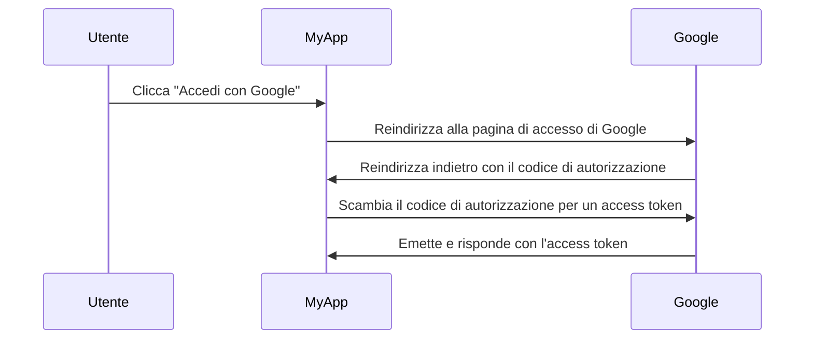

## Cos'è un server di autorizzazione?

Il termine "server di autorizzazione" può essere un termine generico che si riferisce a qualsiasi server che esegue l'autorizzazione. Ci concentreremo sulla definizione nel contesto dei framework <Ref slug="oauth-2.0" /> e <Ref slug="openid-connect" />.

In OAuth 2.0, un server di autorizzazione è un componente che emette <Ref slug="access-token">access token</Ref> ai <Ref slug="client">client</Ref> dopo averli autenticati e autorizzati con successo. Gli access token sono utilizzati dai client per accedere a risorse protette per conto dell'utente (proprietario della risorsa).

Troppi termini? Vediamo un esempio reale: un utente clicca su "Accedi con Google" su un'applicazione "MyApp" che utilizza il <Ref slug="authorization-code-flow" /> per l'accesso con Google.

In questo esempio, Google agisce come il **server di autorizzazione** che emette un access token al **client** (MyApp) dopo che l'utente ha effettuato con successo l'accesso. Il client può quindi utilizzare l'**access token** per recuperare il profilo dell'utente (risorsa protetta) su Google.

### Server di autorizzazione in OpenID Connect (OIDC)

Poiché OpenID Connect è costruito sopra OAuth 2.0, riutilizza alcuni termini e concetti di OAuth 2.0. OIDC aggiunge la capacità di autenticazione al server di autorizzazione OAuth 2.0, il che rende il server di autorizzazione anche un <Ref slug="openid-connect" headingId="openid-provider-op" />. Per evitare ambiguità, raccomandiamo di utilizzare sempre il termine "OpenID Provider" quando ci si riferisce al server di autorizzazione in OIDC.

Oltre a emettere access token, l'OpenID Provider (server di autorizzazione) in OIDC emette anche <Ref slug="id-token">ID token</Ref> ai client. Gli ID token contengono informazioni sull'utente e sono utilizzati per autenticare gli utenti.

## Come funziona un server di autorizzazione?

Un server di autorizzazione dovrebbe supportare i <Ref slug="oauth-2.0-grant">OAuth 2.0 grant (flussi)</Ref> per emettere access token ai client. Un tipo di grant di solito consiste in una serie di passaggi che il client e il server di autorizzazione seguono per ottenere un access token.

- Per l'autorizzazione dell'utente, la maggior parte dei tipi di grant richiede che il client inizi una <Ref slug="authorization-request" /> al server di autorizzazione. Nell'esempio di accesso con Google sopra, il passaggio "Reindirizza alla pagina di accesso di Google" è una richiesta di autorizzazione iniziata dal client.
- Per l'autorizzazione <Ref slug="machine-to-machine" />, il client può utilizzare il <Ref slug="client-credentials-flow" /> per inviare direttamente una <Ref slug="token-request" /> al server di autorizzazione.

Il server di autorizzazione dovrebbe anche convalidare la richiesta del client, autenticare il client e verificare l'identità dell'utente prima di emettere un access token. Può anche imporre misure di sicurezza aggiuntive, come il <Ref slug="pkce" /> per il <Ref slug="authorization-code-flow" />.

## Casi d'uso del server di autorizzazione

Come suggerisce il nome, i server di autorizzazione sono utilizzati per gestire l'<Ref slug="authorization" />. Il server di autorizzazione può coinvolgere prime e terze parti:

- L'esempio di accesso con Google sopra.
- Un sito di e-commerce (client) che richiede l'accesso alle informazioni di pagamento di un utente (risorsa protetta) da un altro sito web.
- Un'app mobile (client) che richiede l'accesso ai dati di localizzazione di un utente (risorsa protetta) da un fornitore di servizi di localizzazione.

Oppure, può essere utilizzato solo per l'autorizzazione interna, come:

- Un utente ha bisogno di accedere ai propri ordini (risorsa protetta) in un sito di e-commerce (client).
- Un servizio (client) ha bisogno di accedere a un database (risorsa protetta) in un'architettura a microservizi.

Nelle applicazioni moderne, un server di autorizzazione può essere anche un <Ref slug="identity-provider" /> che supporta anche <Ref slug="openid-connect" /> per l'autenticazione degli utenti.

<SeeAlso slugs={["oauth-2.0", "authorization-request", "access-token"]} />
 
<Resources
  urls={[
    "https://blog.logto.io/ciam-102-authz-and-rbac",
    "https://tools.ietf.org/html/rfc6749",
  ]}
/>