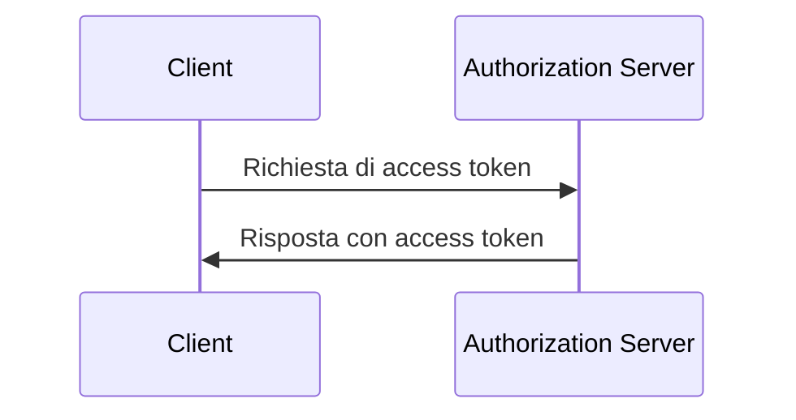
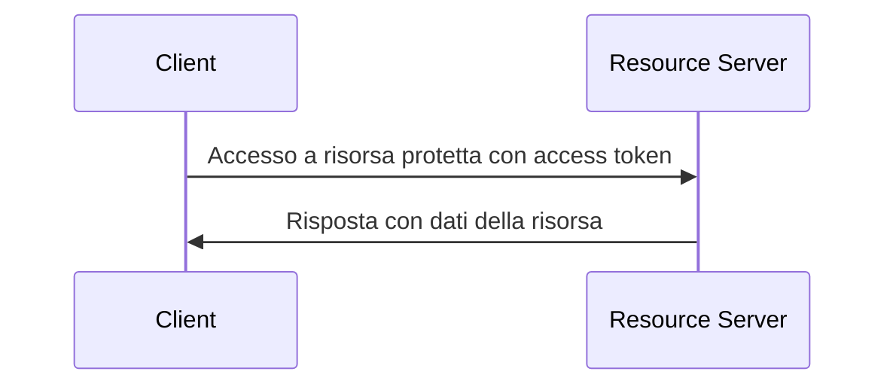

## Cos'è il flusso delle credenziali del client (client credentials flow)?

Il flusso delle credenziali del client (Grant) è un tipo di <Ref slug="oauth-2.0-grant" /> che consente ai client riservati di ottenere <Ref slug="access-token">access token</Ref> per accedere a risorse protette. Di solito, questo flusso è utilizzato per la comunicazione <Ref slug="machine-to-machine" /> dove il client è un server o un servizio.

> [!Note]
> Il flusso delle credenziali del client non è adatto per l'autorizzazione dell'utente finale. Per l'autorizzazione dell'utente finale, dovresti usare <Ref slug="authentication-request" /> o <Ref slug="authorization-request" />.

## Come funziona il flusso delle credenziali del client (client credentials flow)?

Il flusso delle credenziali del client è un semplice processo in due fasi:

1. **Richiesta di token**: Il client invia una <Ref slug="token-request" /> con le sue credenziali (client ID e client secret) e gli <Ref slug="scope">scope</Ref> richiesti.
2. **Risposta del token**: Il <Ref slug="authorization-server" /> valida le credenziali del client e rilascia un access token se il client è autorizzato.

Ecco un diagramma di sequenza semplificato del flusso delle credenziali del client:



Ecco un esempio non normativo di una richiesta di token nel flusso delle credenziali del client:

```http
POST /token HTTP/1.1
Host: your-authorization-server.com
Content-Type: application/x-www-form-urlencoded

grant_type=client_credentials
  &client_id=YOUR_CLIENT_ID
  &client_secret=YOUR_CLIENT_SECRET
  &scope=read write
```

Il server di autorizzazione validerà le credenziali del client e rilascerà un access token se il client è autorizzato. Una volta che il client riceve l'access token, può usarlo per accedere a risorse protette (ad esempio, un'API) per conto di se stesso. Ecco un esempio di come un client utilizza l'access token per accedere a un'API:



Nota che il <Ref slug="resource-server" /> dovrebbe validare l'access token e applicare le politiche di <Ref slug="access-control" /> per garantire che il client abbia le autorizzazioni necessarie per accedere alla risorsa.

### Parametri chiave in una richiesta di token nel flusso delle credenziali del client

A differenza di altri flussi OAuth 2.0, il flusso delle credenziali del client ha una semplice <Ref slug="token-request" /> con i seguenti parametri chiave:

- **`grant_type`**: Il tipo di concessione dovrebbe essere impostato su `client_credentials` per indicare il flusso delle credenziali del client.
- **`client_id`**: L'identificatore del client emesso dal server di autorizzazione.
- **`client_secret`**: Il client secret emesso dal server di autorizzazione.
- **`scope`**: Gli <Ref slug="scope">scope</Ref> richiesti (autorizzazioni) per l'access token.
- **`resource`**: Il parametro opzionale che specifica il <Ref slug="resource-indicator" /> per le risorse richieste. Il server di autorizzazione deve supportare [RFC 8707](https://datatracker.ietf.org/doc/html/rfc8707) per utilizzare questo parametro.

## Considerazioni sulla sicurezza

### Client riservati

Il flusso delle credenziali del client è adatto per <Ref slug="client" headingId="confidential-clients" /> (client riservati) che possono memorizzare in modo sicuro il client secret. Se il client è un client pubblico (ad esempio, un'applicazione a pagina singola), non dovrebbe utilizzare il flusso delle credenziali del client perché il client secret può essere esposto.

### Scadenza del token

Sebbene l'access token ottenuto nel flusso delle credenziali del client possa avere un lungo tempo di scadenza, è consigliato utilizzare access token di breve durata (ad esempio, 1 ora) per ridurre il rischio di accesso non autorizzato se il token viene compromesso.

### Rotazione del client secret

Per migliorare la sicurezza, è consigliato ruotare periodicamente il client secret. Il server di autorizzazione dovrebbe supportare la rotazione del client secret senza influire sulla capacità del client di ottenere access token. Ad esempio, il server di autorizzazione dovrebbe supportare più client secret per la compatibilità retroattiva durante il processo di rotazione.

<SeeAlso slugs={["machine-to-machine", "token-request", "access-token", "scope", "resource-indicator"]} />

<Resources
  urls={[
    "https://blog.logto.io/programmatic-authentication-methods",
    { 
      url: "https://datatracker.ietf.org/doc/html/rfc6749#section-4.4",
      result: {
        ogTitle: "Client Credentials Grant",
        ogDescription: "Il client può richiedere un access token utilizzando solo le sue credenziali (o altri mezzi di autenticazione supportati) quando il client richiede l'accesso alle risorse protette sotto il suo controllo, o quelle di un altro proprietario delle risorse che sono state precedentemente concordate con il server di autorizzazione."
      }
    }
  ]}
/>