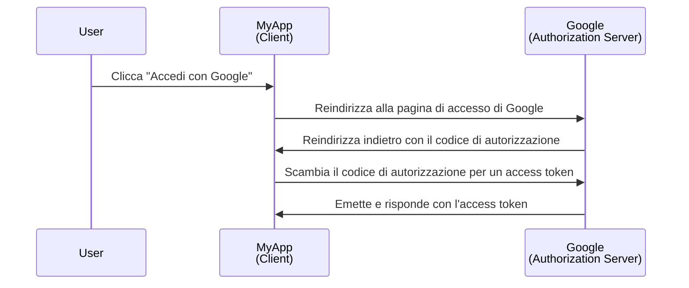
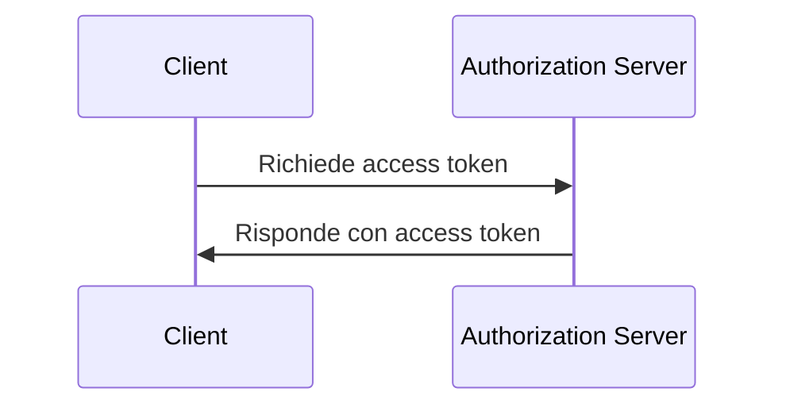

## Cos'è un client?

Un client, nel contesto di <Ref slug="oauth-2.0" /> e <Ref slug="openid-connect" />, è un'applicazione che richiede autenticazione (authentication) o autorizzazione (authorization). Ad esempio, quando un utente clicca su "Accedi con Google" su un'applicazione, l'applicazione agisce come un **client** che richiede l'autorizzazione a Google.

> "Client" e "applicazione" sono spesso usati in modo intercambiabile nel contesto di <Ref slug="iam" />.

Ci sono molteplici categorizzazioni di client basate sulle loro capacità e livelli di fiducia, ma per i framework, una distinzione significativa è tra client pubblici e riservati. Questo influisce su come il client può ottenere i token e sui tipi di concessione che può utilizzare.

### Client pubblici ||public-clients||

I client pubblici sono applicazioni che non possono mantenere riservate le proprie credenziali, il che significa che il proprietario della risorsa (utente) può accedervi. Esempi di client pubblici includono:

- Applicazioni a pagina singola (SPAs)
- App mobili
- App desktop

Si potrebbe sostenere che le app mobili e desktop abbiano capacità di archiviazione sicura, ma la maggior parte dei framework le considera client pubblici perché sono distribuite agli utenti finali e si presume che gli utenti finali possano accedere alle credenziali.

### Client riservati ||confidential-clients||

I client riservati (privati) sono applicazioni che possono memorizzare in modo riservato informazioni sensibili senza esporle ai proprietari delle risorse (utenti finali). Esempi di client riservati includono:

- Server web
- Servizi backend

## Come funziona un client?

### Autenticazione (authentication) e autorizzazione (authorization) dell'utente

Quando un client vuole autenticare un utente, un client avvia una <Ref slug="authorization-request" /> al <Ref slug="authorization-server" /> per ottenere un <Ref slug="access-token" />. Il client dovrebbe includere i parametri necessari nella richiesta, come l'ID del client, l'URI di reindirizzamento e gli scope. Ecco un diagramma di sequenza semplificato del flusso del codice di autorizzazione:

In questo esempio, Google agisce come il **authorization server** che emette un access token al **client** (MyApp) dopo che l'utente ha effettuato correttamente l'accesso. Il client può quindi utilizzare l'**access token** per recuperare il profilo dell'utente (risorsa protetta) su Google.

Per i client OpenID Connect (OIDC), il client deve avviare una <Ref slug="authentication-request" /> per autenticare l'utente. Utilizza lo stesso endpoint della richiesta di autorizzazione, ma i parametri e la risposta sono diversi.

### Comunicazione machine-to-machine

Per la comunicazione <Ref slug="machine-to-machine" />, il client può utilizzare il <Ref slug="client-credentials-flow" /> per inviare direttamente una <Ref slug="token-request" /> al authorization server. Il client dovrebbe includere l'ID del client, il segreto del client e gli scope nella richiesta. Ecco un diagramma di sequenza semplificato del flusso delle credenziali del client:

Il authorization server convaliderà le credenziali del client ed emetterà un access token se il client è autorizzato. Poiché il client deve inviare il segreto del client, è importante utilizzare il flusso delle credenziali del client solo per i client riservati.

## Considerazioni sulla sicurezza

### Tipi di client

Il tipo di client (pubblico o privato) influisce sulle considerazioni di sicurezza per il client.

- I client pubblici non dovrebbero utilizzare il flusso delle credenziali del client perché non possono memorizzare in modo sicuro il segreto del client. Invece, il <Ref slug="authorization-code-flow" /> con <Ref slug="pkce" /> è raccomandato per i client pubblici per autenticare gli utenti.
- I client riservati possono utilizzare il flusso delle credenziali del client per la comunicazione machine-to-machine. Dovrebbero memorizzare in modo sicuro il segreto del client e utilizzarlo solo in ambienti sicuri.

### Archiviazione dei token

I client dovrebbero utilizzare il massimo livello di sicurezza possibile per memorizzare i token. Ad esempio, nelle applicazioni web, i cookie HTTP-only sono raccomandati per memorizzare gli access token per prevenire attacchi XSS.

### Scadenza dei token

Gli access token hanno una durata limitata per ridurre il rischio di accesso non autorizzato. I client dovrebbero gestire la scadenza dei token in modo adeguato utilizzando <Ref slug="refresh-token">refresh token</Ref> per ottenere nuovi access token.

### Revoca dei token

I client dovrebbero essere preparati a gestire la revoca dei token. Se l'utente esce o il authorization server revoca il token, il client dovrebbe cancellare il token dall'archiviazione lato client.

<SeeAlso slugs={["oauth-2.0", "oauth-2.0-grant", "openid-connect", "authorization-request", "authentication-request"]} />

<Resources
  urls={[
    "https://blog.logto.io/secure-cloud-apps-with-oauth-and-openid-connect",
    "https://datatracker.ietf.org/doc/html/rfc6749",
    "https://openid.net/specs/openid-connect-core-1_0.html"
  ]}
/>
