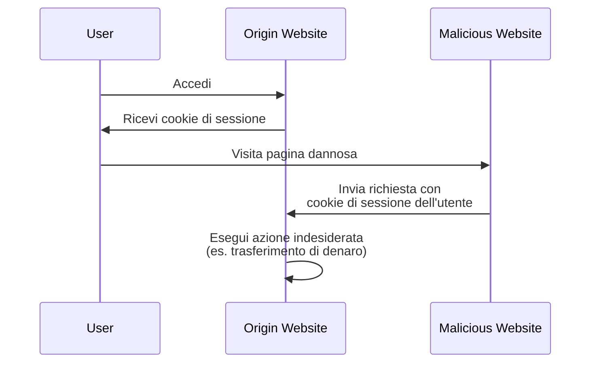

## Che cos'è il cross-site request forgery (CSRF)?

Quando si sviluppano applicazioni web, il CSRF è un termine spesso sentito che porta timore a sviluppatori e professionisti della sicurezza. È un tipo di attacco che inganna (o raggira) gli utenti autenticati facendoli eseguire azioni indesiderate su un'applicazione web senza consenso.

Il CSRF è anche noto come "attacco a un clic" o "session riding" perché si basa sulla sessione attiva dell'utente per eseguire azioni dannose.

## Come funziona il CSRF?

L'attacco CSRF funziona sfruttando la fiducia che un'applicazione web ha nel browser dell'utente. Ecco come avviene tipicamente:



Potresti avere alcune domande su questa sequenza. Esploriamo le ragioni dietro.

### Perché il sito dannoso può inviare una richiesta al sito di origine?

La Same-Origin Policy (SOP) è una funzionalità di sicurezza nei browser web che limita il modo in cui un documento o uno script caricato da un'origine può interagire con una risorsa (es. cookie, DOM) da un'altra origine. Tuttavia, la SOP non impedisce al browser di inviare richieste a un'altra origine.

Pertanto, sebbene il sito dannoso non possa leggere o modificare direttamente il cookie di sessione, può comunque inviare richieste al sito di origine utilizzando la sessione attiva dell'utente.

Potresti sostenere che la maggior parte delle applicazioni web utilizza anche [CORS](https://developer.mozilla.org/en-US/docs/Web/HTTP/CORS) per prevenire richieste cross-origin non autorizzate, ma il CSRF ha ancora un modo per aggirarlo:

1. Attacchi basati su GET: Il sito dannoso può ingannare l'utente facendogli visitare un URL che esegue un'azione sul sito di origine:

    - Un reindirizzamento a `https://example.com/transfer?amount=1000&to=attacker`.
    - Un tag immagine che carica `https://example.com/transfer?amount=1000&to=attacker`.

    Questa è una ragione importante per cui le richieste GET non dovrebbero avere effetti collaterali.

2. Attacchi basati su form: Il sito dannoso può creare un form nascosto che invia dati al sito di origine. Ad esempio, una richiesta POST a `https://example.com/transfer` con campi di form nascosti.

### Perché il sito dannoso ha il cookie di sessione dell'utente?

Il browser dell'utente invia automaticamente i cookie al sito di origine quando effettua richieste. Questo è il modo in cui il sito di origine sa che l'utente è autenticato e può eseguire azioni per suo conto.

In realtà, il sito dannoso non "ha" il cookie di sessione; sfrutta semplicemente il comportamento del browser per inviare il cookie insieme alla richiesta.

## Come prevenire gli attacchi CSRF?

Prevenire gli attacchi CSRF richiede un approccio a più livelli che coinvolge sia il server che il client. Ecco alcune tecniche comuni per mitigare le vulnerabilità CSRF:

### Utilizzare token anti-CSRF

I token anti-CSRF sono valori casuali generati dal server e incorporati nei form dell'applicazione web. Quando il form viene inviato, il server convalida il token per garantire che la richiesta sia legittima.

Ad esempio, un campo di input nascosto in un form HTML:

```html
<form action="/transfer" method="post">
  <input type="hidden" name="csrf_token" value="random_token_here" />
  <!-- Altri campi del form -->
  <button type="submit">Trasferisci</button>
</form>
```

Con questo approccio, il sito dannoso non può falsificare una richiesta perché non conosce il token anti-CSRF. Il parametro `state` in <Ref slug="redirect-uri" /> è un concetto simile.

### Utilizzare cookie SameSite

L'attributo `SameSite` nei cookie può prevenire gli attacchi CSRF limitando quando i cookie vengono inviati al server:

| Valore `SameSite` | Descrizione                                                                          |
|-------------------|--------------------------------------------------------------------------------------|
| `Strict`          | I cookie vengono inviati solo in un contesto di prima parte.                         |
| `Lax`             | I cookie vengono inviati in un contesto di prima parte e con richieste GET da siti esterni. |
| `None`            | I cookie vengono inviati in tutti i contesti. Richiede l'attributo `Secure`.         |

Impostando l'attributo `SameSite` su `Strict` o `Lax` senza effetti collaterali nelle tue richieste GET, puoi prevenire gli attacchi CSRF.

Inoltre, l'attributo `Secure` dovrebbe essere sempre impostato per garantire che il cookie venga inviato solo su connessioni HTTPS.

### Controllare gli header

1. **Header Origin**: L'header `Origin` viene inviato dal browser per indicare l'origine della richiesta. Il server può controllare questo header per garantire che la richiesta provenga da un'origine prevista.
2. **Header Referer**: L'header `Referer` contiene l'URL della pagina precedente. Sebbene possa essere falsificato, può comunque essere utilizzato come ulteriore livello di protezione.

<SeeAlso slugs={["authorization-code-flow", "redirect-uri"]} />

<Resources
  urls={[
    'https://blog.logto.io/csrf',
    "https://cheatsheetseries.owasp.org/cheatsheets/Cross-Site_Request_Forgery_Prevention_Cheat_Sheet.html",
  ]}
/>